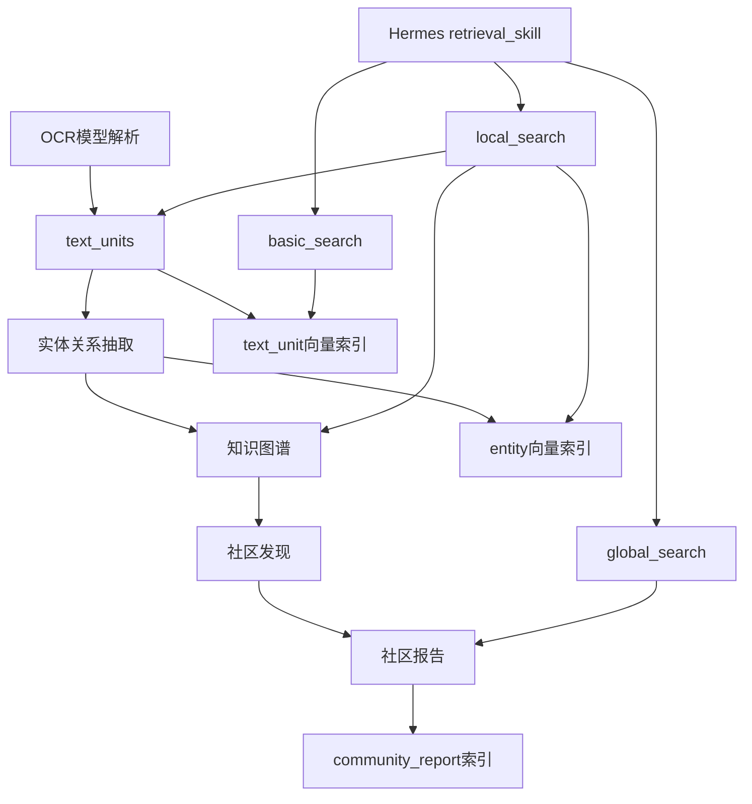

# GraphRAG 复用方案

**日期**: 2026-06-08  
**状态**: 草案  
**目标**: 将 GraphRAG 的核心 RAG 思路复用到智能问答平台知识库中，提升跨文档综合、实体关联推理和可解释证据检索能力。

---

## 1. 复用原则

本方案不直接复制 Microsoft GraphRAG 的完整工程结构，而是复用其 RAG 核心逻辑：

```text
文档
 -> text_units
 -> entities / relationships
 -> communities
 -> community_reports
 -> embeddings
 -> local_search / global_search / basic_search
```

核心思想是：普通 RAG 直接从问题检索相似文本，GraphRAG 先把文档沉淀为知识图谱和社区摘要，再按问题类型从图谱和证据文本中组织上下文。

---

## 2. 适用场景

### 2.1 适合

- 多文档知识库
- 文档之间存在实体、事件、组织、流程、系统、政策等关联
- 用户会问跨文档综合问题
- 需要回答“主题、趋势、风险、关系、影响范围”
- 需要可解释证据包和引用来源

### 2.2 不适合

- 小规模 FAQ
- 单文档问答
- 数据更新频繁但无法承受重建索引成本
- 对实体关系质量要求很高但没有人工校验机制

---

## 3. 分层索引模型

### 3.1 text_units

`text_units` 是基础证据层，由文档切块得到。

```text
text_units
- id
- document_id
- text
- n_tokens
- metadata
- created_at
```

### 3.2 entities

`entities` 是语义入口层，来自每个 text unit 的实体抽取结果。

```text
entities
- id
- title
- canonical_name
- type
- description
- text_unit_ids
- frequency
- rank
- metadata
```

### 3.3 relationships

`relationships` 是图谱连接层，描述实体之间的显式关系。

```text
relationships
- id
- source
- target
- type
- description
- weight
- text_unit_ids
- rank
- metadata
```

### 3.4 communities

`communities` 是主题聚类层，由实体关系图聚类得到。

```text
communities
- id
- level
- title
- entity_ids
- relationship_ids
- text_unit_ids
- parent_id
- children_ids
- size
```

### 3.5 community_reports

`community_reports` 是全局摘要层，用 LLM 对社区内实体、关系和证据文本生成报告。

```text
community_reports
- id
- community_id
- title
- summary
- full_content
- rank
- findings
- text_unit_ids
```

---

## 4. 查询模式

### 4.1 basic_search

普通向量 RAG 兜底策略。

```text
query
 -> query embedding
 -> text_unit embedding search
 -> top_k text_units
 -> answer
```

适合明确事实类问题。

### 4.2 local_search

实体优先检索策略，是第一阶段最值得复用的 GraphRAG 能力。

```text
query
 -> entity embedding search
 -> matched entities
 -> related relationships
 -> related text_units
 -> related community_reports
 -> structured context
 -> answer
```

适合具体对象、系统、组织、人员、流程、事件相关问题。

### 4.3 global_search

社区报告 Map-Reduce 策略。

```text
query
 -> community_reports batches
 -> map: 每批报告生成带评分要点
 -> reduce: 聚合高分要点
 -> final answer
```

适合全局主题、趋势、风险、共性问题、跨文档总结。

---

## 5. 上下文组织策略

Local Search 的上下文不应只包含 chunk，而应按预算组合：

```text
conversation_history
entities
relationships
community_reports
text_units
```

推荐默认 token 分配：

```text
text_units: 50%
community_reports: 25%
entities + relationships: 25%
```

如果用户问题更偏全局，可以提高 `community_reports` 占比；如果用户问题更偏证据核查，可以提高 `text_units` 占比。

---

## 6. 推荐落地阶段

### P0: 基础 RAG

- 建立 documents / text_units
- 构建 text_unit embedding
- 实现 basic_search

### P1: 实体图谱索引

- 增加实体抽取
- 增加关系抽取
- 合并实体和关系
- 构建 entity embedding

### P2: Local GraphRAG

- 实现 query -> entity 检索
- 根据实体扩展 relationships / text_units
- 组织结构化上下文
- 输出证据包

### P3: Community GraphRAG

- 基于 relationships 构建图
- 社区发现
- 生成 community_reports
- 实现 global_search map-reduce

### P4: 运营增强

- 增量更新
- 抽取质量评估
- 人工校正实体和关系
- 命中率、召回率、引用质量统计

---

## 7. 与现有模块关系



---

## 8. 一句话定义

GraphRAG 复用方案的重点不是搬运完整项目，而是在知识库中新增“实体图谱索引 + 社区摘要索引 + 多模式检索”，让智能问答从相似文本检索升级为结构化知识检索。
