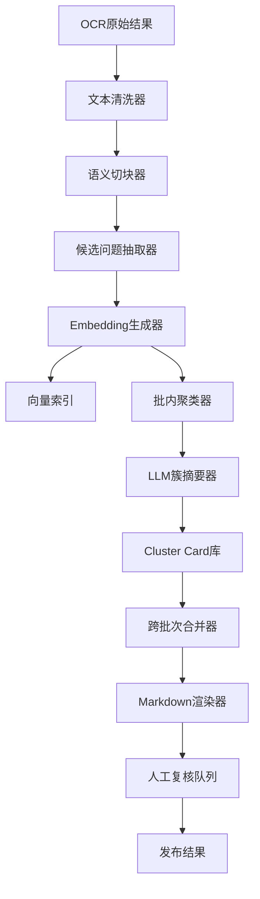

# OCR语义聚类Markdown生成

本方案用于把大体量 OCR 解析文本整理为语义化 Markdown。它不要求 LLM 一次读取完整文档，而是先通过清洗、切块、embedding 和聚类缩小上下文，再让 LLM 对相似片段进行标题归纳、摘要生成和 Markdown 组织。

---

## 1. 背景

OCR 解析后的文本通常存在顺序混乱、断行异常、页眉页脚混入、同义问题表达不统一等问题。直接把全文交给 LLM 会受 token 限制影响；按固定长度分块再总结，又容易产生重复标题、主题割裂和跨页问题无法合并。

本方案将“全文理解”拆成可扩展流水线：程序负责清洗、切块、向量化和聚类，LLM 只处理每个聚类内的代表样本，从而在大文档场景下稳定生成可复核、可溯源的 Markdown。

## 2. 目标

- 将 OCR 文本整理为语义化 Markdown。
- 将相同或相似问题归并到同一个标题下。
- 支持超过 LLM 输入限制的大文档。
- 保留来源页码、块 ID、置信度，便于人工复核。
- 支持新文档增量导入，避免每次全量重跑。

非目标：

- 不依赖 LLM 一次性完成全文聚类。
- 不在第一版处理复杂知识图谱推理。
- 不把低质量 OCR 文本强行归类，低置信度内容进入复核区。
- 不用最终 Markdown 替代原文存档，原始 OCR 结果仍需保留。

## 3. 总体链路或架构

### 3.1 总体链路

```text
OCR 原始结果
  -> 文本清洗
  -> 语义切块
  -> 候选问题抽取
  -> embedding 向量化
  -> 批内聚类
  -> LLM 生成 cluster card
  -> 跨批次 cluster 合并
  -> Markdown 渲染
  -> 人工复核与发布
```

### 3.2 架构图



### 3.3 模块职责

| 模块 | 职责 | 关键输出 |
| --- | --- | --- |
| 文本清洗器 | 去页眉页脚、修复断行、删除噪声 | clean text block |
| 语义切块器 | 按段落、问号、版面块和 token 限制切片 | chunk |
| 候选问题抽取器 | 判断片段是否是问题、说明或噪声 | candidate |
| Embedding生成器 | 为 chunk 生成语义向量并缓存 | embedding |
| 批内聚类器 | 在单批 chunk 内找相似问题 | local cluster |
| LLM簇摘要器 | 给聚类命名、摘要、拆分混杂簇 | cluster card |
| 跨批次合并器 | 合并不同批次产生的重复主题 | global cluster |
| Markdown渲染器 | 输出最终 Markdown 和来源引用 | markdown |
| 人工复核队列 | 承接低置信度、混杂、OCR 质量差的内容 | review item |

## 4. 核心配置或实现

### 4.1 数据对象

核心数据对象包括：

- `ocr_block`：OCR 原始块，保存页码、坐标、原文和 OCR 置信度。
- `text_chunk`：清洗切块后的语义片段，保存 chunk ID、来源块和 token 数。
- `chunk_embedding`：chunk 对应的向量、模型版本和生成时间。
- `local_cluster`：批内聚类结果。
- `cluster_card`：LLM 对聚类生成的标题、摘要、代表样本和置信度。
- `global_cluster`：跨批次合并后的最终主题。
- `markdown_export`：最终 Markdown 版本和导出记录。

详细字段和示例见：[OCR语义聚类落地实施计划](./references/OCR语义聚类落地实施计划.md)。

### 4.2 切块策略

切块不能只按固定长度，应按优先级组合：

1. OCR 版面块边界。
2. 段落和空行。
3. 问题标记，例如 `？`、`?`、`问：`、`Q:`。
4. 语义连接词，例如 `另外`、`还有`、`同时`。
5. 最大 token 限制兜底。

推荐阈值：

| 类型 | 建议长度 |
| --- | --- |
| 短问题 | 50 到 300 中文字 |
| 普通段落 | 200 到 800 中文字 |
| 复杂说明 | 800 到 1500 中文字 |
| 单个 chunk 上限 | 不超过后续 LLM 输入窗口的 10% |

### 4.3 相似度和聚类策略

两个 chunk 的语义相似度使用余弦相似度判断：

```text
cosine_similarity = A · B / (|A| × |B|)
```

初始阈值建议：

| 相似度区间 | 处理方式 |
| --- | --- |
| `>= 0.86` | 自动认为同一问题或强相似 |
| `0.76 到 0.86` | 认为同一主题候选，进入 LLM 复核 |
| `< 0.76` | 默认不合并 |

聚类采用两阶段：

```text
每 500 到 2000 个 chunk 组成一批
  -> 批内相似度聚类
  -> LLM 生成 cluster card
  -> cluster card 再向量化
  -> 跨批次合并相似主题
```

### 4.4 LLM 调用策略

LLM 不读取完整文档，只读取每个簇的代表样本：

- 选择离簇中心最近的 3 到 5 条。
- 选择边缘样本 1 到 2 条，避免标题过窄。
- 去除几乎重复的表达。
- 保留页码和 chunk ID。

LLM 输出必须采用结构化 JSON，字段至少包含：

- `is_coherent`：片段是否属于同一主题。
- `title`：Markdown 标题。
- `summary`：主题摘要。
- `items`：归入该主题的问题列表。
- `split_suggestions`：混杂簇拆分建议。

## 5. 部署步骤

### 5.1 MVP 部署组件

| 组件 | 建议 |
| --- | --- |
| API 服务 | Java Spring Boot 或 Python FastAPI |
| 异步任务 | Celery、RQ、Spring Batch 或消息队列 |
| 数据库 | PostgreSQL |
| 向量检索 | pgvector、Milvus 或 Elasticsearch 向量检索 |
| 对象存储 | MinIO、S3 或本地文件存储 |
| LLM 服务 | 可配置为内网模型或外部 API |
| Embedding 服务 | 可配置为内网 embedding 模型或外部 API |

### 5.2 落地步骤

1. 创建 OCR 结果导入接口，保存原始 OCR block。
2. 实现清洗任务，输出 clean block。
3. 实现 chunker，生成稳定 chunk ID。
4. 实现候选问题抽取，过滤噪声和低价值文本。
5. 接入 embedding 模型，批量生成向量并缓存。
6. 实现批内聚类，生成 local cluster。
7. 接入 LLM，对 local cluster 生成 cluster card。
8. 对 cluster card 做跨批次合并。
9. 渲染最终 Markdown，并写入导出记录。
10. 建立人工复核队列，处理低置信度内容。

### 5.3 推荐任务状态

```text
created
  -> ocr_loaded
  -> cleaned
  -> chunked
  -> embedded
  -> clustered
  -> summarized
  -> merged
  -> rendered
  -> reviewed
  -> published
```

失败状态应记录文档 ID、批次 ID、失败模块、错误信息、可重试次数和输入数据引用，便于单批次重试。

## 6. 验证方式

### 6.1 功能验证

| 验证项 | 通过标准 |
| --- | --- |
| OCR 噪声清洗 | 页眉页脚、页码和重复水印被去除 |
| chunk 切分 | 单个 chunk 不超过设定 token 上限 |
| 相似问题聚类 | 同义问题能进入同一簇 |
| 不相关问题隔离 | 发票、退款、登录等主题不会混杂 |
| LLM 标题生成 | 标题简短、准确、无编造 |
| Markdown 输出 | 标题、摘要、问题列表和来源完整 |
| 低置信度处理 | OCR 缺失和混杂簇进入人工复核区 |

### 6.2 指标验证

| 指标 | 建议目标 |
| --- | --- |
| 聚类准确率 | 大于 85% |
| 错误合并率 | 小于 5% |
| 重复标题率 | 小于 10% |
| 人工复核占比 | 小于 20% |
| Markdown 来源覆盖率 | 大于 95% |
| 单文档失败可重试率 | 100% |

### 6.3 标注集验证

建议准备固定回归集：

```text
同义问题 100 组
同主题不同问法 100 组
不相关问题 100 组
OCR 噪声样本 100 条
```

每次调整 embedding 模型、聚类阈值或 LLM Prompt 后，都使用同一标注集回归验证。

## 7. 风险与边界

| 风险 | 表现 | 应对 |
| --- | --- | --- |
| OCR 质量差 | 文本缺字、断句错误 | 低置信度进入复核区 |
| chunk 过大 | 一个 chunk 混入多个主题 | 按问题标记和 token 上限二次切分 |
| chunk 过小 | 语义不完整 | 合并相邻短句和同版面块 |
| embedding 阈值不准 | 错误合并或漏合并 | 使用标注集校准阈值 |
| LLM 编造标题 | 标题超出原文语义 | Prompt 约束只依据样本，保留来源 |
| 分批导致重复主题 | 多个批次产生相似标题 | 对 cluster card 做二次聚类合并 |
| 成本过高 | embedding 和 LLM 调用量大 | 缓存向量、批量调用、只传代表样本 |
| 敏感信息泄露 | 原文包含个人信息或密钥 | 入模前脱敏，日志不记录敏感正文 |

## 8. 排障方式

### 8.1 聚类结果混杂

优先检查 chunk 是否过大、相似度阈值是否过低、代表样本是否缺少边缘样本，以及 LLM 返回 `is_coherent=false` 后系统是否仍强制合并。处理方式是降低 chunk 上限、提高自动合并阈值、将中间相似度区间交给 LLM 复核，并把混杂 cluster 拆回 chunk 重新聚类。

### 8.2 相似问题没有合并

优先检查 OCR 是否把同一问题切碎、embedding 模型是否适合中文语义、相似度阈值是否过高，以及跨批次合并是否启用。处理方式是合并相邻短 chunk、更换或微调 embedding 模型、引入同义词归一化，并对 cluster card 执行二次合并。

### 8.3 Markdown 标题重复

优先检查是否只做了批内聚类、cluster card 是否生成 embedding，以及全局合并阈值是否过高。处理方式是启用跨批次 cluster card 合并、让 LLM 对候选重复标题做最终判断，并在输出前做标题相似度去重。

### 8.4 LLM 输出不稳定

优先检查 Prompt 是否要求 JSON 输出、是否传入过多样本、temperature 是否过高，以及是否缺少 schema 校验。处理方式是固定 JSON schema、将 temperature 设置为 0 到 0.3、失败后重试并校验 JSON，不合格输出进入人工复核。

## 9. 后续演进

### 9.1 增量更新

```text
新增 chunk
  -> 生成 embedding
  -> 检索相似 global cluster
  -> 高相似度加入旧主题
  -> 低相似度创建新主题
  -> 定期全局重聚类
```

### 9.2 人工反馈闭环

人工调整标题、拆分簇、合并簇后，应回写正确合并样本、错误合并样本和人工修改后的标题，用于阈值校准和 Prompt 回归。

### 9.3 与知识库集成

最终 Markdown 可以作为知识库入库内容，同时保留 chunk 和 cluster 结构：

```text
Markdown 标题 -> 知识主题
问题列表 -> 问法集合
来源页码 -> 证据引用
cluster_id -> 后续增量更新锚点
```

### 9.4 与 GraphRAG 集成

当问题不只是 FAQ 聚类，而是需要跨实体、跨章节推理时，可以把 cluster card 继续输入 GraphRAG，升级为实体关系抽取、主题社区和社区摘要驱动的全局分析。

## 10. 参考资料

- [OCR语义聚类落地实施计划](./references/OCR语义聚类落地实施计划.md)
- [方案库规范](../方案库规范.md)
- [GraphRAG复用探索](../GraphRAG复用探索/README.md)

