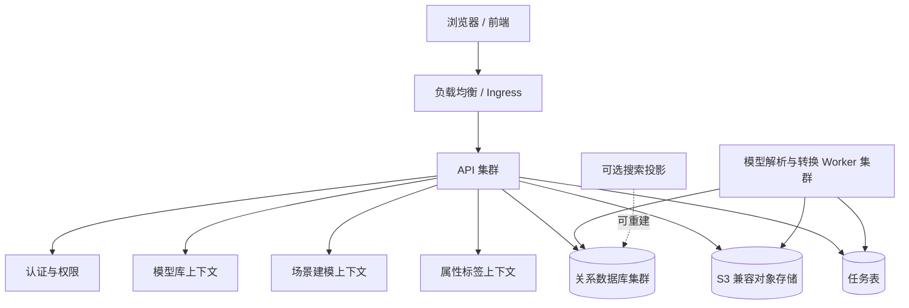

# 三维模型与场景建模平台总体架构方案

## 结论

新平台应当采用 **全新项目、DDD 模块化单体、关系数据库作为唯一事实库、S3 兼容对象存储保存文件、无状态 API 集群和可恢复解析 Worker** 的架构。

首期不引入 Elasticsearch、Redis 和微服务。模型库、场景建模、属性标签管理是三个独立业务上下文；认证与授权、文件存储和异步任务是共享支撑能力。旧后端只复用业务规则、字段语义、状态流转和迁移映射，不复用其代码、数据模型或基础设施绑定。未来确需独立搜索集群时，选择 Easysearch 作为国产化首选；它只承载可从关系数据库重建的检索投影。

生产数据库优先选用 **OceanBase 的 MySQL 兼容模式**。开发和持续集成可使用 MySQL 8，业务 SQL 限制在 MySQL 8 兼容子集。这样既有国产化落点，也能以较低成本适配客户后续指定的国产数据库。任何最终数据库、操作系统、CPU 和 JDK 组合都必须通过实际兼容性验证后才可进入生产。

高可用目标以“单节点或单机器故障不影响核心服务”为基线：API 和 Worker 可自动摘除或接管，数据库与对象存储由各自集群保证高可用，模型文件和场景快照不保存在容器本地磁盘。跨机房自动多活不属于首期承诺，首期采用异地备份和恢复演练。

## 1. 背景与范围

### 1.1 业务范围

本方案只覆盖以下业务能力：

- 模型库：模型资产、分类、文件、版本、解析、预览、审核和发布。
- 场景建模：场景、场景版本、模型实例、空间位置、场景树、预览和发布。
- 属性标签管理：标签分类、字段定义、属性模板、枚举、单位、校验规则和字段映射。
- 公共支撑：验证码登录、Access Token 与 Refresh Token、权限扩展接口、文件上传和模型解析任务。

原型中出现的蓝图编辑、管线绘制、实时数据绑定、后端渲染、跨机房自动多活等能力不在首期实现范围。它们只保留后续扩展位置，不影响当前领域边界。

### 1.2 约束

- 满足国产化环境的 CPU、操作系统、JDK、数据库和中间件替换需要。
- 同时支持 Kubernetes 和物理机两种生产部署方式。
- 不以 Elasticsearch 作为业务数据的唯一或主存储。
- 不依赖 Redis 才能保证登录、验证码、任务和核心业务可用。
- 模型文件、缩略图、转换产物和大型场景快照不放数据库大字段，也不放 API 本地磁盘。
- 首期采用模块化单体，不预先拆成微服务。

### 1.3 非目标

- 不直接迁移旧后端的包结构、Entity、DAO、Controller 或登录票据机制。
- 不保证任意国产数据库、对象存储或国产 OS 的无验证兼容。
- 不将搜索引擎、缓存或消息队列作为首期强制依赖。
- 不承诺数据库、对象存储和 Kubernetes 控制面由应用 Helm Chart 自行创建和运维。

## 2. 为什么新建项目而不是 Fork

旧后端适合做业务行为参考，但不适合作为新项目代码基座。

| 对比项 | Fork 后改造 | 新建项目 |
| --- | --- | --- |
| 数据存储 | Elasticsearch 与实体、DAO、查询深度耦合 | 关系数据库作为事实库，搜索是可选投影 |
| 认证模型 | JWT、ticket、Cookie、缓存逻辑混用 | 标准 Access Token + Refresh Token + 验证码 |
| 领域边界 | 模型、场景、成员、权限和基础设施耦合 | 三个业务上下文与共享支撑能力分离 |
| 国产化 | 旧依赖和运行基线需逐项拆解 | 从数据库、OS、CPU、JDK 的兼容矩阵开始设计 |
| 容器化 | 本地路径、存储和运行时假设较多 | 从无状态容器、外部存储和健康检查开始设计 |
| AI 生成代码 | AI 会沿旧模式持续补丁式修改 | AI 可按稳定领域边界和端口生成实现 |

Fork 的表面优势是已有功能，但迁移成本会转化为持续的架构清债：先拆 Elasticsearch 主存储，再调整登录，再拆领域耦合，最后才能完成容器化和国产化适配。既然本项目允许 AI 重写，代码生成成本不构成主要约束，新建项目的长期确定性更高。

旧系统保留以下参考价值：

- 模型上传、转换、质检、发布和预览的行为规则。
- 场景保存、版本、模型引用和发布的状态流转。
- 业务字段含义、历史数据映射和必要的接口兼容需求。
- 原型中已确认的用户流程。

## 3. 总体架构

### 3.1 逻辑架构



### 3.2 DDD 业务边界

| 上下文 | 负责内容 | 不负责内容 |
| --- | --- | --- |
| 模型库 | 模型资产、分类、模型版本、模型文件、解析状态、审核和发布 | 场景内实例的位置和层级 |
| 场景建模 | 场景、场景版本、模型实例、空间变换、图层、场景树和发布 | 模型源文件和模型版本内容 |
| 属性标签管理 | 标签定义、字段、模板、单位、枚举、校验规则和映射 | 具体模型文件和场景 JSON 的存储 |
| 认证 | 验证码、账号登录、Token 签发、Refresh Token 轮换与撤销 | 具体业务资源的权限判定 |
| 授权 | 角色、权限码、资源范围和授权接口 | Token 生命周期 |
| 文件与任务 | 对象存储访问、上传校验、模型解析、转换、缩略图和任务补偿 | 业务审批与发布规则 |

跨上下文只使用 ID、版本号和已定义的应用服务接口。模型库发布一个模型版本后，场景只能引用该已发布版本；场景实例保存自身的坐标、缩放、可见性、锁定状态和图层，而不是复制模型定义。

### 3.3 模块化单体分层

每个上下文在同一进程内按以下依赖方向组织：

```text
interfaces  ->  application  ->  domain
                    |
                    v
             infrastructure adapters
```

- `domain`：聚合、实体、值对象、领域规则和领域事件；不得依赖框架、SQL、对象存储或搜索 SDK。
- `application`：命令、查询、事务编排、端口定义和权限调用。
- `interfaces`：HTTP API、请求校验、鉴权入口和响应 DTO。
- `infrastructure`：数据库仓储、对象存储、解析器、身份令牌和外部系统适配器。

首期以模块化单体交付，避免网络调用、分布式事务和运维成本。模型解析 Worker 可独立扩缩容，但仍属于同一个发布单元和同一领域契约。只有在团队、容量或部署隔离需要明确出现后，再将 Worker 或搜索投影拆成独立服务。

## 4. 数据与存储选型

### 4.1 数据库选型结论

生产推荐使用 **OceanBase MySQL 兼容模式**，理由如下：

- 是国内厂商产品，适合国产化采购与交付路径。
- MySQL 兼容模式能降低 Java ORM、迁移工具和工程人员的学习与迁移成本。
- 适合模型元数据、场景元数据、标签规则、版本、权限和令牌状态等强一致关系数据。
- 可通过多副本和故障域部署提供高可用。
- 不把业务模型绑定到 Elasticsearch 的文档结构和查询语法。

开发、单元测试和本地集成测试使用 MySQL 8；预发和生产必须使用目标 OceanBase 版本进行完整验证。若客户强制指定达梦、人大金仓、openGauss 或其他数据库，应保留总体模型不变，仅在基础设施适配、迁移脚本和兼容性测试层切换。

### 4.2 数据库使用边界

数据库是唯一事实库，保存：

- 模型、模型版本、分类、审核和发布状态。
- 场景、场景版本、模型实例、场景资源和发布状态。
- 标签、模板、字段、枚举、单位、规则和绑定关系。
- 用户、角色、授权关系、Refresh Token 哈希和验证码记录。
- 文件元数据、解析任务、任务租约、幂等命令和审计记录。

为降低替换成本，业务实现必须遵守：

- 使用标准关系模型、事务、索引和参数化 SQL。
- 不使用存储过程、触发器和厂商专有函数承载业务规则。
- 不使用数据库特有 JSON 查询、全文索引和递归查询作为核心路径。
- 通过迁移工具维护版本化 DDL，并在 MySQL 8 与目标国产数据库运行契约测试。
- 用应用层乐观锁处理场景和版本并发，不依赖某个数据库的专用锁语义。

### 4.3 Elasticsearch 的定位

Elasticsearch、OpenSearch 或国产搜索产品均不是首期必选组件，也不保存唯一业务事实。

首期模型名称、分类、状态、项目和结构化标签查询由关系数据库承载。未来需要大规模中文全文检索、复杂聚合或跨字段搜索时，新增 `SearchPort` 和从数据库重建的搜索投影。搜索故障时，核心读写必须继续可用，并可退化到数据库查询。

### 4.4 搜索引擎国产化选型

#### 选型结论

搜索能力达到引入独立集群的门槛后，生产首选 **Easysearch**，而非继续沿用 Elasticsearch：

- Easysearch 是国内厂商 INFINI Labs 提供的 Elasticsearch 企业级替代产品，采用 Apache 2.0 许可证。
- 其公开产品资料声明兼容 Elasticsearch Query DSL、现有 SDK 和索引存储，并提供国产 CPU、国产 OS 的适配与互认证信息。
- 相比 Elasticsearch，它更符合私有化国产化环境中“厂商支持、兼容适配、问题响应”的采购与交付诉求。
- 它仍然只能作为搜索投影；模型、场景、标签、权限和 Token 的权威数据仍在关系数据库中。

OpenSearch 可以作为技术备选：它是 Apache 2.0 开源搜索套件，生态成熟并能运行在多架构环境，但不是国产产品。只有当客户不要求搜索组件本身国产化、且产品兼容性 POC 结果更优时才采用。Apache Solr、Doris、StarRocks 均不是 Elasticsearch 的低成本直接替代：前者 API 与运维模型差异大，后两者偏向分析型数据库，不进入本项目搜索引擎首选列表。

旧后端所用 Elasticsearch 7.x 不进入新项目选型。其既不满足“搜索组件国产化”的要求，也不应继续作为业务主存储。历史 Elasticsearch 数据仅作为迁移输入，通过离线脚本映射到关系数据库及可重建的搜索索引。

#### 接入边界

领域和应用层只依赖 `SearchPort`，例如模型检索、场景检索、标签检索和索引重建命令。Easysearch 客户端、索引 Mapping、Query DSL、分词器和集群连接配置只能存在于基础设施适配层。

索引文档包含可公开检索的冗余字段，例如模型名称、分类、状态、项目、标签文本和已发布版本号；不保存唯一业务事实，也不保存密码、验证码、Token、预签名 URL 或未授权的场景内容。写入关系数据库成功后通过 Outbox 或定时扫描创建异步索引任务；索引失败可重试、可延迟，不能回滚核心业务写入。

#### 高可用部署要求

Easysearch 生产集群最少三节点，节点必须分布在不同机器或故障域，并配置副本分片、TLS、认证授权、快照和恢复演练。Kubernetes 中使用独立 StatefulSet 或厂商 Operator，每个节点使用独占持久卷；禁止多个节点共享同一个数据目录。物理机部署同样使用三台独立节点和独立数据盘，应用通过统一访问地址连接集群。

搜索索引可从关系数据库全量重建，因此其 RPO 可低于核心数据库；但已发布模型和场景的基础检索应保留关系数据库降级查询。搜索集群故障时，允许全文检索、复杂筛选和聚合能力降级，不允许阻断模型上传、场景保存、发布或登录。

#### 采用前 POC 门槛

在最终版本和客户目标环境中，必须验证：

1. 目标国产 CPU、OS、JDK 和容器运行时的安装、启动、滚动升级和节点恢复。
2. Java 客户端、Query DSL、分页、聚合、中文分词和索引 Mapping 的兼容性。
3. 三节点下单节点故障、分片恢复、快照、索引重建和查询降级行为。
4. TLS、账号权限、审计日志、磁盘水位和容量告警。
5. 与模型库和场景建模实际数据规模相符的写入、查询和重建压测。

未通过 POC 前，维持“关系数据库查询 + 无独立搜索集群”的首期基线，不能因预期的检索需求提前绑定搜索产品。

### 4.5 对象存储选型

所有二进制文件和大对象统一通过 S3 兼容 `ObjectStoragePort` 访问：

- 原始模型文件和导入包。
- 模型转换结果、轻量化文件和缩略图。
- 附件和大型场景 JSON 快照。

开发环境可以使用 MinIO；生产优先接入客户现有的高可用国产对象存储，或使用经许可证、ARM64、国产 OS 和 S3 兼容性验证的对象存储集群。不得让领域代码直接依赖文件系统路径或特定厂商 SDK。

数据库只保存 `fileId`、`objectKey`、`sha256`、文件名、媒体类型、大小、存储状态和版本。对象 Key 不可覆盖，例如：

```text
model/{modelId}/{versionId}/source/{fileId}
model/{modelId}/{versionId}/converted/{fileId}
scene/{sceneId}/{versionId}/snapshot/{fileId}
```

### 4.6 不使用 Redis 的设计

Redis 不作为首期必需组件：

- Access Token 为短时、无状态签名 Token。
- Refresh Token 只保存哈希、过期时间、轮换关系和撤销状态，存于关系数据库。
- 验证码存于关系数据库短期表，具备过期、一次性消费和尝试次数限制。
- 模型解析任务使用数据库任务表和租约，不依赖队列或缓存。
- 登录限流优先由网关执行；低流量场景可由数据库计数辅助。

Redis 可在后续性能压测证明必要时作为可替换加速层引入，不能成为正确性或数据持久性的前提。

## 5. 核心业务与一致性设计

### 5.1 模型上传与解析

```text
创建上传记录 -> 前端获取预签名上传地址 -> 前端直传对象存储
-> 服务端校验元数据与哈希 -> 创建解析任务 -> Worker 租约领取
-> 输出转换文件和缩略图 -> 原子更新任务与模型版本状态
```

模型版本和输出对象采用不可变语义。Worker 重试时复用任务幂等键和目标文件校验和；租约过期的处理中任务可被其他 Worker 接管。失败任务保留错误摘要和可重试状态，不删除已有已发布版本。

### 5.2 场景保存与发布

- 场景保存使用 `revision` 乐观锁，客户端必须带上读取时的修订号。
- 并发编辑发生冲突时返回明确冲突，而不是“最后一次写入覆盖”。
- 已发布场景版本不可直接修改；编辑产生新草稿版本。
- 发布以幂等命令执行；发布失败时对外仍指向上一已发布版本。
- 场景引用具体模型版本和标签模板版本，确保历史版本可复现。

### 5.3 登录与权限

- 登录前需通过验证码校验，验证码按账号、终端标识和有效期限制尝试次数。
- Access Token 生命周期短，只携带必要身份与权限版本信息。
- Refresh Token 为随机高熵值，只保存单向哈希；每次刷新轮换并撤销旧 Token。
- 退出、改密、账号禁用和高风险操作可以撤销该用户或该会话的 Refresh Token。
- 授权以资源权限接口实现，首期可采用角色和权限码；领域服务不直接依赖具体角色名称。

## 6. 高可用与容灾

### 6.1 可用性基线

| 场景 | 预期行为 |
| --- | --- |
| 单个 API 实例故障 | 负载均衡摘除实例，其他 API 副本继续服务 |
| 单个 Worker 故障 | 任务租约超时后由其他 Worker 接管 |
| 单个数据库节点故障 | 数据库集群完成故障切换，应用重连统一访问入口 |
| 单个对象存储节点故障 | 对象存储集群继续提供读写或按其副本策略降级 |
| 搜索投影故障 | 退化到数据库查询，不阻断核心读写 |
| 一次发布或解析失败 | 保留上一已发布版本，不出现半发布结果 |

首期的目标建议是 RPO 不超过 5 分钟、RTO 不超过 15 分钟；数据库同步复制能够满足更严格 RPO 时，以厂商能力和故障演练结果为准。机房级故障先通过独立备份和恢复演练处理，自动跨机房切换列为后续专项。

### 6.2 通用部署原则

- API 和 Worker 均无状态，禁止依赖容器内本地磁盘保存业务数据。
- 每个副本分散到不同物理机、可用区或机柜，避免单故障域。
- 配置通过环境变量、配置文件、ConfigMap 或 Secret 注入；密钥不进入镜像和 Git。
- 所有外部调用设置连接、读取和总超时，重试只用于幂等操作。
- API、Worker、数据库和对象存储分别监控健康、容量、错误率和延迟。
- 数据库备份、对象存储备份和恢复演练均是上线门禁，不以“已配置备份”代替验证。

## 7. Kubernetes 高可用部署

### 7.1 组件规划

| 组件 | 建议部署 | 高可用措施 |
| --- | --- | --- |
| Kubernetes 控制面 | 由平台提供三节点 HA 控制面 | 控制面节点独立故障域 |
| Worker 节点 | 至少 3 台 | 节点反亲和与跨节点调度 |
| API | 3 副本 `Deployment` | `HPA`、`PDB`、探针、滚动发布 |
| 模型 Worker | 2 副本 `Deployment` | 任务租约接管、资源限制、反亲和 |
| Ingress | 至少 2 副本或平台网关 | 多后端与健康检查 |
| 数据库 | 独立厂商 HA 集群 | 不作为普通应用 Deployment 管理 |
| 对象存储 | 独立 HA 集群或客户平台 | 多节点、多副本和备份 |
| Easysearch | 按需部署独立三节点 StatefulSet 或厂商 Operator | 可重建索引、独占持久卷、跨节点分布；首期不部署 |
| 定时清理 | `CronJob` | 清理过期验证码、失效租约和孤儿文件 |

### 7.2 应用 Chart 必须提供的资源

- API 与 Worker 的 `Deployment`、`Service`、`ConfigMap`、`Secret`。
- 对外入口 `Ingress`，仅暴露必要 API 和前端静态资源。
- `readinessProbe`、`livenessProbe`、`startupProbe`，探针不得把短暂外部依赖故障误判为应用进程故障。
- `PodDisruptionBudget`，保证维护和滚动升级期间至少保留可用 API 副本。
- `topologySpreadConstraints` 或 Pod 反亲和，避免副本集中于单个 Worker 节点。
- `HorizontalPodAutoscaler`，API 按 CPU、内存和请求指标扩缩；Worker 按资源和待处理任务指标扩缩。
- `NetworkPolicy`，仅放行 API 到数据库、对象存储和必要内部服务的链路。
- `CronJob`，执行过期验证码清理、任务租约补偿和无引用对象标记清理。

### 7.3 Kubernetes 发布与回滚

- 镜像构建必须提供目标架构的 manifest，例如 `linux/amd64` 与 `linux/arm64`；是否支持取决于目标 CPU 基线验证结果。
- 镜像、Chart 和数据库迁移均使用不可变版本号。
- 数据库迁移先向前兼容，再发布应用；回滚应用不回滚已执行且不可逆的数据迁移。
- 滚动发布先等待新副本通过就绪检查，再终止旧副本；API 优雅停机期间停止接收新请求并完成在途请求。
- Worker 升级时，已获取的任务需显式续约或释放，避免重复执行。

## 8. 物理机高可用部署

### 8.1 部署拓扑

```text
                         业务访问入口
                               |
                         虚拟 IP (VIP)
                               |
              +----------------+----------------+
              |                                 |
       LB-01: HAProxy + Keepalived       LB-02: HAProxy + Keepalived
              |                                 |
              +----------- API 集群 ------------+
                     API-01 / API-02 / API-03
                               |
                     Worker-01 / Worker-02
                               |
               +---------------+----------------+
               |                                |
    OceanBase 高可用集群                 S3 对象存储高可用集群
    (独立数据盘与故障域)                 (独立数据盘与故障域)
```

### 8.2 最低生产资源规划

| 层级 | 最低建议 | 说明 |
| --- | --- | --- |
| 负载均衡 | 2 台 | Keepalived 提供 VIP，HAProxy 健康检查并转发到 API |
| API | 3 个实例 | 可部署在 3 台机器，或与其他非数据组件混部但必须分散 |
| Worker | 2 个实例 | 解析任务通常 CPU、内存和 IO 更重，优先独立机器 |
| 数据库 | 至少 3 个投票/副本节点 | 由 OceanBase 厂商方案确定实际节点规格、zone 与仲裁方式 |
| 对象存储 | 厂商 HA 最低节点数 | 必须使用独立磁盘，不得共用 API 本地盘 |
| Easysearch | 按需 3 台独立节点 | 独立数据盘、快照与分片副本；首期不部署 |
| 监控与日志 | 独立节点或客户既有平台 | 不应影响主业务路径 |

两台物理机无法提供完整的数据库仲裁和存储高可用。若资源不足，只能明确降级为主备或单故障域部署，不能宣称完整高可用。

### 8.3 物理机运维要求

- API 与 Worker 使用 systemd 或容器运行时托管，并配置开机恢复和健康检查。
- 负载均衡节点之间仅共享 VIP 状态，不共享应用会话；会话状态必须在 Token 与数据库中。
- 数据库和对象存储按厂商建议部署，应用只使用统一访问地址。
- 模型解析的临时目录必须位于 Worker 本地可清理空间；最终结果仅写入对象存储。
- 备份至少覆盖数据库逻辑/物理备份、对象存储版本或快照、配置和密钥恢复流程。

## 9. 可观测性与故障演练

应用必须对外提供健康检查和指标，并统一输出结构化日志。日志不得记录密码、验证码原文、Access Token、Refresh Token 或预签名 URL。

关键指标包括：

- API 可用率、请求量、错误率、P95/P99 延迟、鉴权失败和限流次数。
- 数据库连接池利用率、慢查询、复制延迟、磁盘和故障切换状态。
- 对象存储容量、读写错误、延迟、未完成上传和孤儿对象数量。
- Worker 任务积压、成功率、失败率、重试次数、任务租约超时和转换耗时。
- 场景保存冲突、发布失败、模型解析失败和版本回滚次数。

生产上线前必须执行并留存证据：

1. 任意一个 API 实例故障时，连续请求可由其他副本处理。
2. 任意一个 Worker 故障时，未完成任务可被接管且结果不重复损坏。
3. 数据库主节点或单副本故障时，应用能在目标 RTO 内恢复连接。
4. 对象存储单节点故障时，已发布模型和场景快照可读。
5. 滚动升级、应用回滚和数据库恢复演练不丢失已发布版本。
6. 目标国产 CPU、OS、JDK、数据库和对象存储组合通过构建、部署、读写、上传、解析与故障测试。

## 10. 分阶段实施建议

### 第一阶段：可运行且可替换的核心

- 搭建 DDD 模块化单体与三大业务上下文。
- 实现数据库端口、对象存储端口、认证端口和任务端口。
- 实现模型上传、异步解析、模型版本、场景保存、场景版本和属性标签模板。
- 实现验证码、双 Token 和权限接口预留。
- 在 MySQL 8 与单节点对象存储中完成开发验证。

### 第二阶段：生产高可用基线

- 在目标 OceanBase、对象存储、CPU、OS、JDK 组合上完成兼容性矩阵。
- 交付 Kubernetes Helm Chart 和物理机部署清单。
- 配置 API/Worker 多副本、数据库 HA、对象存储 HA、备份与监控。
- 执行单节点故障、滚动升级和恢复演练。

### 第三阶段：按实际容量演进

- 通过压测决定是否引入 Redis 作为缓存或限流加速层。
- 通过检索需求决定是否引入 Easysearch 作为可重建搜索投影；OpenSearch 仅在国产化要求不覆盖搜索组件且 POC 更优时作为备选。
- 通过任务吞吐决定是否引入消息队列。
- 通过跨机房指标决定是否建设异地灾备或双活。

## 11. 需要在实施前确认的环境基线

以下事项不影响总体架构结论，但会影响最终部署配置和验证范围：

- 指定的国产 CPU 架构与型号。
- 指定的国产操作系统及版本。
- 指定 JDK 发行版和支持版本。
- OceanBase 是否为客户允许或要求的数据库；否则确认其强制数据库及兼容模式。
- 是否已有客户对象存储及其 S3 兼容性、版本、认证和高可用能力。
- Kubernetes 是否由客户平台提供 HA 控制面、Ingress、私有镜像仓库和存储类。
- RPO、RTO 是否需要高于本方案暂定的 5 分钟与 15 分钟基线。

## 12. 复用设计与资产沉淀

本项目按"平台内核 + 领域业务"两层资产组织，目标是让后续类似项目只编写业务上下文，直接复用内核、转换引擎和契约测试。

### 12.1 模块结构

```text
platform-kernel（可复用，发布为内部制品库制品）
├── kernel-domain            值对象（ID、版本、revision）、领域事件、乐观锁、审计字段
├── kernel-application       端口定义：ObjectStoragePort / TaskPort / SearchPort /
│                            TokenSignerPort / TokenStorePort / CurrentUserPort，
│                            事务、幂等、Outbox、命令查询骨架
├── kernel-auth              双 Token 认证支撑模块（自带 domain/application/
│                            infrastructure/interfaces 四层，见 12.3）
├── kernel-infra-s3-minio    MinIO 对象存储适配器（开发/测试）
├── kernel-infra-s3-vendor   客户对象存储适配器（生产）
├── kernel-infra-db-mysql    MySQL 8 持久层实现（开发/CI）
├── kernel-infra-db-oceanbase OceanBase MySQL 模式实现（生产）
├── kernel-infra-db-*        达梦、人大金仓、openGauss 等按需适配器
├── kernel-infra-search-es   Easysearch 搜索适配器（按需）
└── contract-tests           端口契约测试包（见 12.4）

conversion-engine（可独立发布的包，不依赖 kernel 与业务领域）
├── conversion-api           转换任务契约、结果契约、Converter SPI（零框架、零业务依赖）
├── conversion-core          管线：格式探测 -> 路由 -> 执行 -> 校验 -> 产物清单
└── converter-*              glTF、轻量化、缩略图及国产转换引擎适配插件

app-domain（本项目私有，不可复用）
├── model-context            模型库上下文
├── scene-context            场景建模上下文
├── tag-context              属性标签上下文
└── app-worker               任务调度、租约、状态回写（编排 conversion-engine）
```

模块调用关系与功能视图合并为一张图，见同目录 `platform-architecture.html`（上半部分为模块逻辑架构，下半部分为功能架构；源文件 `platform-architecture.json`，修改后重跑 archify 渲染即可）。

### 12.1.1 Maven 多模块坐标

三组制品分属三个聚合 POM，groupId 统一为 `com.example.platform`，版本独立演进：

```text
platform-kernel (pom)
├── kernel-domain              无框架依赖
├── kernel-application         依赖 kernel-domain
├── kernel-auth                依赖 kernel-application
├── kernel-infra-db-mybatis    依赖 kernel-application + MyBatis（标准 SQL 子集）
│   ├── 方言 profile: mysql8（默认，开发/CI）
│   └── 方言 profile: oceanbase-mysql（生产）
├── kernel-infra-db-dm         达梦适配器（按需引入）
├── kernel-infra-s3-minio      依赖 kernel-application + S3 SDK（开发/测试）
├── kernel-infra-s3-vendor     客户对象存储适配器（生产）
├── kernel-infra-search-es     Easysearch 适配器（按需引入）
└── contract-tests             契约测试抽象基类，test-jar 形式发布，
                               供各 kernel-infra-* 模块在 test 阶段继承执行

conversion-engine (pom)
├── conversion-api             零依赖（纯 Java 契约与 SPI 接口）
├── conversion-core            依赖 conversion-api
├── conversion-server          薄 HTTP 壳，供独立容器部署（依赖 conversion-core）
├── converter-gltf             依赖 conversion-api
├── converter-lightweight      依赖 conversion-api
└── converter-*                新格式或国产引擎插件，按需扩展

app-domain (pom，本项目)
├── model-context              依赖 kernel-application
├── scene-context              依赖 kernel-application
├── tag-context                依赖 kernel-application
├── app-worker                 依赖 kernel-application + conversion-api
└── app-bootstrap              可执行装配模块：按部署环境引入 kernel-infra-*、
                               kernel-auth、conversion-core 与 converter-*，
                               通过条件装配选择供应商实现
```

依赖规则由构建强制（ArchUnit 或 Maven `enforcer`）：

- `app-domain` 只能依赖 `kernel-application` 与 `conversion-api`，禁止直接依赖 `kernel-infra-*`。
- `kernel-*` 之间只允许依赖 `kernel-domain` / `kernel-application`，禁止依赖 `app-domain`。
- `conversion-*` 不得依赖 `kernel-*` 与 `app-domain`。
- 供应商实现只出现在 `app-bootstrap` 的依赖与配置中。

### 12.2 持久层的供应商替换

持久层按"一个端口接口、多个供应商适配器、装配层选择"实现：

- 业务代码只注入端口接口，接口按业务能力命名（如 `createUploadUrl`），不得直译某个供应商 SDK 的 API。
- 供应商选择发生在装配层（条件装配或 Profile），切换供应商只改变依赖坐标和配置项，业务代码零改动。
- 数据库仓储接口同样端口化，业务 SQL 限制在标准子集，方言差异收敛在适配器内。
- 每个适配器必须通过 `contract-tests` 中对应的契约测试套件后才允许进入交付。

### 12.3 kernel-auth 的分层归属

双 Token 认证整体作为 kernel-auth 支撑模块，内部按四层组织：

- `domain`：Refresh Token 轮换与撤销、验证码过期与尝试次数等纯规则，不依赖框架和 JWT 库。
- `application`：登录、刷新、登出、撤销会话用例；定义 `TokenSignerPort`、`TokenStorePort`、`CredentialVerifierPort`。
- `infrastructure`：JWT 签名实现、Refresh Token 哈希入库、验证码表。国密签名等国产化替换只换本层适配器。
- `interfaces`：登录、刷新、登出端点与鉴权过滤器。

认证（身份确认）由 kernel-auth 负责；授权（权限判定）留在业务上下文。业务上下文只通过 `CurrentUserPort` 获取当前用户身份并做权限码判定，不接触 Token 机制。客户要求对接统一认证（OAuth2、CAS 或国产 IAM）时，替换 kernel-auth 模块或其适配器即可，业务代码不变。

### 12.4 契约测试包

契约测试包为每个端口定义标准测试套件（抽象基类形式），适配器以子类方式提供运行环境：

- `ObjectStoragePortContractTest`：上传、下载、元数据、删除、预签名行为。
- 持久层契约测试：标准 SQL 子集、事务、乐观锁、分页行为。
- `SearchPortContractTest`：索引、查询、分页、聚合与降级行为。
- `TokenSignerPortContractTest`：签发、校验、过期、篡改拒绝行为。

契约测试包是国产化适配的验收标准，也是跨项目复用价值最高的测试资产：任何新供应商、新国产数据库、新对象存储接入时，跑通同一套契约测试即证明兼容。

### 12.5 模型转换引擎的独立性

转换引擎作为独立包 `conversion-engine` 维护：

- `conversion-api` 只包含输入对象 Key、目标格式、参数和产物清单，不包含模型 ID、版本状态等业务概念，不依赖 Spring。
- 转换器通过 SPI 注册为插件，新增格式或替换国产转换引擎只增加 `converter-*` 模块，不修改管线。
- 部署形态可变：本项目内嵌于 app-worker 进程，其他项目可包装为独立容器镜像，契约不变。

转换引擎对外只暴露一个任务契约，不含任何业务概念：

```json
{
  "taskId": "t-123",
  "source": { "bucket": "assets", "key": "raw/fbx/abc.fbx", "sha256": "..." },
  "targets": [
    { "format": "gltf", "params": { "draco": true } },
    { "format": "thumbnail", "params": { "size": 512 } }
  ]
}
```

转换结果同样只携带产物清单（产物 Key、哈希、大小）、状态和耗时。复用方只需能给出文件、接收产物，不需要理解模型库的领域模型。

#### 复用实例

**实例一：设备资产库项目（最相似场景，内嵌依赖）**

数字孪生类项目，管理设备三维模型，同样需要上传、转换、预览。新项目 worker 直接引入 `kernel-application`、`conversion-core`、`converter-gltf` 三个制品，只编写胶水代码：从自己的任务表读取任务、调用引擎、将产物清单回写自己的业务状态。转换能力零开发，剩余工作集中在新设备领域模型。

**实例二：三维展厅/可视化项目（只要转换能力，独立部署）**

客户已有自有系统，只需要"上传 FBX 输出 glTF"的能力。使用 conversion-engine 附带的 `conversion-server` 模块（薄 HTTP 壳）打包为独立容器镜像交付。复用方零代码，仅部署镜像并配置对象存储地址，工作量是运维级而非开发级。

**实例三：BIM 项目（新增格式与国产转换引擎，只加插件）**

需要支持 Revit/IFC 格式，或客户要求以国产转换引擎替换 FBX2glTF 时，新增 `converter-ifc`、`converter-xxx-domestic` 插件模块，实现 `Converter` SPI 接口并注册。管线、任务契约、重试与校验逻辑不变。新增插件沉淀回 conversion-engine，后续项目直接引入。

#### 复用工作量对比

| 项目类型 | 转换部分工作量 | 主要工作 |
| --- | --- | --- |
| 本项目（首个） | 100% | 引擎、管线、SPI、任务契约与胶水全部实现 |
| 设备资产库 | 约 10% | 引入制品，编写任务表与状态回写胶水 |
| 三维展厅 | 约 2% | 部署现成镜像与配置，零代码 |
| BIM 项目 | 约 20% | 仅编写新格式/国产引擎插件，管线复用 |

所有项目共用同一套转换契约与插件库，转换质量修复和国产引擎适配改一次即全项目受益。

### 12.6 后续类似项目的复用路径

后续类似项目（同样涉及资产库、文件转换、国产化交付）的工作量集中在新增业务上下文，其余直接复用：

| 资产 | 复用方式 | 新项目剩余工作 |
| --- | --- | --- |
| kernel-domain / kernel-application | 引入制品 | 仅定义新业务聚合与端口 |
| kernel-auth | 引入制品 + 配置 | 仅配置密钥、Token 时长、权限模型对接 |
| kernel-infra-* 适配器 | 按目标供应商选坐标 | 仅在新供应商时新增适配器并跑契约测试 |
| conversion-engine | 引入制品或部署镜像 | 仅在新格式时新增 converter 插件 |
| contract-tests | 引入制品 | 直接复用，约束新增适配器 |
| 兼容矩阵与部署清单 | 复用模板 | 仅填写客户环境差异 |

复用纪律：kernel 与 conversion-engine 中不得混入任何项目特定字段与业务规则；kernel 的改动只能由端口契约变化驱动，不得由单个项目的业务需求驱动。首次复用时再将 kernel 模块独立为制品发布，避免在只有一个项目时过度设计。
