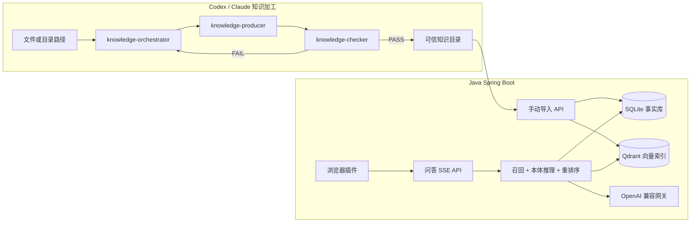

# 产品知识本体问答助手

面向单个企业内部产品资料的知识加工、跨文档检索与浏览器插件问答方案。系统将产品 Markdown 加工为带章节、概念、本体关系和原文证据的知识包；Java 后端用语义召回、本体推理和重排序选取证据，再通过 SSE 向插件流式返回答案。

本方案是独立产品，不依赖仓库中的智能问答平台、OCR、工单或多租户能力。

## 1. 背景

产品文档通常有三个问题：用户问法随机且口语化；一个问题经常同时依赖操作文档和规则文档；文档更新后容易让旧章节或跨文档关系留在检索结果中。将全文交给模型成本高且不可控，单靠关键词又无法覆盖同义表达。

本方案把职责拆开：

```text
Codex / Claude Skill Loop：把可信产品 Markdown 加工为知识包
SQLite：保存章节、概念、关系和证据等权威事实
Qdrant：只做章节语义召回
Java 服务：本体扩展、重排序、回答编排和 SSE
浏览器插件：单轮问题输入、流式展示与来源展示
```

## 2. 范围与边界

### 2.1 第一期开箱范围

- 单租户、单一可信知识目录。
- 中文产品文档和中文自然语言问题。
- 通过 OpenAI 兼容网关调用聊天和 Embedding 模型。
- 单轮问答，回答完成后仅显示“文档 / 章节”来源。
- 手动触发知识导入，不监听目录变化。
- 最大四跳的确定性本体关系扩展。

### 2.2 明确不做

- 多租户、SSO、细粒度权限和跨企业隔离。
- OCR、文档上传后台、人工审核流、工作流引擎。
- 多轮会话记忆、工单、第三方系统工具调用。
- RDF、OWL、Neo4j 或让 LLM 自由进行图谱推理。
- 把 Qdrant 当成知识事实源。

## 3. 总体架构



完整链路分为两条：

```text
知识加工：Markdown -> 三角色 Loop -> 可信目录 -> 手动导入 -> SQLite + Qdrant
用户问答：问题 -> Embedding -> Qdrant -> SQLite / 本体 -> 重排序 -> SSE 回答
```

## 4. 核心决策

| 决策 | 选择 | 原因 |
| --- | --- | --- |
| 事实库 | SQLite | 章节替换、关系证据和有效性可事务化，且可完整重建索引。 |
| 向量库 | Qdrant | 适合 Java 服务、元数据过滤和独立部署；仅承担语义候选召回。 |
| 文档格式 | Markdown + 同名 Sidecar JSON | 原文可读、结构可检索、关系可追溯。 |
| 文档加工 | 总控 + 生产者 + 检查者 | 将抽取和检查分离，可信目录仅接受 PASS 产物。 |
| 本体推理 | Java 有界规则遍历 | 结果稳定、可解释，避免 LLM 发散。 |
| 回答 | 重排序与回答两次模型调用 | 控制上下文，避免把候选全文交给最终模型。 |
| 更新 | 同名文件替换、显式删除 | 不将“本次没扫描到”误判为删除。 |

## 5. 运行形态

### 5.1 知识加工

在 Codex 或 Claude 中给总控 Skill 一个 Markdown 文件或目录：

```text
knowledge-orchestrator /product-docs/team.md
knowledge-orchestrator /product-docs/
```

目录模式递归找 Markdown，以文件名字典序逐一处理。前一份成功知识包生成的概念和关系，会作为后一份的局部图谱上下文。详细协议见[知识加工 Skill 协议](./references/知识加工Skill协议.md)。

### 5.2 后端导入

后端固定读取可信目录：

```text
/knowledge/published/
  team.md
  team.knowledge.json
  billing.md
  billing.knowledge.json
```

运营或自动化显式调用：

```http
POST /api/admin/knowledge-imports
Content-Type: application/json

{"sourceKey":"team.md"}
```

该接口只开放给部署网络中的内部运维入口，不开放给浏览器插件。导入不负责审核文档，只校验文件对、Hash 和 Schema，再写入 SQLite 并调度 Qdrant 同步。详见[数据、本体与导入设计](./references/数据本体与导入设计.md)。

### 5.3 插件问答

浏览器插件只负责请求和展示：

```text
Popup -> Java POST /api/chat/stream -> SSE delta / sources / done
```

插件不保存模型密钥，不直接访问 SQLite、Qdrant 或模型网关。详见[检索、回答与浏览器插件](./references/检索回答与浏览器插件.md)。

## 6. 端到端示例

用户问题：

> 邀请链接过期后重新邀请，会不会占用席位？

处理过程：

```text
Qdrant 直接命中：团队成员管理 > 邀请链接失效
入口概念：invitation_link_expired

SQLite 图谱扩展：
invitation_link_expired --exception_of--> member_invitation
member_invitation --creates--> pending_invitation
pending_invitation --governed_by--> seat_billing

重排序候选：
1. 团队成员管理 > 邀请链接失效
2. 席位与计费 > 待接受邀请
3. 团队成员管理 > 成员角色（排除）

回答模型：只读取前两节完整原文，流式输出答案。
插件来源：团队成员管理 / 邀请链接失效；席位与计费 / 待接受邀请。
```

这里没有让“邀请链接失效”文档越权描述席位规则；该规则只由拥有相应原文证据的计费文档支撑。

## 7. 落地阶段

1. 建立三份 Skill 与共享协议，选取 3 至 5 篇样本文档跑通 Loop。
2. 实现 Spring Boot 中的 JSON 校验、SQLite 导入和 Qdrant 同步任务。
3. 实现 Embedding、召回、本体推理、重排序和 SSE API。
4. 实现浏览器插件 Popup 与流式渲染。
5. 用 30 至 50 道真实问题进行召回、跨文档和拒答验收。

## 8. 验收与风险

系统不以“模型回答流畅”作为成功标准。必须验证：正确章节是否出现在 Top 20 召回中、是否进入 Top 3 重排序、本体是否补到必要规则、无资料问题是否拒答、答案来源是否与最终证据一致。详见[运行、观测与验收](./references/运行观测与验收.md)。

## 9. 参考文档

- [知识加工 Skill 协议](./references/知识加工Skill协议.md)
- [可执行 Skill 模板](./references/可执行Skill模板.md)
- [知识包 JSON Schema](./references/knowledge-package.schema.json)
- [Checker 判定 JSON Schema](./references/checker-verdict.schema.json)
- [数据、本体与导入设计](./references/数据本体与导入设计.md)
- [检索、回答与浏览器插件](./references/检索回答与浏览器插件.md)
- [运行、观测与验收](./references/运行观测与验收.md)
