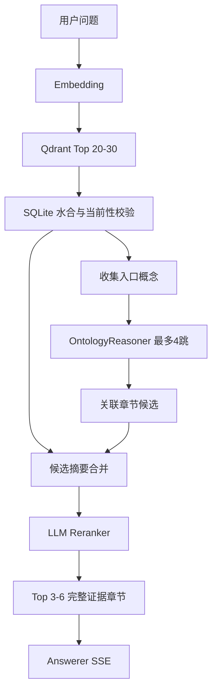

# 检索、回答与浏览器插件

## 0. 后端工程坐标

后端工程位于 `ProjectIQ/backend`，使用 Maven 坐标 `io.github.lvdaxianer.dinghai:knowledge-assistant`，Java 根包为 `io.github.lvdaxianer.dinghai.projectiq`。以下模块名称均相对于该根包：

## 1. 后端模块

Spring Boot 保持为模块化单体：

```text
knowledge-import：可信目录读取、Schema 校验、SQLite 事务、Qdrant 同步任务
knowledge-store：SQLite 文档、章节、概念、边和证据查询
embedding-client：OpenAI 兼容 /embeddings 调用
vector-retriever：Qdrant Top K 检索与 payload 过滤
ontology-reasoner：有界强关系遍历和覆盖规则
reranker：候选摘要的结构化 LLM 重排序
answer-service：证据上下文、OpenAI 兼容流式回答、SSE 映射
```

所有模型调用经过统一网关适配器：

```yaml
gateway:
  baseUrl: https://<openai-compatible-gateway>/v1
  apiKey: ${MODEL_GATEWAY_API_KEY}
  chatModel: <chat-model>
  embeddingModel: <embedding-model>
```

Producer、Checker、Reranker、Answerer 可复用同一个 `chatModel`，但必须是独立请求和独立系统提示词：Producer 温度 0.1，Checker/Reranker 为 0，Answerer 为 0.2。Embedding 始终独立调用。

## 2. 问答检索链路



### 2.1 召回

用户问题经 Embedding 后，在 Qdrant 取 Top 20 至 30。Qdrant 距离仅用于候选，不作为最终事实判断。Java 根据 `sectionId` 从 SQLite 读取章节，并丢弃过期、缺失或 Hash 不匹配的数据。

### 2.2 本体扩展

收集命中 section 的 `conceptId` 作为入口。Reasoner 走强关系，产生“需要补充的概念”，再从 SQLite 找这些概念的章节。距离越远优先级越低：

```text
第 0 跳直接语义命中：最高
第 1 跳：高
第 2 跳：中
第 3、4 跳：只供重排序选择
```

`overrides` 用于排除被新规则覆盖的证据，不允许新旧冲突内容同时进入 Answerer。

### 2.3 重排序

Reranker 只接收轻量候选：

```text
sectionId
文档标题 / 章节路径
摘要
conceptIds
直接召回或图谱跳数
```

输出严格 JSON：

```json
{
  "rankedSectionIds": [
    "team_member_management.invitation_link_expired",
    "seat_and_billing.pending_invitation"
  ],
  "excludedSectionIds": ["team_member_management.member_role"]
}
```

Java 只接受原候选集合中的 ID。最终最多六节、三份文档、约 8,000 个中文字符；同文档相邻内容去重。

### 2.4 回答

Answerer 输入：

```text
系统约束：只依据给定产品资料回答；资料未覆盖时明确说明；不得猜测。
用户问题：...
证据：[文档 > 章节] 完整正文 ...
```

模型不能自行搜索、引用未提供章节或补充产品外事实。回答完成后，由后端根据实际选用 sections 生成简化 sources。

## 3. SSE API

请求：

```http
POST /api/chat/stream
Content-Type: application/json
Accept: text/event-stream

{"question":"邀请链接过期后重新邀请，会不会占用席位？"}
```

`/api/chat/stream` 是查询的例外端点：问题通过 POST body 传递以避免 URL 长度和字符编码限制，响应必须是 SSE，不具备资源创建语义。其他资源接口仍遵循名词路径和 HTTP 方法语义。

正常事件：

```text
event: delta
data: {"text":"邀请链接过期后，可以……"}

event: sources
data: {"sources":[
  {"documentName":"团队成员管理","sectionPath":"邀请链接失效"},
  {"documentName":"席位与计费","sectionPath":"待接受邀请"}
]}

event: done
data: {}
```

错误事件：

```text
event: error
data: {"code":"answer_failed","message":"暂时无法生成回答，请稍后重试。"}
```

状态处理：

| code | 后端行为 | 插件文案 |
| --- | --- | --- |
| `no_knowledge` | 不调用聊天模型 | 当前产品资料未覆盖这个问题。 |
| `knowledge_updating` | 不用旧索引回答新版本 | 产品资料正在更新，请稍后重试。 |
| `no_relevant_knowledge` | 不调用聊天模型 | 已检索相关资料，但没有找到可确认的答案。 |
| `answer_failed` | 中断 SSE | 暂时无法生成回答，请稍后重试。 |

## 4. 浏览器插件

第一期采用最小 Chrome/Chromium 扩展：

```text
popup.html / popup.js：问题输入、发送、流式渲染、来源展示
service worker：统一请求配置、取消请求、错误转发
options page：后端基础地址和固定客户端密钥配置
```

插件仅调用 Java 后端，不能存放模型网关密钥。第一期不做用户登录和会话持久化；部署上依赖内网地址和反向代理隔离访问。可轮换 `X-Client-Key` 仅用于轻量筛选、统计或撤销安装实例，因扩展可读取它，不能作为身份认证或管理接口保护手段。`knowledge-imports` 和 `knowledge-sources` 管理接口不得暴露给插件，必须由独立的内部运维身份或部署侧服务密钥保护。后续引入 SSO 时在网关增加身份解析，不改变检索管线。

插件 UI 的结束态：

```text
回答正文
参考：团队成员管理 / 邀请链接失效
      席位与计费 / 待接受邀请
```

不显示原文 quote、内部 section ID、向量距离或模型调试信息。
