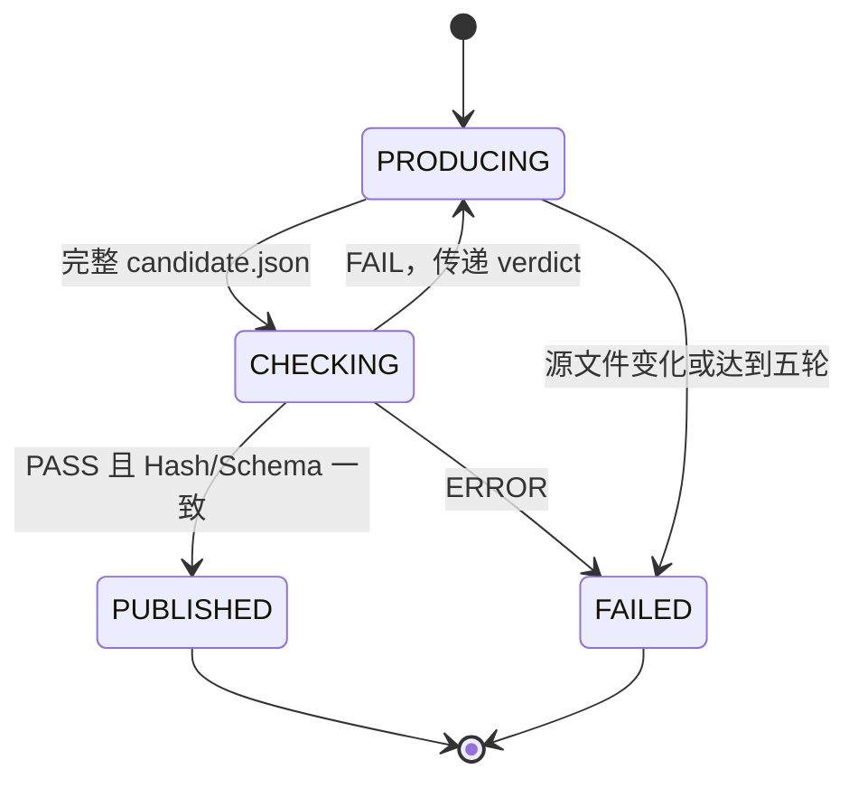

# 知识加工 Skill 协议

## 1. 角色与共享协议

系统有三个执行 Skill：

| Skill | 角色 | 负责 | 不负责 |
| --- | --- | --- | --- |
| `knowledge-orchestrator` | 总控 | 输入、上下文、调度、循环、退出、输出和总计 | 抽取或裁决产品事实 |
| `knowledge-producer` | 生产者 | 从 Markdown 生成完整知识包，或根据错误完整修复 | 发布、自我审核 |
| `knowledge-checker` | 检查者 | 独立核对原文、候选包、已有图谱，返回判定 | 修改候选包、发布 |

三者共享 `knowledge-loop-protocol`。协议定义 JSON Schema、哈希、ID、概念类型、关系类型、错误码与状态机；它不是第四个执行角色。

## 2. General Loop



总控固定流程：

```text
1. 固化本轮 sourceHash，构建 graphContext 和 previousKnowledge。
2. 调 Producer(create)。
3. 校验 candidate 文件存在、完整且 Hash 可计算。
4. 调 Checker。
5. PASS：校验 sourceHash、candidateHash、Schema，写入可信目录。
6. FAIL：将 verdict 原样交给同一个 Producer(repair)，回到第 3 步。
7. ERROR、源文件变化或五轮失败：不发布，返回失败总计。
```

Producer 与 Checker 不直接通信。唯一交接物为完整 `candidate.json` 和结构化 `checker-verdict.json`。

## 3. 输入上下文

总控接收单文件或目录路径。目录模式按字典序逐份处理，建议用 `10-team.md`、`20-billing.md` 表达显式依赖顺序。

处理 `A.md` 时总控传递：

```text
source：A.md 的完整文本、固定 sourceKey、sourceHash
graphContext：可信目录中除旧 A.knowledge.json 外的聚合概念、别名、关系和关系证据摘要
previousKnowledge：旧 A.knowledge.json；首次处理时为空
checkerVerdict：repair 模式才有
```

图谱上下文不是手工维护的 `graph.json`。它由 `/knowledge/published/*.knowledge.json` 实时聚合；每份文件 PASS 后立即加入当前运行内存上下文。给模型的上下文只保留概念 ID、名称、别名、类型、直接关系和文档/章节定位，不发送其他文档正文。

## 4. Producer 规则

### 4.1 create 模式

Producer 必须：

1. 按 Markdown 标题提取可独立回答的章节。
2. 为章节绑定概念、概念类型、术语别名和原文行范围。
3. 优先复用 graphContext 中语义等价的 `conceptId`。
4. 仅抽取原文能证明的关系，并为每条关系给出原文 quote。
5. 输出完整知识包，不能输出补丁。

### 4.2 repair 模式

Producer 必须逐项处理 Checker 的所有 `severity=error` 问题，在完整候选包中修复，并返回 `resolvedIssueIds`。该字段只是声明，Checker 不得据此降低检查标准。

Producer 禁止：

- 用产品常识补充原文未写出的限制或计费事实。
- 用关联文档的事实为当前文档伪造证据。
- 发明协议外关系类型。
- 因标题改名创建重复概念。
- 写入可信目录。

## 5. Checker 规则

Checker 只依赖原文、候选包、协议和图谱上下文，不能读取 Producer 的思考过程。检查顺序：

```text
文件一致性 -> 章节忠实性 -> 概念身份 -> 关系及证据 -> 新旧影响 -> Schema
```

| 检查 | 通过标准 |
| --- | --- |
| 文件一致性 | `source.key` 与文件名相同，`source.hash` 等于当前原文 SHA-256。 |
| 章节忠实性 | 摘要、正文、标题路径和行锚点与原文一致；关键步骤、限制、异常未被错误合并。 |
| 概念身份 | 已有等价概念复用同一 ID；新概念的类型和定义受原文支持。 |
| 关系有效性 | 类型白名单、方向正确、两端存在、quote 在指定章节逐字出现且能支撑关系。 |
| 替换影响 | 已删除的旧关系必须显式 `retire`；其他文档证据不会被误撤销。 |

返回状态：

```text
PASS：可发布
FAIL：业务或证据错误，可交回 Producer 修复
ERROR：输入不可读、Schema 版本不支持等不可由 Producer 推断修复的问题
```

## 6. 知识包契约

可信目录中的文件成对出现：

```text
A.md
A.knowledge.json
```

最小结构：

```json
{
  "schemaVersion": "1.0",
  "source": {
    "key": "team.md",
    "hash": "sha256:<markdown-content-hash>",
    "title": "团队成员管理",
    "language": "zh-CN"
  },
  "document": {
    "id": "team_member_management",
    "summary": "成员邀请、邀请异常和成员状态规则。"
  },
  "sections": [],
  "concepts": [],
  "relations": []
}
```

章节：

```json
{
  "id": "team_member_management.invitation_link_expired",
  "headingPath": ["团队成员管理", "邀请链接失效"],
  "summary": "处理成员邀请链接过期或无法打开的问题。",
  "content": "邀请链接有效期为 72 小时。链接失效后……",
  "conceptIds": ["member_invitation", "invitation_link_expired"],
  "sourceAnchor": {"startLine": 42, "endLine": 61}
}
```

概念：

```json
{
  "id": "member_invitation",
  "name": "成员邀请",
  "type": "feature",
  "definition": "管理员邀请用户加入团队的产品能力。",
  "canonicalAliases": ["邀请成员", "邀请加入团队"],
  "queryAliases": ["加人", "拉同事", "邀请同事"],
  "evidenceSectionIds": ["team_member_management.invite_member"]
}
```

关系：

```json
{
  "operation": "add",
  "from": "invitation_link_expired",
  "type": "exception_of",
  "to": "member_invitation",
  "evidence": {
    "sectionId": "team_member_management.invitation_link_expired",
    "quote": "链接失效后，管理员可以取消原邀请并重新发起邀请。"
  }
}
```

硬性规则：

```text
document.id：首次发布后稳定，英文 snake_case
section.id：<document.id>.<语义章节名>，标题改名不应改变语义 ID
concept.id：全局英文 snake_case，不使用行号和自动编号
每个 section 至少一个 conceptId
每个 concept 至少一个当前文档的 evidenceSectionId
每个 relation evidence 的 quote 必须在 section.content 中逐字出现
operation 仅为 add、retain、retire
```

`canonicalAliases` 必须在原文出现；`queryAliases` 可是合理口语同义表达，但不能引入新产品事实、过于泛化或与已有概念产生明显歧义。

## 7. 类型、关系与错误码

概念类型：

```text
feature、action、entity、state、rule、exception、role
```

关系类型：

```text
parent_of、has_part、creates、requires、governed_by、exception_of、overrides、related_to
```

错误码第一期：

```text
INVALID_SCHEMA
SOURCE_HASH_MISMATCH
UNSUPPORTED_CONTENT
MISSING_SECTION
DUPLICATE_CONCEPT
INVALID_CONCEPT_TYPE
INVALID_RELATION_TYPE
INVALID_RELATION_DIRECTION
UNSUPPORTED_RELATION
MISSING_EVIDENCE
INVALID_EVIDENCE_QUOTE
UNDECLARED_RELATION_RETIREMENT
```

FAIL 问题必须具备 `issueId`、`severity`、`code`、`candidatePath`、`message` 和 `requiredAction`，例如：

```json
{
  "status": "FAIL",
  "issues": [{
    "issueId": "REL-001",
    "severity": "error",
    "code": "UNSUPPORTED_RELATION",
    "candidatePath": "/relations/2",
    "message": "当前文档没有席位占用事实。",
    "requiredAction": "删除该关系，或仅保留由计费规则文档支持的关系证据。"
  }]
}
```

## 8. 更新和删除

替换 `A.md` 时，旧 `A.knowledge.json` 不参与本轮 `graphContext`，但作为 `previousKnowledge` 用来识别当前文档原先支撑的关系。新版本仍支持的关系重新声明 `retain`；不再支持的关系声明 `retire`。

关系是否有效由全部当前证据决定。移除 A 的证据不会移除 B 仍在支持的同一关系。

缺失于某次目录扫描不等于删除。删除必须显式调用 `knowledge-orchestrator --remove A.md`，再由后端移除该源拥有的数据和向量。
