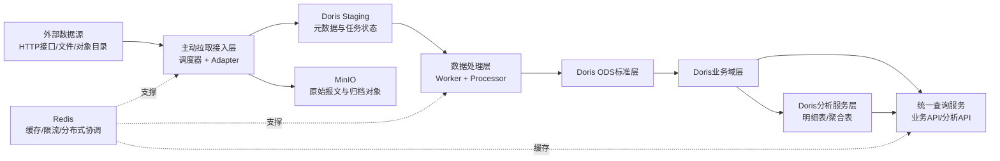
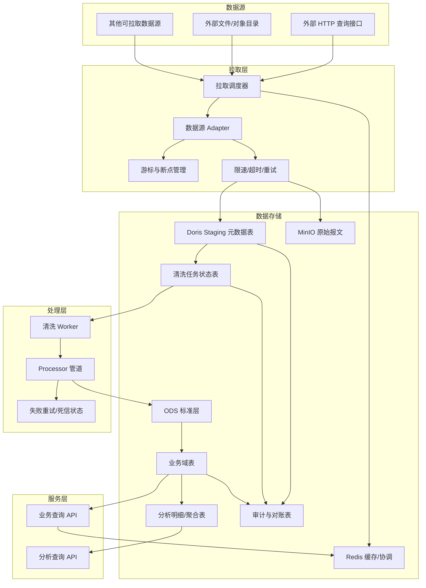
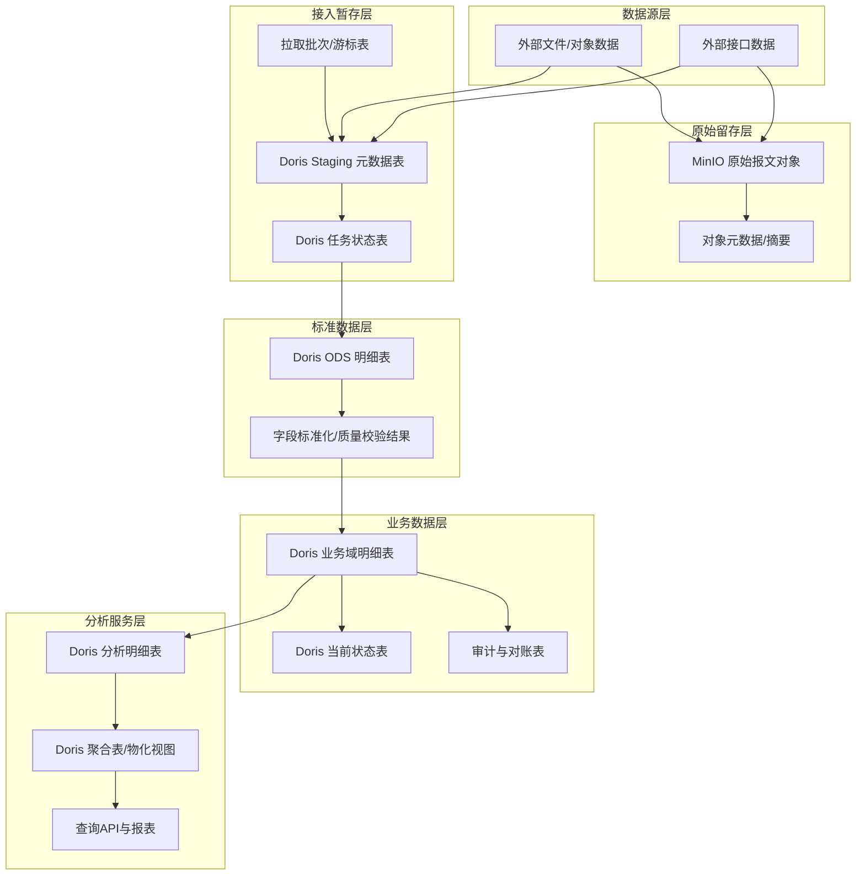
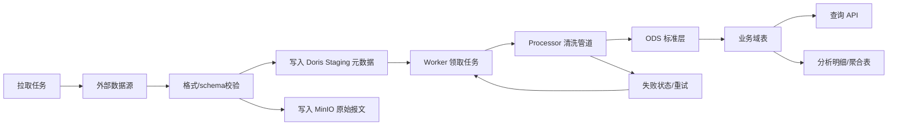
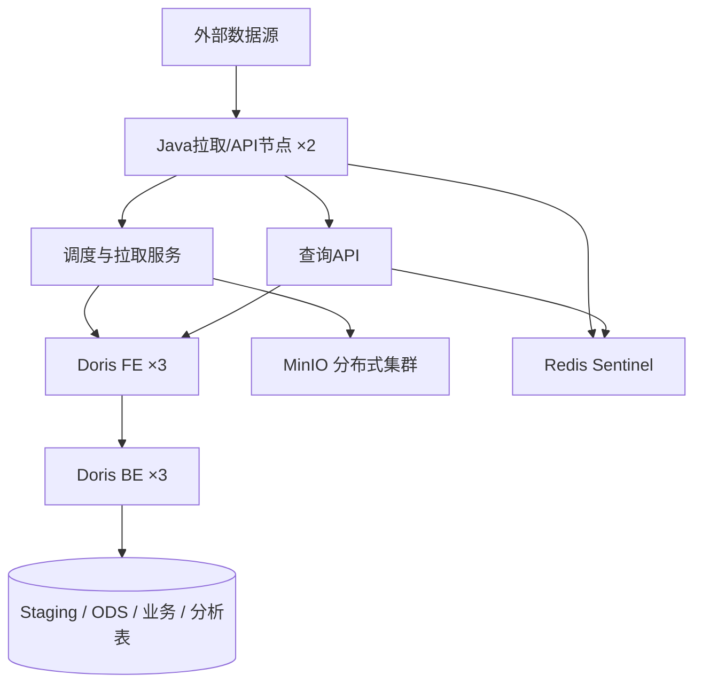
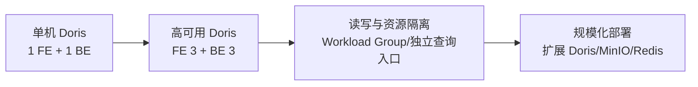

# 数据转换平台总体技术架构方案

## 结论先行

本方案最终采用 **Java + Doris + MinIO + Redis** 的精简架构：平台只通过主动拉取接入外部数据，原始报文由 MinIO 保存，Doris 统一承载任务状态、业务数据和分析数据，Redis 提供缓存、限流和分布式协调。

```text
外部系统
   ↓
拉取调度器 / 数据源 Adapter
   ↓
Doris Staging 元数据与任务表
   ↓
清洗 Worker
   ├─→ MinIO 原始报文
   └─→ Doris ODS / 业务域表
   ↓
查询 API / 分析查询
```

核心决策：

1. **接入方式**：只保留平台主动拉取，支持分页、游标、时间窗口和断点续拉。
2. **数据库统一**：处理状态、清洗结果、业务数据和分析数据统一使用 Doris；MinIO 继续保存原始报文，Redis 继续提供缓存、限流和分布式协调。
3. **异步处理**：通过 Doris Staging 表承担元数据落盘和待处理任务登记，原始报文正文写入 MinIO。
4. **任务可靠性**：Worker 通过状态、租约、重试次数和版本号抢占任务；处理成功后更新状态，失败进入重试或死信状态。
5. **业务与分析**：Doris 使用不同表模型和分区策略承载业务查询、明细查询和聚合分析；分析查询不能无限制扫描业务热表。
6. **部署基线**：单机版为 16 核、64GB 内存、4TB 可用 NVMe、单 FE + 单 BE，并部署单节点 MinIO/Redis；高可用版为 FE 3 + BE 3、MinIO 分布式集群、Redis Sentinel。
7. **边界**：Doris 适合本平台当前的批量写入、明细查询和分析场景，但不提供传统 OLTP 数据库级别的跨表事务；跨表一致性通过批次状态、幂等键和对账保证。

---

## 1. 背景与目标

### 1.1 业务定位

平台作为数据中枢，定时或按游标主动拉取外部系统数据，完成原始数据保存、清洗转换、业务数据落库和统一查询。

平台承担三类职责：

1. **数据拉取方**：按数据源配置主动调用外部接口或读取外部文件；
2. **数据处理方**：按业务类型执行字段映射、格式转换、校验、过滤和业务转换；
3. **数据服务方**：通过统一 API 和分析查询提供处理后的数据。

### 1.2 核心需求

| 类别 | 需求 |
| --- | --- |
| 数据接入 | 只支持平台主动拉取，支持分页、游标、时间窗口和断点续拉 |
| 数据处理 | 管道化清洗，当前以 Java Processor 硬编码实现，保留规则化演进空间 |
| 数据存储 | Doris 统一承载数据库数据；MinIO 保存原始报文；Redis 提供缓存和分布式协调 |
| 数据生命周期 | 默认保留半年业务数据；原始报文清洗成功且对账完成后短期保留 |
| 对外服务 | 查询 API 无状态部署，按业务查询和分析查询分流 |
| 流量管控 | 控制拉取并发、批次大小和外部接口调用频率，避免压垮外部系统和 Doris |
| 可观测性 | 监控拉取游标、拉取延迟、Staging 积压、清洗成功率、Doris 查询和副本状态 |

### 1.3 非目标

- 不接收外部 HTTP 推送数据；
- 不在 Doris 中实现复杂跨表事务；
- 不把 Doris 当作任意 OLTP 业务系统的通用数据库。

### 1.4 约束条件

1. 技术栈为 Java + Doris + MinIO + Redis；
2. 当前为物理机部署，无容器编排环境；
3. 数据量为中小规模，实时性要求不高，以秒级到分钟级准实时为主；
4. 有国产化和组件数量控制要求；
5. 将来可能有复杂查询和报表需求；
6. 外部数据源支持按时间、游标或分页方式拉取。

---

## 2. 总体架构

### 2.1 总体逻辑架构图

总体逻辑架构体现数据从外部数据源进入平台、经过拉取与处理、最终提供业务查询和分析服务的主链路。MinIO 和 Redis 作为支撑组件，分别承担原始报文保存和缓存/分布式协调职责。



### 2.2 功能架构图



### 2.3 分层数据架构图

分层数据架构用于区分原始数据、处理过程数据、标准数据、业务数据和分析数据的职责，避免不同用途的数据混在同一张表中。



数据层职责约束：

1. **原始留存层**只保存原始报文和对象定位信息，不直接承担业务查询；
2. **接入暂存层**保存拉取批次、游标、任务状态和 MinIO 对象地址；
3. **标准数据层**完成字段规范化、类型转换和质量校验；
4. **业务数据层**面向业务查询和状态读取，按业务主键设计模型；
5. **分析服务层**面向统计分析和报表查询，使用独立分区、聚合表或物化视图降低扫描成本。

### 2.4 数据流



### 2.5 控制面与数据面

- **控制面**：数据源配置、拉取计划、游标、限速策略、Schema、管道版本、重试策略、生命周期策略和权限配置。
- **数据面**：拉取 Adapter、Doris Staging、清洗 Worker、业务表、分析表和查询 API。

控制面配置必须版本化，支持发布、回滚和审计。拉取任务读取已发布配置，不直接使用未发布的临时配置。

---

## 3. 核心设计

### 3.1 数据源 Adapter

不同外部数据源使用独立 Adapter，统一输出平台内部的标准拉取结果：

```json
{
  "dataId": "全局唯一数据ID",
  "source": "数据源标识",
  "bizType": "业务类型",
  "schemaVersion": "Schema版本",
  "receiveTime": "平台接收时间",
  "sourceCursor": "外部游标或分页位置",
  "payload": "原始报文"
}
```

Adapter 必须支持：

- 请求超时和连接池限制；
- 外部接口限速；
- 分页或游标保存；
- 断点续拉；
- 外部数据重复和乱序；
- 临时错误指数退避；
- 拉取结果校验和数据指纹计算。

### 3.2 拉取调度

拉取任务以数据源和业务类型为维度配置，记录以下状态：

| 状态/字段 | 说明 |
| --- | --- |
| `lastCursor` | 上次成功提交的外部游标或分页位置 |
| `watermark` | 已经确认处理到的时间水位 |
| `nextRunTime` | 下一次允许执行时间 |
| `leaseOwner` | 当前执行实例 |
| `leaseExpireTime` | 租约过期时间 |
| `lastError` | 最近一次失败摘要 |
| `consecutiveFailures` | 连续失败次数 |

调度器使用租约避免多实例重复执行；租约超时后允许其他实例接管。游标只能在本批数据成功写入 Doris Staging 后推进，避免拉取成功但数据未落库造成跳数。

### 3.3 Doris Staging 设计

Doris Staging 表承担原始报文的元数据落盘和待处理任务登记；原始报文正文保存到 MinIO，Doris 保存对象地址、摘要和处理状态。

建议字段：

```text
data_id             全局唯一ID，唯一键
source              数据源
biz_type            业务类型
schema_version      Schema版本
source_cursor       外部游标/分页位置
receive_time        平台接收时间，分区键
object_uri          MinIO原始报文地址
payload_preview     可选的检索摘要或小报文
payload_hash        原始报文指纹
status              PENDING/PROCESSING/SUCCESS/RETRY/DEAD
attempt_count       已处理次数
next_retry_time     下一次重试时间
lease_owner         Worker实例
lease_expire_time   租约过期时间
pipeline_version    清洗管道版本
last_error          最近错误摘要
```

任务领取不能使用简单的“查询待处理再更新”两步操作，必须使用版本号、租约和条件更新避免多个 Worker 同时处理同一条数据。

### 3.4 Doris 表模型分工

| 数据用途 | Doris 表模型 | 说明 |
| --- | --- | --- |
| Staging 当前状态 | Unique Key | 以 `data_id` 去重并更新处理状态 |
| 原始处理记录 | Duplicate Key | 追加保存拉取和处理事件，便于审计 |
| ODS 标准数据 | Duplicate/Unique Key | 根据是否保留重复记录选择 |
| 业务域当前状态 | Unique Key | 以业务唯一键保留最新状态 |
| 分析明细 | Duplicate Key | 保留明细，支持多维扫描 |
| 统计结果 | Aggregate Key 或物化视图 | 固定维度的聚合查询 |

表模型在创建时确定，必须根据“保留所有明细、按主键更新、还是预聚合”选择，不能把所有表都简单设成同一种模型。

### 3.5 清洗管道

每个清洗步骤实现统一的 `Processor` 接口，由业务类型和管道版本组装：

```text
读取 Staging
  → 领取租约
  → Schema 校验
  → 字段映射
  → 格式转换
  → 业务校验
  → 写 ODS/业务域表
  → 更新处理状态
```

清洗失败分为三类：

1. **临时错误**：按退避策略重试；
2. **数据错误**：进入 DEAD 状态，等待人工修复或重放；
3. **系统错误**：暂停相关业务类型，避免错误数据持续冲击 Doris。

Doris 不承担跨 Staging、ODS 和业务表的完整事务，因此必须通过 `data_id`、业务唯一键、批次号和对账表保证重复执行可恢复。

### 3.6 数据生命周期

- MinIO 原始报文：清洗成功且对账完成后默认保留 7~30 天；
- 失败、待重放和未完成对账数据：保留到处理闭环完成；
- 业务域数据：默认保留半年，按接收时间做月分区；
- 分析明细：按查询和报表需求保留，可独立于业务域数据设置周期；
- 超期数据：先完成导出、校验、归档登记，再删除分区。

时间分区是一张逻辑表下的多个物理分区，不是应用层维护的多张独立业务表。应用继续查询逻辑表，Doris 负责分区裁剪和数据路由。

---

## 4. Doris 选型与容量

### 4.1 选型结论

**当前统一采用 Doris 作为业务库和分析库，不再引入 PostgreSQL；MinIO 继续承担原始报文存储，Redis 继续承担缓存和分布式协调。**

选择原因：

- 当前数据量中小规模，避免建设多套数据库高可用；
- 业务查询和分析查询都以批量写入、明细查询和聚合查询为主；
- 数据转换平台的数据状态可以通过状态表、唯一键、版本号和对账机制实现；
- Doris 的 FE/BE 多副本能力可同时覆盖业务存储和分析存储；
- 组件少，物理机部署和运维链路更短。

边界：如果未来出现高频小事务、复杂跨表事务、强一致余额/库存或大量点更新场景，应重新评估是否引入专用 OLTP 数据库，而不是继续扩展 Doris 的职责。

### 4.2 单机部署资源与 Doris 容量基线

单机版适合开发、联调和中小规模生产验证。以下容量是运行基线，不是 Doris 的物理上限；最终承载量应以真实报文和查询压测结果为准：

| 资源/数据项 | 建议基线 | 说明 |
| --- | --- | --- |
| CPU | 16 核以上 | 拉取、Worker、Doris FE/BE 和查询服务共用 |
| 内存 | 64GB | 需要给 Doris、Java 进程和操作系统预留空间 |
| 磁盘 | 4TB 可用 NVMe | Doris、MinIO 和系统共用时，整体预留 30%~40% 空间 |
| Doris 业务/ODS 数据 | ≤500GB | 含 Staging 元数据、ODS 和业务表，不含 MinIO 原始报文 |
| Doris 分析数据 | ≤500GB，可选 | 只保留分析所需字段或明细，可通过聚合表降低存储量 |
| Doris 逻辑数据总量 | 建议 ≤1TB，扩展评估 ≤1.5TB | 不是物理上限，需结合 Compaction、查询性能和磁盘水位评估 |
| MinIO 原始报文 | 200~500GB 起步 | 独立于 Doris 计算，按保留周期和备份策略清理 |
| 单个时间分区 | 100万~500万行 | 实际以行宽、索引和查询压测为准 |

单机版使用 1 个 FE + 1 个 BE、1 个 MinIO 实例和 1 个 Redis 实例，不具备节点级高可用。所有重要数据必须备份到外部存储；备份存储不计入平台运行时组件，但属于生产依赖。

### 4.3 高可用集群基线



| 组件 | 最小实例数 | 高可用方案 |
| --- | --- | --- |
| Java 拉取/API | 2 | 无状态多副本，支持优雅上下线 |
| 调度器 | 2 | 租约和任务接管，避免重复拉取 |
| Doris FE | 3 | 多数派选主，前置负载均衡 |
| Doris BE | 3 | 数据副本数建议 3，跨物理机/故障域 |
| MinIO | 4 个故障域 | 分布式保存原始报文，支持故障恢复和短期归档 |
| Redis | 3 | Sentinel 或等价高可用部署，提供缓存和分布式协调 |
| 备份存储 | 外部 | 用于 Doris/MinIO 故障恢复和长期归档 |

高可用版本采用 Doris、MinIO 和 Redis 的集群部署；Doris 负责业务数据和分析数据，MinIO 负责原始报文，Redis 负责缓存和分布式协调，Java 服务负责拉取、任务调度和处理编排。

### 4.4 Doris 高可用与可靠性

- FE 至少 3 个节点，避免单节点元数据故障；
- BE 至少 3 个节点，业务表和分析表副本数建议为 3；
- 副本必须跨物理机或故障域；
- 写入成功条件、副本修复和 Tablet 健康状态纳入监控；
- 查询服务连接 FE 负载均衡入口，不固定连接单个 FE；
- 通过 Workload Group 或资源组隔离拉取写入、清洗和分析查询；
- Doris 故障时，拉取任务暂停或退避，不能无限堆积内存；恢复后从 Doris 中的游标和任务状态继续处理。

### 4.5 容量评估原则

容量不能只按行数估计，应同时记录：

- 每日拉取数据量和峰值数据量；
- 平均/最大报文大小；
- Staging 元数据和 MinIO 原始报文的保留周期；
- 业务表和分析表的副本系数；
- Tablet 数量和分布；
- 导入耗时、Compaction 延迟和查询 P95/P99；
- 磁盘安全水位和故障恢复时间。

建议以以下公式估算单机热数据空间：

```text
Doris 热数据空间
≈ Staging/ODS/业务数据 + 分析数据
  + 索引/排序/Compaction开销
  + 30%~40%安全余量

MinIO 热数据空间
≈ 原始报文日增量 × 保留天数
  + 对象版本/临时文件/备份开销
  + 预留空间
```

如果 Doris 和 MinIO 共用单机磁盘，应先按两者合计容量规划；如果后续将 MinIO 迁移到独立存储，Doris 可使用更多本地磁盘空间。以上数据必须通过真实报文 POC 验证，不把数据库产品理论上限当作容量目标。

---

## 5. 运行可靠性

### 5.1 拉取失败与重试

| 失败类型 | 处理方式 |
| --- | --- |
| 网络超时 | 有上限的指数退避重试 |
| 外部限流 | 尊重外部响应，延后下一次拉取 |
| 返回格式错误 | 记录原始响应摘要，任务失败并告警 |
| 游标失效 | 回退到安全时间窗口，依靠 `dataId` 去重 |
| Doris 暂时不可用 | 暂停拉取，等待 Doris 恢复，不推进游标 |
| 清洗数据错误 | 标记 DEAD，提供人工修复和定向重放 |

### 5.2 幂等与一致性

必须分别定义：

- 数据源唯一键；
- 平台 `dataId`；
- 业务实体唯一键；
- 拉取批次号；
- Processor 版本；
- 重放规则。

同一数据可能因外部接口重复、时间窗口重叠、游标回退或 Worker 超时而多次进入 Staging。Doris 写入必须通过 Unique Key、版本号或条件更新实现幂等，不能假设每条数据只会到达一次。

### 5.3 监控指标

| 类别 | 关键指标 |
| --- | --- |
| 拉取 | 调用次数、成功率、外部 RT、游标延迟、连续失败次数 |
| Staging | PENDING/PROCESSING/RETRY/DEAD 数量、最老数据年龄 |
| 清洗 | 成功率、失败率、重试次数、Processor 耗时 |
| Doris | FE/BE 存活、Tablet 副本健康、磁盘水位、Compaction、导入耗时 |
| 查询 | QPS、P95/P99、扫描行数、慢查询、超时数 |
| 数据质量 | 拉取量、标准化量、业务落库量、对账差异 |

### 5.4 告警与恢复

- Staging 最老数据超过阈值：告警并降低或暂停新拉取；
- Doris 副本异常：告警，禁止继续扩大数据写入规模；
- 连续拉取失败：按数据源隔离任务，不影响其他数据源；
- DEAD 数据增长：进入人工处理队列；
- 对账不一致：禁止删除相关原始数据；
- Doris 磁盘达到安全水位：停止非必要分析任务并执行生命周期清理。

---

## 6. 演进路径



演进原则：

1. 数据量增长优先扩 Doris BE 和副本资源；
2. 查询与写入互相影响时，先做 Workload Group 和查询模型优化；
3. 分析数据量扩大时增加聚合表、物化视图或独立 Doris 集群；
4. 数据规模扩大时，扩展 Doris BE、MinIO 存储和 Redis 集群；
5. 只有出现强事务 OLTP 需求时，才重新引入专用业务数据库。

---

## 7. 风险与边界

1. **Doris 不是传统 OLTP 数据库**：跨表事务、频繁单行更新和复杂状态转移需要通过状态机、批次和对账补偿实现。
2. **Staging 表兼任任务队列**：中小数据量可接受，但必须控制轮询频率、租约并发和状态更新压力。
3. **Doris 业务与分析共集群**：必须做资源隔离；若大查询影响拉取和清洗，应拆分分析集群。
4. **只主动拉取意味着依赖外部接口**：外部接口不可用、游标失效、数据迟到和重复必须有恢复策略。
5. **原始数据依赖 MinIO**：MinIO 保存原始报文，Doris 保存对象地址、摘要和处理状态；若需要长期合规归档，应增加外部备份或归档存储。
6. **单机版不具备节点级高可用**：适合验证和中小规模生产，不适合作为强可用生产部署。

---

## 8. 参考资料

- Apache Doris 官方文档：系统架构、FE/BE 高可用、数据模型和集群规划；
- 待补充：真实报文 POC、Doris 导入压测、查询压测、故障恢复演练和国产化兼容性验证记录。
