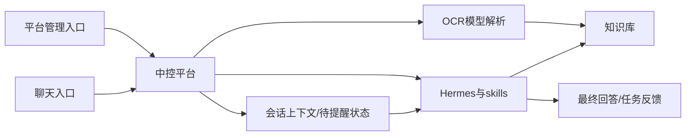
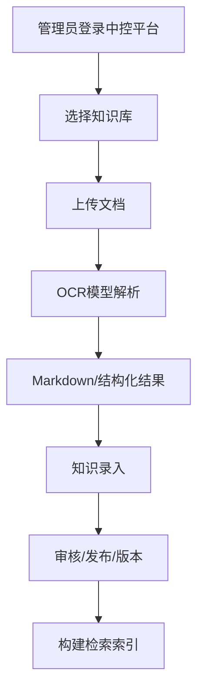
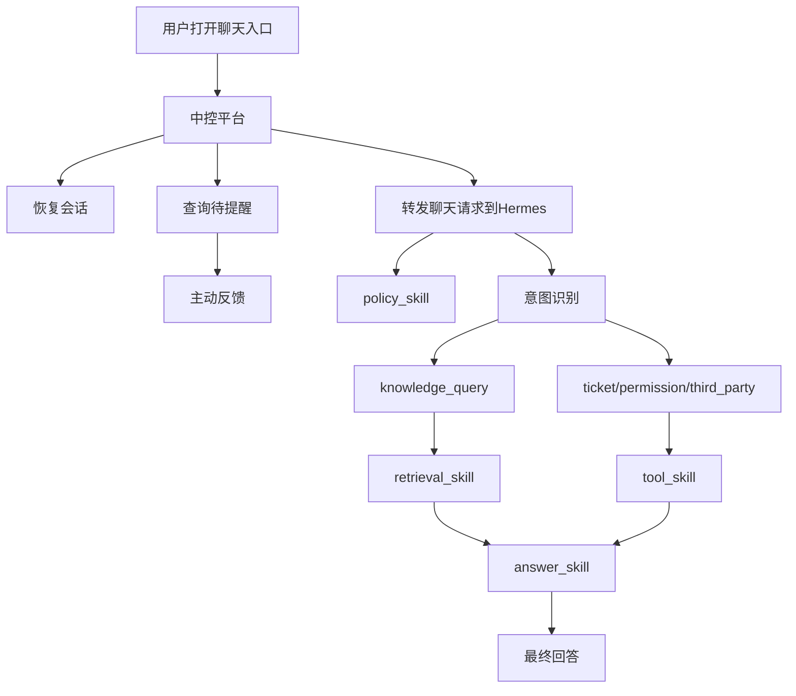

# 智能问答平台

智能问答平台面向两类入口：

1. **中控平台入口**
2. **聊天入口**

平台的核心目标是把资料沉淀为知识资产，并让用户通过聊天入口完成知识问答、工单处理、权限申请和第三方系统问询。

---

## 1. 方案说明

整个平台当前收敛为 4 个主模块：

- **中控平台**
- **OCR模型解析**
- **知识库**
- **Hermes与skills**

这 4 个模块共同完成“资料入库”和“用户聊天”两条主链路。

---

## 2. 文档结构

方案文档分为 5 份：

1. [中控平台设计](./references/中控平台设计.md)
2. [Hermes与技能编排设计](./references/Hermes与技能编排设计.md)
3. [OCR模型解析设计](./references/OCR模型解析设计.md)
4. [知识库设计](./references/知识库设计.md)
5. [设计文件智能体技术方案](./references/设计文件智能体技术方案.md)
6. [本体诊断推理平台设计](./references/本体诊断推理平台设计.md)
7. [本体诊断推理POC](./references/本体诊断推理POC.md)

---

## 3. 子文档说明

### 3.1 [中控平台设计](./references/中控平台设计.md)

中控平台是整个智能问答平台的控制面，负责两类入口的统一承接：

- 平台管理入口：知识库选择、文档上传、权限与风控规则配置
- 聊天入口前置：会话恢复、待提醒查询、主动反馈、请求转发

中控平台不负责 AI 能力本身，而是负责入口、状态、分发和规则配置。

### 3.2 [Hermes与技能编排设计](./references/Hermes与技能编排设计.md)

Hermes 是聊天运行时中枢，负责：

- 意图识别
- 路由判断
- 技能编排
- 知识查询
- 工单、权限、第三方问询
- 最终回答收口

Hermes 内部采用 `policy_skill`、`retrieval_skill`、`tool_skill`、`answer_skill`、`session_skill`、`notice_skill` 的方式组织能力。

### 3.3 [OCR模型解析设计](./references/OCR模型解析设计.md)

OCR 模型解析模块只服务于资料入库链路，负责：

- 接收中控平台转发的文档解析任务
- 把 PDF / 图片解析为 Markdown 和结构化结果
- 返回解析状态、进度和结果引用

它不直接面向聊天用户。

### 3.4 [知识库设计](./references/知识库设计.md)

知识库负责：

- 承接 OCR 解析结果
- 录入、编辑、审核、发布、下线、版本管理
- 构建检索索引
- 为 Hermes 提供知识检索与证据结果

### 3.5 [设计文件智能体技术方案](./references/设计文件智能体技术方案.md)

设计文件智能体技术方案负责模板指标、文章校验、图谱审核、模型管理和智能体编排的细化设计，作为四个核心模块之上的专题实现参考。

### 3.6 [本体诊断推理平台设计](./references/本体诊断推理平台设计.md)

本体诊断推理平台设计补充知识库的语义抽取、规则治理、多本体桥接和可解释推理能力。它明确区分向量检索与正式推理链路：向量检索只能辅助候选发现和证据定位，正式结论必须来自已审核的事实、映射和规则。

### 3.7 [本体诊断推理POC](./references/本体诊断推理POC.md)

本体诊断推理 POC 以 `~/Downloads/Case知识库_7字段.xlsx` 中随机抽取的 30 条问答为样本，验证“候选抽取 → 人工审核 → 本体/规则发布 → 客户问题解析 → 诊断推理 → 原文证据回链”的完整链路，并提供 OpenAI 兼容模型接入、提示词模板和前端审核工作台设计。

## 4. 逻辑架构图

### 4.1 逻辑说明

- 中控平台是统一入口和控制面。
- OCR 模型解析只服务资料入库。
- 知识库既负责知识资产管理，也负责对 Hermes 提供知识查询能力。
- Hermes 是聊天运行时执行中枢。

---

## 5. 功能架构图

```mermaid
flowchart TD
    C[中控平台]
    C --> C1[登录与入口接入]
    C --> C2[知识库选择]
    C --> C3[文档上传]
    C --> C4[会话恢复]
    C --> C5[待提醒查询]
    C --> C6[规则配置]

    O[OCR模型解析]
    O --> O1[异步解析]
    O --> O2[Markdown输出]
    O --> O3[结构化结果输出]
    O --> O4[进度与回调]

    K[知识库]
    K --> K1[知识录入]
    K --> K2[审核发布]
    K --> K3[版本管理]
    K --> K4[索引构建]
    K --> K5[知识检索]

    H[Hermes与skills]
    H --> H1[意图识别]
    H --> H2[policy_skill]
    H --> H3[retrieval_skill]
    H --> H4[tool_skill]
    H --> H5[answer_skill]
    H --> H6[session_skill]
    H --> H7[notice_skill]
```

---

## 6. 流程架构图

### 6.1 资料解析与知识入库流程

### 6.2 用户聊天与主动反馈流程

---

## 7. 模块分工

| 模块 | 负责内容 | 不负责内容 |
| --- | --- | --- |
| 中控平台 | 登录、知识库选择、文档上传、会话恢复、待提醒查询、请求分发 | OCR解析、知识检索、最终答案生成 |
| OCR模型解析 | 文档异步解析、Markdown/结构化结果、进度与回调 | 知识审核发布、聊天编排 |
| 知识库 | 知识录入、审核发布、版本管理、检索索引、证据检索 | 文档原始解析、聊天编排 |
| Hermes与skills | 意图识别、聊天路由、知识查询、技能执行、最终回答 | 文档解析、知识录入审核 |

---

## 8. 核心功能归属

| 功能 | 中控平台 | OCR模型解析 | 知识库 | Hermes与skills |
| --- | --- | --- | --- | --- |
| 登录与入口接入 | 负责 |  |  |  |
| 知识库选择 | 负责 |  |  |  |
| 文档上传 | 负责 |  |  |  |
| 文档解析任务执行 |  | 负责 |  |  |
| Markdown/结构化结果输出 |  | 负责 |  |  |
| 知识条目录入 |  |  | 负责 |  |
| 审核/发布/版本管理 |  |  | 负责 |  |
| 检索索引构建 |  |  | 负责 |  |
| 会话恢复 | 负责 |  |  | 读取使用 |
| 待提醒查询 | 负责 |  |  | 读取与消费 |
| 主动反馈 | 前置查询与分发 |  |  | 组织提醒内容 |
| 意图识别 |  |  |  | 负责 |
| 知识查询 |  |  | 提供检索能力 | 发起调用 |
| 工单/权限/第三方问询 |  |  |  | 负责 |
| 最终回答 |  |  |  | 负责 |
| 权限与风控规则配置 | 负责 |  |  | 运行时使用 |

---

## 9. 当前落地原则

- 以单机部署为主，优先减少组件数量。
- 中控平台采用 Java Spring Boot 体系。
- OCR模型解析和知识检索能力可继续沿用 Python 体系。
- 权限与风控、答案生成、工具执行等能力先归入 Hermes 内部 skills，不独立拆服务。
