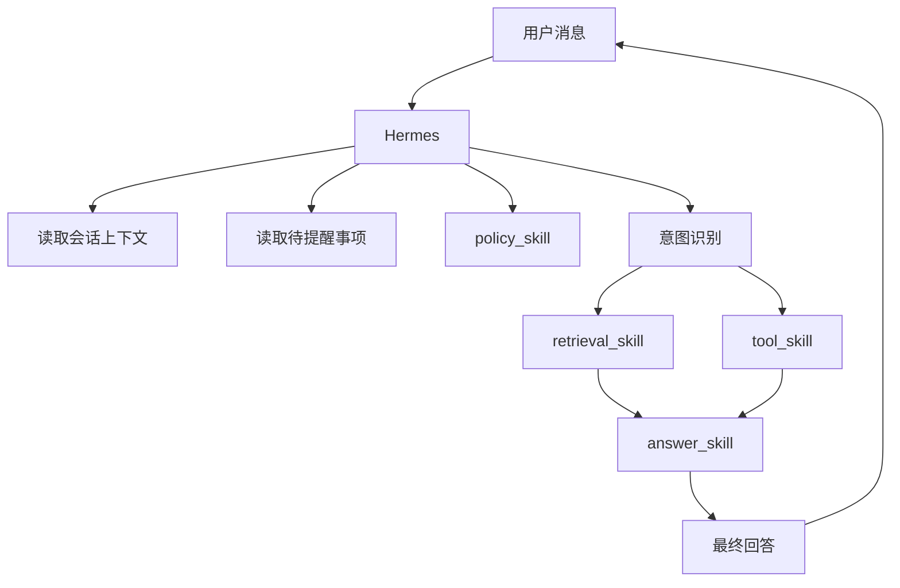

# Hermes与技能编排设计

- **日期**: 2026-06-05
- **状态**: 草案
**目标**: 作为聊天运行时中枢，负责意图识别、路由、技能编排、知识查询、业务动作执行和最终回答收口。

---

## 1. 职责边界

### 1.1 负责

- 聊天请求接入
- 意图识别
- 路由判断
- 多轮会话编排
- 调用知识库检索
- 调用内部 skills
- 最终回答生成
- 结果回写到会话上下文和待提醒状态

### 1.2 不负责

- 平台管理入口
- 文档 OCR 解析
- 知识录入审核

---

## 2. 内部 skills

Hermes 内部先按 skill 组织，而不是继续拆成独立服务：

- `policy_skill`
- `retrieval_skill`
- `tool_skill`
- `answer_skill`
- `session_skill`
- `notice_skill`

### 2.1 skill 说明

- `policy_skill`：读取中控平台配置的规则，在运行时执行权限、脱敏、确认和升级判断
- `retrieval_skill`：调用知识库检索证据
- `tool_skill`：处理工单、权限申请、第三方问询
- `answer_skill`：组织最终用户回答
- `session_skill`：读写会话上下文
- `notice_skill`：查询和消费待提醒事项

---

## 3. 模块功能清单

### 3.1 路由与编排功能

- 聊天请求接入
- 意图识别
- 槽位抽取
- 路由判断
- 多轮追问与补槽
- 子流程编排
- 失败兜底与降级

### 3.2 `policy_skill`

- 运行时权限校验
- 风险等级判断
- 脱敏判断
- 二次确认判断
- 人工升级判断

### 3.3 `retrieval_skill`

- 调用知识库检索
- 传递查询上下文
- 获取证据包与引用
- 将证据结果交给回答模块

### 3.4 `tool_skill`

- 工单处理
- 权限申请
- 第三方系统问询
- 跟进已有任务状态
- 将异步结果写入待提醒事项

### 3.5 `answer_skill`

- 组织最终回答
- 结合知识证据输出引用
- 结合工具结果输出状态反馈
- 拒答、确认、下一步建议表达

### 3.6 `session_skill` 与 `notice_skill`

- 读取会话上下文
- 回写会话上下文
- 查询待提醒事项
- 消费已读提醒
- 生成新的待提醒事项

---

## 4. 输入输出

### 4.1 输入

- 用户消息
- 会话上下文
- 待提醒事项
- 用户身份信息
- 业务元数据

### 4.2 输出

- 路由结果
- 技能执行结果
- 最终回答
- 回写后的会话状态
- 新生成的待提醒事项

---

## 5. 技术栈

Hermes 仍建议采用适合 AI 编排和快速迭代的服务化技术栈：

- `Python 3.12+`
- `FastAPI`
- `Pydantic v2`
- `httpx`
- `PostgreSQL` 或读取中控平台状态库
- `Redis`，可选，用于热点状态缓存
- `LLM Gateway`
- `OpenTelemetry`
- `structlog`

---

## 6. 路由范围

聊天入口的核心意图范围建议限定为：

- `knowledge_query`
- `ticket_request`
- `permission_request`
- `third_party_query`
- `follow_up_status`
- `chitchat`
- `unknown`

### 6.1 路由原则

- 先恢复会话与待提醒
- 先执行 `policy_skill` 的前置约束判断
- 再缩小候选范围
- 最后做意图识别与槽位抽取
- 低置信度时优先追问

---

## 7. 主流程

---

## 8. 一句话定义

Hermes 是聊天运行时的执行中枢，负责在中控平台配置规则的约束下，把知识查询、业务动作和最终回答组织成一条完整的交互链路。
