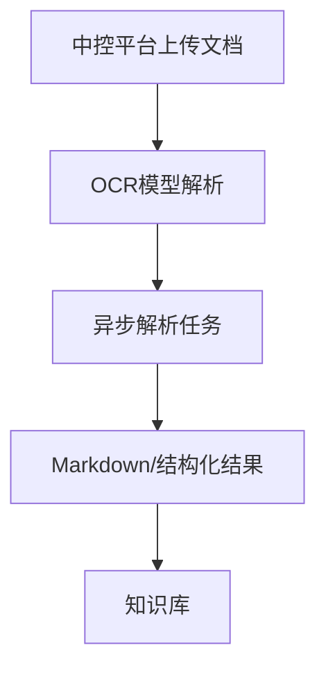

# OCR模型解析设计

- **日期**: 2026-06-05
- **状态**: 草案
**目标**: 将资料解析能力独立为 OCR 模型解析服务，只负责把文档转换为 Markdown 与结构化结果，供知识库入库使用。

---

## 1. 职责边界

### 1.1 负责

- 接收上传后的解析任务
- 异步处理 PDF / 图片文件
- 调用 OCR 模型或厂商能力
- 输出 Markdown
- 输出结构化解析结果
- 返回任务状态、进度和结果引用

### 1.2 不负责

- 知识审核与发布
- 聊天问答
- 检索召回
- 最终答案生成

---

## 2. 输入输出

### 2.1 输入

- 文件
- 文件类型
- 知识库标识
- 上传元数据
- 回调地址

### 2.2 输出

- `batch_id`
- `document_id`
- Markdown 文本
- 结构化结果
- 页级文本
- 坐标信息
- 解析状态与进度

---

## 3. 模块功能清单

### 3.1 任务接入功能

- 接收中控平台转发的解析任务
- 生成 `batch_id` 与 `document_id`
- 保存上传元数据
- 支持单文件与多文件批次

### 3.2 解析执行功能

- PDF 解析
- 图片 OCR
- OCR 厂商适配
- 直传 PDF 与图片 fallback 路由
- 页级进度记录

### 3.3 结果产出功能

- 输出 Markdown
- 输出结构化结果
- 输出页级文本
- 输出坐标与版面信息
- 输出置信度与错误信息

### 3.4 状态与回调功能

- 查询解析任务状态
- 查询解析结果
- 解析完成回调
- 失败重试与恢复

---

## 4. 技术栈

建议沿用当前解析链路思路：

- `Python 3.12+`
- `FastAPI`
- `Pydantic v2`
- `Redis`
- `Celery` 或等价异步任务框架
- `APScheduler`
- `PostgreSQL`
- `MinIO / S3`
- OCR 厂商 API
- `PaddleOCR`，可选
- `OpenTelemetry`
- `structlog`

---

## 5. 处理流程

---

## 6. 一句话定义

OCR模型解析服务只负责把资料转换成知识可消费的结构化内容，不直接面向聊天用户。
