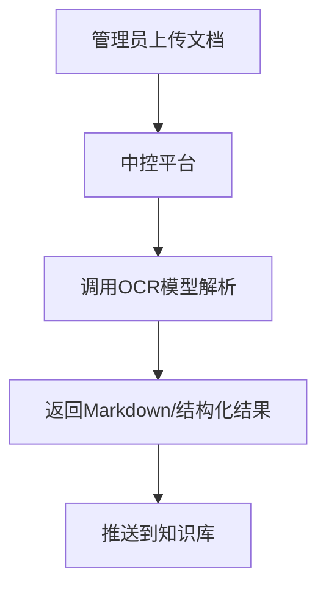
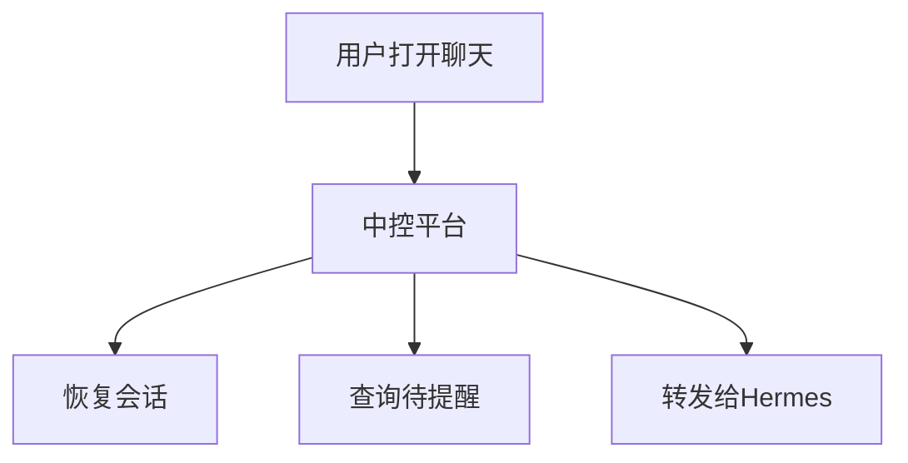

# 中控平台设计

- **日期**: 2026-06-05
- **状态**: 草案
**目标**: 提供统一控制面，负责平台管理入口、聊天入口前置恢复、待提醒查询、资料上传分发和请求转发。

---

## 1. 职责边界

### 1.1 负责

- 用户登录与入口接入
- 知识库选择
- 文档上传入口
- 权限与风控规则配置
- 知识可见范围配置
- 待提醒规则配置
- 调用 OCR 模型解析服务
- 接收 OCR 结果并推送给知识库
- 会话拉取与恢复
- 新员工状态查询
- 待提醒事项查询
- 用户进入聊天前的主动反馈
- 将聊天请求转发给 Hermes

### 1.2 不负责

- 文档 OCR 解析本身
- 知识检索与证据整理
- 聊天路由与技能编排
- 最终答案生成

---

## 2. 典型功能

1. 平台管理入口：
   - 选择知识库
   - 上传文档
   - 配置权限与风控规则
   - 配置知识可见范围
   - 查看解析任务状态
   - 查看知识入库状态
2. 聊天入口前置：
   - 拉取历史会话
   - 恢复上下文
   - 查询用户未读待提醒
   - 主动反馈用户最新结果
3. 请求分发：
   - 文档上传请求转发给 OCR 模型解析
   - 聊天请求转发给 Hermes

---

## 3. 模块功能清单

### 3.1 平台管理功能

- 用户登录与退出
- 用户身份接入与组织信息同步
- 知识库列表展示与选择
- 文档上传入口
- 上传任务状态查看
- OCR 解析任务结果查看
- 知识入库状态查看

### 3.2 规则配置功能

- 权限规则配置
- 风控规则配置
- 知识可见范围配置
- 待提醒规则配置
- 规则启停与版本管理

### 3.3 聊天前置功能

- 会话列表查询
- 会话恢复
- 新员工状态查询
- 待提醒事项查询
- 主动反馈生成前置数据准备

### 3.4 请求分发功能

- 转发文档解析请求到 OCR 模型解析
- 接收 OCR 解析结果并推送知识库
- 转发聊天请求到 Hermes
- 透传用户上下文、知识库上下文与业务元数据

### 3.5 状态与审计功能

- 上传任务状态持久化
- 会话状态持久化
- 待提醒事项持久化
- 关键操作审计
- traceId 透传与日志记录

---

## 4. 输入输出

### 4.1 输入

- 登录用户信息
- 知识库选择信息
- 权限与风控配置
- 上传文件和元数据
- 聊天会话 ID
- 用户消息

### 4.2 输出

- 上传任务 ID
- OCR 解析任务状态
- 权限与风控配置结果
- 会话恢复结果
- 待提醒事项列表
- 对 Hermes 的聊天请求

---

## 5. 技术栈

中控平台当前以单机部署为主，优先减少组件数量，建议采用：

- `Java 17/21`
- `Spring Boot`
- `Spring Web`
- `Spring Security`
- `MyBatis-Plus`
- `MySQL`
- `Spring Scheduler`
- `HTTP Client / OpenFeign`
- `本地文件存储` 或现有共享存储
- `日志 + traceId`

### 5.1 为什么这样选

- 团队更熟悉 Java Spring Boot
- 中控平台偏控制面和后台管理，适合 Spring 体系
- 单机部署下可以避免引入过多消息、编排和缓存组件
- `MyBatis-Plus` 足够支撑会话、待提醒、上传任务等核心数据管理

---

## 6. 核心数据

建议至少包含以下数据表：

- `chat_session`
- `session_context`
- `user_notice`
- `upload_task`
- `knowledge_binding`
- `policy_rule`
- `knowledge_visibility_rule`
- `audit_log`

---

## 7. 流程位置

### 7.1 资料入库链路

### 7.2 聊天链路

---

## 8. 一句话定义

中控平台是智能问答平台的控制面，负责入口、恢复、分发、主动反馈以及权限与风控规则配置，不负责 AI 能力本身。
