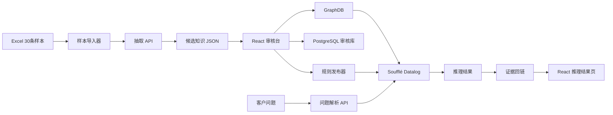
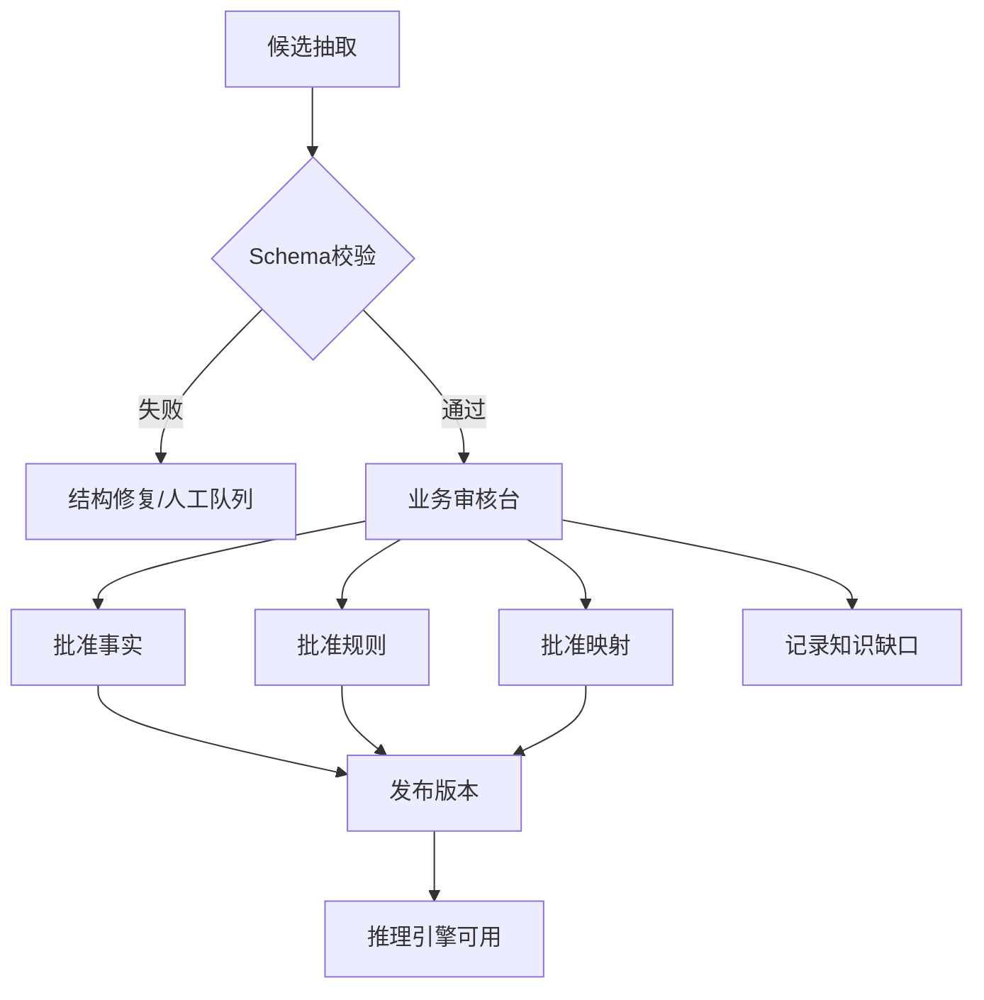

# 本体诊断推理 POC

## 1. POC 目标

本 POC 验证一条完整链路，而不是单独验证文本抽取或单独验证图数据库：

```text
FAQ 文本
→ 结构化抽取
→ 候选概念/事实/规则
→ 人工审核
→ 本体与规则发布
→ 客户问题解析
→ 诊断推理
→ 结论、推理路径和原文证据
```

POC 聚焦技术支持知识库。当前样本中包含孪生场景、版本迁移、TJS、模型、点位、视频、CAD、图表和配置等内容，因此 POC 不把数据强行建模为审批或售后政策，而是验证“现象—环境—版本—根因—动作”的诊断模型。

## 2. 数据样本

输入文件：`~/Downloads/Case知识库_7字段.xlsx`

- 工作表：`Case知识库`
- 从第 2 行开始读取；A 列为问题，G 列为用户方案/答案；
- 固定随机种子：`20260820`；
- 从问题和答案均非空的 12,862 条记录中抽取 30 条；
- 原文件只读，不修改、不回写。

### 2.1 抽样清单

| Excel 行 | 样本摘要 | POC 分类 |
| ---: | --- | --- |
| 405 | 实施期间客户需要提供 CAD、点位样例和接口协议 | 实施前置条件 |
| 705 | 鼠标移入后取消孪生体名称 | 配置动作 |
| 782 | 热风从地球进入场景后的配饰不一致 | 代码/临时方案 |
| 1458 | 删除 3DMAX 插件上传模型 | 操作步骤 |
| 1741 | `createLayerByEnterLevel` 事件未生效 | 版本事实 |
| 1776 | 场景打不开 | 资源归属/重传 |
| 2579 | 3.5.4 地图点点击不生效 | 版本条件规则 |
| 2859 | Postman 推数据不成功 | 坐标条件 |
| 4210 | 本地视频融合无法复现 | 环境与地址条件 |
| 5170 | 本地视频无法静音 | 功能操作 |
| 5426 | 长时间运行后视频监控面板不弹出 | 状态刷新动作 |
| 5885 | 4.2.2 定位告警设备退出到建筑层级 | 多步排查/配对规则 |
| 6428 | 4.2.2 迁移到 4.2.3 后地面模型不显示 | 迁移条件规则 |
| 6851 | 标记显示不全 | 集合筛选根因 |
| 6886 | 删除自定义属性后面板仍显示 | 缓存/JAR 刷新 |
| 7600 | 房间点位场景看不到 | ID/层级依赖 |
| 8260 | 部署成功后页面白屏 | 低信息质量/清缓存 |
| 8348 | 3.4M CAD 自动识别一直转换 | 文件大小约束 |
| 8475 | 热力图只显示一个颜色 | 温度区间配置 |
| 8531 | 房间内面板无法在园区显示 | 产品逻辑/显示状态 |
| 8805 | 同版本环境包迁移后场景不显示 | 版本缺陷/外部文档 |
| 9269 | 售前项目三维功能开发 | 知识缺口 |
| 9450 | 特定背景图无法加载 | 文件名约束 |
| 9901 | 配线功能不生效 | 模型导出端口条件 |
| 10221 | 数据全为 0 时图表错误 | 模板替换动作 |
| 11292 | TJS 上传未知错误 | Nginx 上传大小配置 |
| 11412 | FBX/GLTF 预览黑色阴影 | 灯光配置 |
| 11430 | 系统加载缓慢 | 缓存/模型复杂度 |
| 12049 | 地球查看室内模型切换视角掉入地下 | API 与相机参数 |
| 12546 | dix 无法启动且无日志 | 知识缺口 |

### 2.2 样本分层

```text
可形成正式规则：2579、5885、6428、8348、9450、9901、11292 等
可形成操作事实：405、1458、5170、6851、8475、10221、11430 等
需要补充条件：1776、8260、8531、8805 等
知识缺口/不形成规则：9269、12546，以及答案仅为“无”或“场景问题”的记录
```

## 3. POC 架构



## 4. POC 数据结构

### 4.1 抽取中间结构

```json
{
  "unitId": "FAQ-row-2579",
  "source": {
    "file": "Case知识库_7字段.xlsx",
    "sheet": "Case知识库",
    "row": 2579,
    "question": "地图场景点击地图点不生效",
    "answer": "原因：客户环境是3.5.4版本的……"
  },
  "concepts": [],
  "facts": [],
  "rules": [],
  "candidateMappings": [],
  "knowledgeGaps": [],
  "status": "candidate"
}
```

### 4.2 规则结构

```json
{
  "id": "R-MAP-POINT-001",
  "status": "candidate",
  "when": {
    "all": [
      {"field": "symptom", "operator": "=", "value": "MapPointClickIneffective"},
      {"field": "productVersion", "operator": "=", "value": "3.5.4"}
    ]
  },
  "then": {
    "cause": "MapPointPlacementDefect",
    "actions": ["ManuallyAddMapPoint", "UpgradeToVersion:3.5.5"]
  },
  "modality": "recommend",
  "priority": 80,
  "sourceQuote": "3.5.4版本地图摆放的点位摆放中摆点有问题",
  "evidence": ["FAQ-row-2579"]
}
```

### 4.3 知识缺口结构

```json
{
  "type": "knowledge_gap",
  "symptom": "DixCannotStart",
  "missingFacts": ["productVersion", "startupLog", "deploymentEnvironment"],
  "action": "EscalateToSupport",
  "sourceQuote": "无",
  "evidence": ["FAQ-row-12546"]
}
```

## 5. 可直接使用的抽取提示词

以下提示词用于“文档/FAQ 片段 → 候选本体知识”。实际调用时将 `{{source_text}}`、`{{source_meta}}` 和 `{{ontology_context}}` 替换为请求内容。提示词中的 JSON Schema 由服务端再次校验。

### 5.1 系统提示词

```text
你是企业技术支持知识工程师。你的任务是从给定的中文 FAQ、排障记录、产品手册或实施文档中，抽取“候选概念、事实、诊断规则、操作步骤和知识缺口”。

严格遵守以下边界：
1. 只抽取原文明确表达或可由原文直接组合得到的内容，不补写原文没有的根因、版本、日志、参数或解决方案。
2. 每个 fact、rule、step 必须绑定 sourceQuote，sourceQuote 必须是输入文本中的连续短片段。
3. 若答案包含“可能、通常、建议、参考、暂时、未知”等不确定词，保留 modality，不得改成确定事实。
4. 若答案只写“无”“未知”“场景问题”或信息不足，输出 knowledgeGaps，不生成正式诊断规则。
5. 版本、数字、单位、文件名、API 名称和配置项必须原样保留，并额外给出规范化值。
6. “场景包、环境包、TJS 文件”等相似词不能自动判定为同一概念；输出 candidateMapping，等待审核。
7. “重新上传”“升级版本”“修改配置”“清理缓存”等是 RemediationAction，不是 Cause。
8. “原因是……”才可能抽取 Cause；如果原文只给出操作，不要反推原因。
9. 多步骤方案必须保留顺序；替代方案用 alternatives 表达。
10. 如果一个答案同时包含现象、排查、原因和方案，分别输出，不要把整段答案塞入一个字段。
11. 不要输出 Markdown，不要输出 JSON 之外的解释。

允许使用的核心类型：
Product, ProductVersion, Component, DeploymentEnvironment, Artifact, Symptom,
Cause, DiagnosticStep, RemediationAction, Constraint, Process, Role, Event,
Evidence, KnowledgeGap。

允许使用的关系示例：
hasSymptom, occursIn, affects, involvesArtifact, hasProductVersion,
explains, requiresStep, recommendsAction, hasPrecondition, hasAlternative,
dependsOn, causedBy, fixedBy, appliesTo, precedes。

规则抽取的最低要求：when 至少包含一个可验证条件，then 至少包含 cause、action 或 diagnosticStep 之一。没有条件的纯操作说明只能输出 fact 或 step。
```

### 5.2 用户提示词模板

```text
请分析下面的来源文本。

来源元数据：
{{source_meta}}

已有本体候选（只可引用，不代表已经批准）：
{{ontology_context}}

来源文本：
{{source_text}}

请按约定 JSON Schema 输出候选结果。
```

### 5.3 抽取正例 1：版本条件 + 根因 + 方案

```text
输入：
问题：地图场景点击地图点不生效
答案：原因：客户环境是3.5.4版本的，3.5.4版本地图摆放的点位摆放中摆点有问题。
解决方案：（1）在孪生体管理中手动添加点位（2）升级到3.5.5版本。

期望：
{
  "facts": [
    {"field":"productVersion","value":"3.5.4","sourceQuote":"客户环境是3.5.4版本"},
    {"field":"symptom","value":"MapPointClickIneffective","sourceQuote":"地图场景点击地图点不生效"}
  ],
  "rules": [
    {
      "when":[
        {"field":"productVersion","operator":"=","value":"3.5.4"},
        {"field":"symptom","operator":"=","value":"MapPointClickIneffective"}
      ],
      "then":{"cause":"MapPointPlacementDefect","actions":["ManuallyAddMapPoint","UpgradeToVersion:3.5.5"]},
      "sourceQuote":"3.5.4版本地图摆放的点位摆放中摆点有问题"
    }
  ],
  "knowledgeGaps": [],
  "status":"candidate"
}
```

### 5.3.1 输出 JSON 契约

抽取 API 使用以下 JSON Schema 作为模型 Structured Output 的 `response_format`；不支持该能力的 OpenAI-compatible 服务使用 JSON mode，再由 Pydantic 校验同一契约。字段可以为空数组，但不得省略顶层字段。

```json
{
  "type": "object",
  "required": ["concepts", "facts", "rules", "candidateMappings", "knowledgeGaps", "status"],
  "properties": {
    "concepts": {"type": "array", "items": {"type": "object"}},
    "facts": {"type": "array", "items": {"type": "object", "required": ["field", "value", "sourceQuote"]}},
    "rules": {"type": "array", "items": {"type": "object", "required": ["when", "then", "sourceQuote"]}},
    "candidateMappings": {"type": "array", "items": {"type": "object", "required": ["sourceText", "candidateConcept", "possibleRelation", "requiresReview"]}},
    "knowledgeGaps": {"type": "array", "items": {"type": "object", "required": ["type", "missingFacts", "sourceQuote"]}},
    "status": {"type": "string", "enum": ["candidate", "knowledge_gap", "no_extractable_rule"]}
  },
  "additionalProperties": false
}
```

服务端在 Schema 校验后还必须执行两类业务校验：

```text
sourceQuote 必须逐字出现在来源文本中；
rule.when 的每个条件和 rule.then 的每个根因/动作都必须有对应 sourceQuote。
```

### 5.4 抽取正例 2：多步骤排查 + 配对约束

```text
输入：
问题：点击定位告警设备后会自动退出到建筑层级
答案：取消告警事件必须和告警事件配对使用，不能单独使用取消告警事件，还需要改配置。

期望：
{
  "facts":[
    {"field":"symptom","value":"AlarmLocationReturnsToBuildingLevel","sourceQuote":"自动退出到建筑层级"}
  ],
  "rules":[
    {
      "when":[{"field":"event","operator":"=","value":"CancelAlarm"}],
      "then":{"constraint":"CancelAlarmMustPairWithAlarm","actions":["UpdateConfiguration"]},
      "sourceQuote":"取消告警事件必须和告警事件配对使用"
    }
  ],
  "knowledgeGaps": [],
  "status":"candidate"
}
```

### 5.5 抽取正例 3：资源迁移规则

```text
输入：
问题：4.2.2环境包迁移到4.2.3环境后地面模型不显示
答案：重新上传园区tjs场景文件后问题消失了。

期望：
{
  "facts":[
    {"field":"sourceVersion","value":"4.2.2","sourceQuote":"4.2.2环境包"},
    {"field":"targetVersion","value":"4.2.3","sourceQuote":"迁移到4.2.3环境"},
    {"field":"symptom","value":"GroundModelNotDisplayed","sourceQuote":"地面模型不显示"}
  ],
  "rules":[
    {
      "when":[
        {"field":"sourceVersion","operator":"=","value":"4.2.2"},
        {"field":"targetVersion","operator":"=","value":"4.2.3"},
        {"field":"symptom","operator":"=","value":"GroundModelNotDisplayed"}
      ],
      "then":{"actions":["ReuploadParkTjsSceneFile"]},
      "sourceQuote":"重新上传园区tjs场景文件后问题消失了"
    }
  ],
  "knowledgeGaps": [],
  "status":"candidate"
}
```

### 5.6 抽取正例 4：条件限制

```text
输入：
问题：CAD自动识别一直在转换中
答案：图纸太大了，拆开图纸分开上传使用。

期望：
{
  "facts":[
    {"field":"symptom","value":"CadConversionStuck","sourceQuote":"一直在转换中"},
    {"field":"cause","value":"CadFileTooLarge","sourceQuote":"图纸太大了"}
  ],
  "rules":[
    {
      "when":[{"field":"symptom","operator":"=","value":"CadConversionStuck"}],
      "then":{"actions":["SplitCadFileAndUploadSeparately"]},
      "sourceQuote":"拆开图纸分开上传使用"
    }
  ],
  "knowledgeGaps": [],
  "status":"candidate"
}
```

### 5.7 抽取正例 5：同义词只生成候选映射

```text
输入：
问题：环境包迁移后场景不能显示
答案：客户现场导出的环境包迁移到同版本环境中，场景不能显示。

期望：
{
  "candidateMappings":[
    {
      "sourceText":"环境包",
      "candidateConcept":"EnvironmentPackage",
      "possibleRelation":"closeMatch",
      "targetConcept":"ScenePackage",
      "reason":"两个概念均用于场景迁移上下文，但原文未证明完全等价",
      "requiresReview":true
    }
  ],
  "facts":[{"field":"symptom","value":"SceneNotDisplayed","sourceQuote":"场景不能显示"}],
  "rules":[],
  "knowledgeGaps":[],
  "status":"candidate"
}
```

### 5.8 抽取反例 1：答案为“无”

```text
输入：
问题：dix无法启动，日志不输出
答案：无

期望：
{
  "facts":[],
  "rules":[],
  "knowledgeGaps":[
    {
      "type":"insufficientEvidence",
      "missingFacts":["productVersion","deploymentEnvironment","startupLog"],
      "sourceQuote":"无"
    }
  ],
  "status":"knowledge_gap"
}
```

### 5.9 抽取反例 2：不能把操作反推为根因

```text
输入：
问题：自定义属性删除后面板中还显示
答案：换 jar 包以后孪生体面板会去库中重新拉取。

期望：
{
  "facts":[
    {"field":"symptom","value":"DeletedPropertyStillDisplayed","sourceQuote":"自定义属性删除后，在孪生体面板中还会显示"},
    {"field":"action","value":"ReplaceJarPackage","sourceQuote":"换jar包"}
  ],
  "rules":[],
  "knowledgeGaps":[
    {"type":"missingExplicitCause","missingFacts":["confirmedCause"],"sourceQuote":"换jar包以后……重新拉取"}
  ],
  "status":"candidate"
}
```

### 5.10 抽取正例 6：纯操作说明不生成根因

```text
输入：
问题：3DMAX插件上传的模型如何删除？
答案：3dmax插件有个按钮是“我的模型”，在这里可以看到上传的所有模型，也可以删除模型。

期望：
{
  "facts":[
    {"field":"component","value":"ThreeDMaxPlugin","sourceQuote":"3dmax插件"},
    {"field":"action","value":"DeleteUploadedModel","sourceQuote":"也可以删除模型"}
  ],
  "rules":[],
  "candidateMappings":[],
  "knowledgeGaps":[],
  "status":"no_extractable_rule"
}
```

该例说明“操作路径”不是诊断规则：系统可用于回答明确操作，但不得生成 `Cause` 或推测故障条件。

## 6. 客户问题解析提示词

```text
你是技术支持问题解析器。请把客户问题转换为“可用于规则匹配的事实”，不要回答问题，不要自行猜测根因。

规则：
1. 原文明确给出的版本、环境、组件、资源、症状、日志和操作必须保留。
2. 同义表达映射到已有 approved 概念；只有 candidate 概念时标记 requiresReview。
3. 缺少规则必需事实时，写入 missingFacts。
4. “怎么解决”“如何处理”写入 goal=diagnose_and_remediate。
5. 不要把问题中的猜测当成事实，例如“是不是缓存问题”只能写 suspectedCauseFromUser。
6. 输出 JSON，不要输出答案或解释。

已有已批准概念：
{{approved_ontology_context}}

已有已批准规则需要的字段：
{{rule_input_schema}}

客户问题：
{{customer_question}}
```

### 6.1 问题解析示例

```text
输入：4.2.2升级到4.2.3以后地面模型不显示，怎么处理？

输出：
{
  "facts":[
    {"field":"sourceVersion","value":"4.2.2"},
    {"field":"targetVersion","value":"4.2.3"},
    {"field":"symptom","value":"GroundModelNotDisplayed"}
  ],
  "goal":"diagnose_and_remediate",
  "missingFacts":[],
  "suspectedCauseFromUser":[],
  "requiresReview":false
}
```

## 7. 跨本体映射审核提示词

```text
你是跨本体映射候选评审器。请比较 sourceConcept 和 targetConcept 的定义、domain、range、实例标识和使用上下文。

只允许选择：exactMatch、closeMatch、broader、narrower、relatedMatch、noMatch。

硬性规则：
1. 仅名称相似不能输出 exactMatch。
2. 一对多或上下文依赖时优先 closeMatch 或 relatedMatch。
3. 共享唯一标识、定义一致且 domain/range 兼容时，才可以推荐 exactMatch。
4. 不确定时 requiresHumanReview=true。
5. 输出证据和受影响规则，不要直接修改本体。

sourceConcept：
{{source_concept}}

targetConcept：
{{target_concept}}

上下文与实例证据：
{{mapping_evidence}}
```

## 8. 审核流程



审核人必须能看到原文、抽取结构、置信度、候选影响范围和预期推理路径。审核不是只点击“通过”，还可以编辑规范概念、条件、动作、优先级、生效期和证据。

## 9. 推理执行规范

本节定义 POC 的确定性运行时。LLM 只在进入推理前把客户问题转为候选事实；一旦事实通过 Schema、术语和类型校验，根因、动作、冲突和缺失信息只能由已发布的规则、映射和事实推导。运行时不得让 LLM 临时增加规则或补全根因。

### 9.1 一次查询的固定执行顺序

```text
1. 接收问题与请求上下文：tenant、知识版本、提问时间、用户权限。
2. 调用问题解析模型，获得候选 QueryFact；不产生诊断结论。
3. 用 SKOS 别名和已批准映射规范化 QueryFact；未批准映射不参与匹配。
4. 用 SHACL/Pydantic 校验字段类型、版本格式、枚举值和引用概念状态。
5. 装载指定知识版本下生效的事实、映射和规则，并编译为 Datalog 输入事实。
6. Datalog 计算候选规则、缺失字段、诊断、动作和证明节点。
7. 执行冲突消解；若存在同级冲突，输出 conflict，不输出唯一结论。
8. 根据证明节点装配答案、追问、规则 ID、证据原文和知识版本。
9. 保存不可变的 QueryRun，支持之后按同一版本回放。
```

“生效”必须同时满足：`status=approved`、当前时间在 `effectiveFrom/effectiveTo` 内、租户可见、所依赖的跨本体映射也已批准。`candidate`、`rejected`、`deprecated` 记录在任何步骤都不能进入步骤 5。

### 9.2 运行时输入与标准化结果

调用 `/v1/reasoning/diagnose` 时，客户端只提交问题和必要的上下文，不直接提交根因或动作：

```json
{
  "tenantId": "demo",
  "knowledgeVersion": "2026.01.0",
  "askedAt": "2026-08-20T10:00:00+08:00",
  "question": "4.2.2升级到4.2.3以后地面模型不显示，怎么处理？",
  "context": {
    "product": "ThingJS",
    "environment": "customer"
  }
}
```

问题解析与术语标准化后，推理器接收的不是原句，而是以下不可变 `QueryFact` 集合：

```json
{
  "runId": "run-001",
  "facts": [
    {"field": "sourceVersion", "operator": "=", "value": "4.2.2", "valueType": "version", "origin": "question"},
    {"field": "targetVersion", "operator": "=", "value": "4.2.3", "valueType": "version", "origin": "question"},
    {"field": "symptom", "operator": "=", "value": "GroundModelNotDisplayed", "valueType": "concept", "origin": "question"},
    {"field": "product", "operator": "=", "value": "ThingJS", "valueType": "concept", "origin": "context"}
  ]
}
```

`origin` 只能是 `question`、`context`、`approved_mapping` 或 `derived_fact`。来自模型但未通过标准化的词保留在解析审计记录中，不能成为 `QueryFact`。

### 9.3 Rule DSL 的完整执行语义

每条已批准规则在发布前必须具备以下字段：

```json
{
  "id": "R-SCENE-RESOURCE-001",
  "version": 1,
  "status": "approved",
  "effectiveFrom": "2026-01-01T00:00:00+08:00",
  "effectiveTo": null,
  "priority": 80,
  "when": {
    "all": [
      {"field": "sourceVersion", "operator": "=", "value": "4.2.2", "valueType": "version"},
      {"field": "targetVersion", "operator": "=", "value": "4.2.3", "valueType": "version"},
      {"field": "symptom", "operator": "=", "value": "GroundModelNotDisplayed", "valueType": "concept"}
    ]
  },
  "then": {
    "diagnoses": ["SceneResourceStateIncomplete"],
    "actions": ["ReuploadParkTjsSceneFile"]
  },
  "evidence": ["FAQ-row-6428"],
  "review": {"reviewer": "support-owner", "reviewedAt": "2026-08-20T09:00:00+08:00"}
}
```

POC 只允许 `when.all`，不允许模型直接发布任意嵌套布尔表达式，也不实现 `when.any`。需要 OR 语义时，审核人将其拆成多条 `when.all` 规则并复用同一个诊断/动作；这样编译、测试和冲突分析都保持确定。

发布校验还必须拒绝同一规则中的重复条件，例如两次出现完全相同的 `symptom = GroundModelNotDisplayed`。否则条件计数会失去“具体度”和“全匹配”的业务意义。

支持的条件操作符及类型：

| `valueType` | 允许操作符 | 示例 |
| --- | --- | --- |
| `concept` / `string` | `=`、`!=`、`in` | `symptom = GroundModelNotDisplayed` |
| `version` | `=`、`!=`、`>=`、`>`、`<=`、`<` | `productVersion >= 4.2.3` |
| `number` | `=`、`!=`、`>=`、`>`、`<=`、`<`、`between` | `fileSizeMb > 3` |
| `duration` | `>=`、`>`、`<=`、`<` | `runningHours > 8` |
| `boolean` | `=` | `hasAlarmEvent = true` |

版本比较不能用字符串字典序。发布器将版本 `4.2.3` 解析为数字元组 `(4,2,3)`；无法规范化的版本号被拒绝发布或显式标为 `versionType=opaque`，此时只允许 `=` 比较。

### 9.4 Rule DSL 到 Souffle 的编译

发布器对每个知识版本生成一组只读 Datalog 输入关系。以下是上述规则的简化编译产物；实际文件由发布器生成，人工不直接编辑。

```souffle
.decl query_fact(run:symbol, field:symbol, value:symbol)
.decl active_rule(rule:symbol, priority:number, specificity:number)
.decl rule_condition(rule:symbol, field:symbol, value:symbol)
.decl rule_diagnosis(rule:symbol, cause:symbol)
.decl rule_action(rule:symbol, action:symbol)
.decl rule_evidence(rule:symbol, evidence:symbol)

.input query_fact
.input active_rule
.input rule_condition
.input rule_diagnosis
.input rule_action
.input rule_evidence

.decl matched_condition(run:symbol, rule:symbol, field:symbol, value:symbol)
matched_condition(run, rule, field, value) :-
    rule_condition(rule, field, value),
    query_fact(run, field, value).

.decl matched_count(run:symbol, rule:symbol, count:number)
matched_count(run, rule, count : { matched_condition(run, rule, _, _) }) :-
    query_fact(run, _, _),
    active_rule(rule, _, _).

.decl candidate_rule(run:symbol, rule:symbol, priority:number, specificity:number)
candidate_rule(run, rule, priority, specificity) :-
    active_rule(rule, priority, specificity),
    matched_count(run, rule, specificity).

.decl candidate_diagnosis(run:symbol, rule:symbol, cause:symbol, priority:number, specificity:number)
candidate_diagnosis(run, rule, cause, priority, specificity) :-
    candidate_rule(run, rule, priority, specificity),
    rule_diagnosis(rule, cause).

.decl candidate_action(run:symbol, rule:symbol, action:symbol, priority:number, specificity:number)
candidate_action(run, rule, action, priority, specificity) :-
    candidate_rule(run, rule, priority, specificity),
    rule_action(rule, action).
```

上例展示等值条件。`run` 必须贯穿所有中间关系，保证同一 Datalog 进程批量处理时不同客户问题不会共享事实。`number`、`duration` 和 `version` 条件编译为单独的类型化关系，例如 `query_version_fact`、`rule_version_lower_bound` 和 `query_number_fact`，由发布器在生成输入时完成元组解析和比较，避免把数值/版本降级为字符串。

规则是否命中使用“条件数 = 匹配条件数”的全匹配语义：有三个 `when.all` 条件，就必须恰好证明三个条件都满足。不能因为只匹配到“地面模型不显示”就自动推荐 4.2.2 → 4.2.3 的迁移方案。

### 9.5 跨本体事实如何参与推理

本体图谱只把已批准的桥接关系导出为 `derived_fact`。例如已批准的关系与规则：

```text
User_A102 correspondsTo Employee_E10086
Employee_E10086 worksFor Department_Finance
Department_Finance mapsTo CostCenter_Finance
Reimbursement_9001 submittedBy User_A102
```

编译器可以安全推导：

```souffle
.decl submits(reimbursement:symbol, user:symbol)
.decl corresponds_to(user:symbol, employee:symbol)
.decl works_for(employee:symbol, department:symbol)
.decl maps_to_cost_center(department:symbol, costCenter:symbol)
.decl reimbursement_cost_center(reimbursement:symbol, costCenter:symbol)

reimbursement_cost_center(reimbursement, costCenter) :-
    submits(reimbursement, user),
    corresponds_to(user, employee),
    works_for(employee, department),
    maps_to_cost_center(department, costCenter).
```

如果 `correspondsTo` 仍是 `candidate`，上述关系不导出，推理只能返回“缺少已批准的身份映射”，不能擅自把用户和员工视为同一实体。

### 9.6 具体度、优先级与冲突消解

同一现象可能有通用规则和版本特定规则。排名元组固定为：

```text
rank = (specificity, priority, ruleVersion)
```

- `specificity`：已命中且经过审核的 `when.all` 条件数；
- `priority`：业务审核人设定的 0-100 整数，数值越大优先级越高；
- `ruleVersion`：同一 `ruleId` 的较新批准版本优先。

规则先按生效期筛选，再按 `rank` 降序排序。只有最高 rank 的所有规则得出相同诊断/动作时，系统输出唯一结论；若最高 rank 的规则给出不同诊断或互斥动作，输出 `conflict`：

```json
{
  "status": "conflict",
  "conflictingRules": ["R-A", "R-B"],
  "missingFacts": [],
  "nextAction": "human_review",
  "evidence": ["FAQ-row-6428", "FAQ-row-8805"]
}
```

禁止使用“随机取第一条规则”“让 LLM 在冲突中挑一个更像的答案”作为消解策略。

### 9.7 缺失事实、显式否定和未知

推理器采用三值结果，而不是把缺失当作 `false`：

```text
true       已有批准事实证明条件成立
false      已有批准事实明确证明条件不成立
unknown    没有足够的已批准事实
```

例如提问“地面模型不显示怎么办？”只命中 `symptom`，但缺少 `sourceVersion` 和 `targetVersion`。系统应计算“部分匹配的候选规则”并输出：

```json
{
  "status": "need_more_information",
  "questions": [
    "问题出现前的来源版本是什么？",
    "当前目标环境版本是什么？"
  ],
  "candidateRules": ["R-SCENE-RESOURCE-001"],
  "reasoningPath": [
    "symptom=GroundModelNotDisplayed matched",
    "sourceVersion is unknown",
    "targetVersion is unknown"
  ]
}
```

显式否定必须作为独立事实保存，如 `isMigrated=false`；缺失 `isMigrated` 不能等价于 `false`。规则中使用否定条件时，必须要求明确负面事实，或在审核时显式声明可以采用封闭世界假设的有限枚举字段。

### 9.8 推理轨迹与回放

每次运行写入不可变 `QueryRun`，至少保存：

```text
runId
input question and context
question-parser model and promptVersion
normalized QueryFact set
knowledgeVersion
approved mapping version set
compiled Datalog program checksum
matched / rejected / partial rules
rank and conflict result
proof nodes and evidence IDs
final response payload
```

证明节点采用有向无环图，而不是只有一段自然语言：

```text
FactNode(sourceVersion=4.2.2)
FactNode(targetVersion=4.2.3)
FactNode(symptom=GroundModelNotDisplayed)
RuleNode(R-SCENE-RESOURCE-001)
DiagnosisNode(SceneResourceStateIncomplete)
ActionNode(ReuploadParkTjsSceneFile)
EvidenceNode(FAQ-row-6428)
```

边表示 `supports`、`matches`、`derives` 或 `recommends`。前端用 React Flow 按此图渲染，用户可以从动作反查规则、输入事实和 FAQ 原文。

### 9.9 推理 API 输出契约

```json
{
  "runId": "run-001",
  "status": "resolved",
  "knowledgeVersion": "2026.01.0",
  "diagnoses": [
    {"concept": "SceneResourceStateIncomplete", "ruleId": "R-SCENE-RESOURCE-001"}
  ],
  "actions": [
    {"concept": "ReuploadParkTjsSceneFile", "order": 1, "ruleId": "R-SCENE-RESOURCE-001"}
  ],
  "missingFacts": [],
  "conflicts": [],
  "proofGraph": {
    "nodes": ["FactNode:sourceVersion", "FactNode:targetVersion", "FactNode:symptom", "RuleNode:R-SCENE-RESOURCE-001", "ActionNode:ReuploadParkTjsSceneFile"],
    "edges": ["sourceVersion->rule", "targetVersion->rule", "symptom->rule", "rule->action"]
  },
  "evidence": [
    {"id": "FAQ-row-6428", "quote": "重新上传园区tjs场景文件后问题消失了"}
  ]
}
```

`status` 只能是 `resolved`、`need_more_information`、`conflict`、`no_approved_rule` 或 `authorization_denied`。Hermes 只能基于该结构组织自然语言，不能添加新的诊断、动作或未返回的证据。

### 9.10 推理测试矩阵

每条已批准规则都必须生成至少以下测试：

| 测试 | 输入 | 期望 |
| --- | --- | --- |
| 正例 | 全部 `when.all` 条件 | 命中规则、输出诊断/动作和证据 |
| 单条件缺失 | 缺少任一必填条件 | `need_more_information` 与缺失字段 |
| 反例 | 明确不满足一个条件 | 不命中该规则 |
| 版本边界 | 等于、低于、高于版本阈值 | 按版本比较语义选择规则 |
| 同义词 | 批准别名代替首选名称 | 规范化后命中同一规则 |
| 未批准映射 | 仅有 candidate 跨本体映射 | 不产生派生事实 |
| 冲突 | 同 rank 输出不同结论 | `conflict`，不输出唯一动作 |
| 回放 | 固定 `QueryRun` | 重放得到相同规则、轨迹和输出 |

测试集不得只验证最终中文回答；必须断言 `normalized QueryFact`、`matchedRules`、`missingFacts`、`proofGraph` 和 `evidence`。

## 10. 推理验收问题

POC 建议准备 20 条人工标准问题：

```text
直接命中：
1. 3.5.4 地图点点击没有反应怎么处理？
2. CAD 文件一直转换怎么办？
3. 特殊字符图片名无法加载怎么办？
4. 模型配线没有端口信息怎么办？
5. TJS 上传未知错误如何处理？
6. 数据全是 0 时图表异常怎么处理？
7. 3DMAX 上传的模型怎么删除？
8. 本地视频如何静音？

多条件推理：
9. 4.2.2 迁移到 4.2.3 后地面模型不显示怎么办？
10. 4.2.2 定位告警设备为什么会退回建筑层级？
11. 房间内设备面板为什么在园区不显示？
12. 3.4M 的 CAD 转换很慢怎么办？
13. 只有在告警设备楼层切换才退出，如何排查？

同义词：
14. 环境包迁移后场景不见了怎么办？
15. 报错时重新传 TJS 是否有效？
16. 点位摆放后前台看不到和孪生体挂载问题是否相关？

信息缺失：
17. 场景打不开，怎么解决？
18. dix 启动不了怎么办？

知识冲突/过期：
19. 3.5.4 不升级是否还有旧方案？
20. 同一个现象在 4.2.2 和 4.2.3 是否使用同一方案？
```

每条问题的标准答案应由业务人员预先填写“事实、规则、预期动作和证据”，不要直接用模型回答作为金标准。

## 11. POC 验收指标

- 30 条样本全部完成抽取状态分类；
- 至少 15 条样本形成经审核的正式事实或规则；
- 20 条验收问题中，正式推理结果与标准答案一致率不低于 90%；
- 每个结论都返回规则 ID、推理路径和来源行号；
- 对缺少版本、日志或环境的提问，至少 90% 能返回正确缺失字段；
- 未批准映射、冲突规则和过期规则不得无提示地产生唯一结论；
- 更换 OpenAI-compatible 模型服务，只修改配置即可完成同一批测试。

## 12. POC 交付物

```text
抽样数据 manifest
30 条样本的候选抽取 JSON
已批准的诊断本体 TTL/OWL
已批准的规则 DSL JSON
20 条验收问题和标准答案
推理 API
React 审核/推理工作台
每条结论的推理路径与证据
POC 测试报告
```

## 13. 实施里程碑

1. 第 1 周：导入 30 条样本，完成抽取 Schema、提示词和 JSON 校验。
2. 第 2 周：完成概念标准化、审核状态、证据绑定和规则 DSL。
3. 第 3 周：完成 GraphDB、Datalog、推理 API 和推理路径。
4. 第 4 周：完成 React 审核台、20 条验收问题和测试报告。

POC 结束后，根据错误分布决定下一阶段重点：抽取质量、术语治理、规则覆盖、跨本体映射，或推理性能。不要在没有错误分类的情况下直接扩大文档数量。
