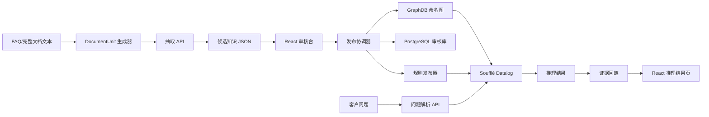
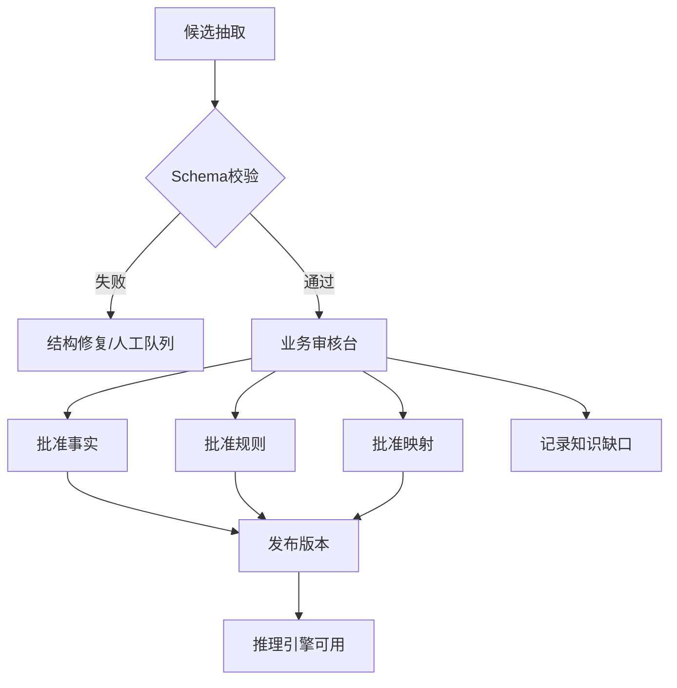

# 本体诊断推理 POC

## 1. POC 目标

本 POC 验证一条完整链路，而不是单独验证文本抽取或单独验证图数据库：

```text
FAQ 文本
→ 结构化抽取
→ 候选概念/事实/规则
→ 人工审核
→ 本体与规则发布
→ 客户问题解析
→ 诊断推理
→ 结论、推理路径和原文证据
```

POC 聚焦技术支持知识库。当前样本中包含孪生场景、版本迁移、TJS、模型、点位、视频、CAD、图表和配置等内容，因此 POC 不把数据强行建模为审批或售后政策，而是验证“现象—环境—版本—根因—动作”的诊断模型。

## 2. 数据样本

输入文件：`~/Downloads/Case知识库_7字段.xlsx`

- 工作表：`Case知识库`
- 从第 2 行开始读取；A 列为问题，G 列为用户方案/答案；
- 固定随机种子：`20260820`；
- 从问题和答案均非空的 12,862 条记录中抽取 30 条；
- 原文件只读，不修改、不回写。

### 2.1 抽样清单

| Excel 行 | 样本摘要 | POC 分类 |
| ---: | --- | --- |
| 405 | 实施期间客户需要提供 CAD、点位样例和接口协议 | 实施前置条件 |
| 705 | 鼠标移入后取消孪生体名称 | 配置动作 |
| 782 | 热风从地球进入场景后的配饰不一致 | 代码/临时方案 |
| 1458 | 删除 3DMAX 插件上传模型 | 操作步骤 |
| 1741 | `createLayerByEnterLevel` 事件未生效 | 版本事实 |
| 1776 | 场景打不开 | 资源归属/重传 |
| 2579 | 3.5.4 地图点点击不生效 | 版本条件规则 |
| 2859 | Postman 推数据不成功 | 坐标条件 |
| 4210 | 本地视频融合无法复现 | 环境与地址条件 |
| 5170 | 本地视频无法静音 | 功能操作 |
| 5426 | 长时间运行后视频监控面板不弹出 | 状态刷新动作 |
| 5885 | 4.2.2 定位告警设备退出到建筑层级 | 多步排查/配对规则 |
| 6428 | 4.2.2 迁移到 4.2.3 后地面模型不显示 | 迁移条件规则 |
| 6851 | 标记显示不全 | 集合筛选根因 |
| 6886 | 删除自定义属性后面板仍显示 | 缓存/JAR 刷新 |
| 7600 | 房间点位场景看不到 | ID/层级依赖 |
| 8260 | 部署成功后页面白屏 | 低信息质量/清缓存 |
| 8348 | 3.4M CAD 自动识别一直转换 | 文件大小约束 |
| 8475 | 热力图只显示一个颜色 | 温度区间配置 |
| 8531 | 房间内面板无法在园区显示 | 产品逻辑/显示状态 |
| 8805 | 同版本环境包迁移后场景不显示 | 版本缺陷/外部文档 |
| 9269 | 售前项目三维功能开发 | 知识缺口 |
| 9450 | 特定背景图无法加载 | 文件名约束 |
| 9901 | 配线功能不生效 | 模型导出端口条件 |
| 10221 | 数据全为 0 时图表错误 | 模板替换动作 |
| 11292 | TJS 上传未知错误 | Nginx 上传大小配置 |
| 11412 | FBX/GLTF 预览黑色阴影 | 灯光配置 |
| 11430 | 系统加载缓慢 | 缓存/模型复杂度 |
| 12049 | 地球查看室内模型切换视角掉入地下 | API 与相机参数 |
| 12546 | dix 无法启动且无日志 | 知识缺口 |

### 2.2 样本分层

```text
可形成正式规则：2579、5885、6428、8348、9450、9901、11292 等
可形成操作事实：405、1458、5170、6851、8475、10221、11430 等
需要补充条件：1776、8260、8531、8805 等
知识缺口/不形成规则：9269、12546，以及答案仅为“无”或“场景问题”的记录
```

## 3. POC 架构



### 3.1 POC monorepo 目录与所有权

POC 使用一个仓库和一个发布版本，不把每个本体或推理阶段拆成独立部署项目。目录按运行职责分层，`ontology/` 下的文件是逻辑模块而非独立项目：

```text
ontology-reasoning-poc/
├── backend/
│   ├── app/
│   │   ├── api/                 # FastAPI 路由、鉴权与请求/响应模型
│   │   ├── domain/              # 领域对象、状态机和不可变版本约束
│   │   ├── services/            # 抽取、审核、发布、推理、续跑、回放用例
│   │   ├── repositories/        # PostgreSQL、GraphDB、产物存储唯一访问入口
│   │   ├── llm/                 # OpenAI-compatible 客户端、提示词与模型能力探测
│   │   ├── compiler/            # RDF 导出、Rule DSL -> Datalog、manifest 生成
│   │   └── validators/          # Pydantic、SHACL、证据、版本和发布校验
│   └── tests/                   # 单元、集成、规则、回放和 API 契约测试
├── frontend/
│   └── src/
│       ├── pages/               # 候选、规则、映射、发布、推理问答页面
│       ├── features/            # 按资源状态组织的 API、store、业务组件
│       └── components/          # 通用表单、证据定位、二维/三维证明图组件
├── ontology/
│   ├── src/                     # Git 管理的 Protégé/TTL 源文件
│   │   ├── support.ttl          # 故障、症状、根因、动作、证据
│   │   ├── product.ttl          # 产品、版本、组件、资源
│   │   ├── deployment.ttl       # 环境、迁移、配置
│   │   └── integration.ttl      # 跨本体映射与桥接关系
│   ├── shapes/                  # SHACL 约束
│   └── published/               # 发布器生成物，按 knowledgeVersion 只读保存
├── rules/
│   ├── src/                     # 已审核 Rule DSL，例如 R-SCENE-RESOURCE-001.v1.json
│   └── generated/               # Datalog 程序、输入关系和编译报告
├── fixtures/                    # 30 条样本、DocumentUnit、验收问题和标准答案
├── infra/                       # Docker Compose、GraphDB 初始化、数据库迁移
└── docs/                        # 架构决策、接口和测试报告
```

依赖只能向内收敛：`api -> services -> domain`，`services -> repositories/compiler/validators/llm`；`domain` 不依赖 FastAPI、数据库客户端或 GraphDB SDK。`repositories/` 是 GraphDB、PostgreSQL 与文件产物的唯一访问入口。`llm/` 只能生成候选知识和候选 `QueryFact`，不得调用发布、写图或产生正式推理结论。前端的二维/三维图只消费 `proofGraph.nodes/edges`，禁止从自然语言答案反向解析关系。

本体源文件由 Protégé 编辑后提交 Git；GraphDB 只能加载发布器基于 `ontology/src/`、`rules/src/` 与批准知识生成的 `ontology/published/<knowledgeVersion>/` 产物。文件命名分别采用 `backend/app/services/publication_service.py`、`frontend/src/features/reasoning/api.ts`、`rules/src/R-SCENE-RESOURCE-001.v1.json` 这类“职责/对象.版本”形式。

### 3.2 服务与 API 所有权

每个写操作只能由一个应用服务拥有，API 路由不得跨服务直接更新表或调用 GraphDB：

| 服务 | 唯一职责 | 允许调用的 API |
| --- | --- | --- |
| `ExtractionService` | `DocumentUnit` 抽取、候选知识和 EvidenceSpan 生成 | 候选导入、重试、查询 |
| `ReviewService` | 候选编辑、审核决定、差异和乐观锁处理 | 候选读取、编辑、批准、拒绝 |
| `MappingReviewService` | 跨本体映射候选与影响规则审核 | 映射读取、编辑、批准、拒绝 |
| `PublicationService` | 冻结版本、SHACL/规则预检、manifest、原子发布 | 创建暂存版本、预检、发布、废弃 |
| `ReasoningService` | 客户问题解析、规则执行、冲突与缺失信息计算 | `/v1/reasoning/diagnose` |
| `RunContinuationService` | 补答校验、QueryRun revision 与重新推理 | `/v1/reasoning/runs/{runId}/facts` |
| `ReplayService` | 读取不可变运行记录、证明图和原文回链 | QueryRun、proofGraph、evidence 查询 |

前端页面按资源状态拥有自己的 `features/<resource>/api.ts` 和 store：候选、规则、映射、版本和推理问答不得共用可写的“万能知识 store”。写请求一律提交 `expectedRevision` 或 `expectedStatus`；服务端在事务内校验并返回 `409`，前端必须重新加载后才允许再次提交。

## 4. POC 数据结构

### 4.1 输入文本单元

抽取 API 只接收 `DocumentUnit`。FAQ 导入器把 A/G 列转换为一个 `kind=faq` 的单元；完整文档由分段器输出标题路径和稳定位置。

```json
{
  "unitId": "FAQ-row-2579",
  "documentId": "Case知识库_7字段.xlsx",
  "kind": "faq",
  "titlePath": ["技术支持 FAQ"],
  "text": "问题：地图场景点击地图点不生效\n答案：原因：客户环境是3.5.4版本的……",
  "contextBefore": null,
  "contextAfter": null,
  "location": {"sheet": "Case知识库", "row": 2579, "charStart": 0, "charEnd": 42}
}
```

### 4.2 抽取中间结构

```json
{
  "unitId": "FAQ-row-2579",
  "source": {"documentUnitRef": "FAQ-row-2579"},
  "concepts": [],
  "facts": [],
  "rules": [],
  "candidateMappings": [],
  "knowledgeGaps": [],
  "evidenceSpans": [],
  "status": "candidate"
}
```

### 4.3 候选/发布规则结构

```json
{
  "id": "R-MAP-POINT-001",
  "status": "candidate",
  "when": {
    "all": [
      {"field": "symptom", "operator": "=", "value": "MapPointClickIneffective"},
      {"field": "productVersion", "operator": "=", "value": "3.5.4"}
    ]
  },
  "then": {
    "diagnoses": ["MapPointPlacementDefect"],
    "actions": ["ManuallyAddMapPoint", "UpgradeToVersion:3.5.5"],
    "steps": [
      {"order": 1, "action": "ManuallyAddMapPoint"},
      {"order": 2, "action": "UpgradeToVersion:3.5.5"}
    ]
  },
  "modality": "recommend",
  "priority": 80,
  "evidenceBindings": [
    {"target": "when.all[0]", "evidenceRefs": ["EV-2579-question"]},
    {"target": "when.all[1]", "evidenceRefs": ["EV-2579-answer"]},
    {"target": "then.diagnoses[0]", "evidenceRefs": ["EV-2579-answer"]},
    {"target": "then.steps[0]", "evidenceRefs": ["EV-2579-solution-1"]},
    {"target": "then.steps[1]", "evidenceRefs": ["EV-2579-solution-2"]}
  ]
}
```

候选与批准规则使用同一结构；只有 `status`、正式概念 ID、审核信息、生效期和发布版本不同。`steps` 是有序操作的唯一正式表达，`actions` 仅为便于检索的去重索引，发布器必须验证两者一致。

### 4.4 知识缺口结构

```json
{
  "type": "knowledge_gap",
  "symptom": "DixCannotStart",
  "missingFacts": ["productVersion", "startupLog", "deploymentEnvironment"],
  "action": "EscalateToSupport",
  "sourceQuote": "无",
  "evidenceRefs": ["EV-12546-gap"]
}
```

### 4.5 PostgreSQL 持久化模型

PostgreSQL 保存可查询的状态、关联、审核与审计；GraphDB 只保存已发布 RDF；原文、TTL、Datalog 和 manifest 的大对象保存为版本化产物。允许变化的抽取载荷留在 JSONB，但不得把状态、版本、审核人与关联关系埋入 JSONB。

除版本字符串外，主键使用 UUID；时间使用带时区的 `TIMESTAMPTZ`；短枚举使用 PostgreSQL enum 或受控 `VARCHAR`；语义载荷、位置和 manifest 使用 `JSONB`；原文使用 `TEXT`；哈希保存完整 `sha256:<hex>` 字符串。`revision` 和 `run_revision` 使用正整数；每个可编辑资源都有 `updated_at` 与 `updated_by`，每次审核决定都保留独立审计行。

| 表 | 主键与关键列 | 数据责任 |
| --- | --- | --- |
| `document_unit` | `id`、`tenant_id`、`document_id`、`kind`、`title_path`、`text`、`location_json`、`content_hash` | FAQ、标题、段落、表格、代码块等统一输入 |
| `evidence_span` | `id`、`tenant_id`、`unit_id`、`quote`、`char_start`、`char_end`、`content_hash` | 所有知识对象回链的原子证据 |
| `knowledge_item` | `id`、`tenant_id`、`kind`、`status`、`revision`、`payload_jsonb`、`created_by` | `concept`、`fact`、`rule`、`mapping`、`knowledge_gap` |
| `knowledge_evidence` | `tenant_id`、`knowledge_item_id`、`target_path`、`evidence_id` | 条件、诊断、动作、步骤与证据的精确绑定 |
| `review_decision` | `id`、`tenant_id`、`item_id`、`decision`、`before_jsonb`、`after_jsonb`、`reason`、`reviewer` | 人工审核及前后差异 |
| `knowledge_version` | `tenant_id`、`version`、`status`、`manifest_jsonb`、`graph_checksum`、`rule_checksum` | 暂存、发布、失败、废弃的版本状态 |
| `version_item` | `tenant_id`、`knowledge_version`、`knowledge_item_id`、`item_revision` | 将批准对象冻结到发布快照 |
| `query_run` | `id`、`tenant_id`、`principal_id`、`parent_run_id`、`revision`、`input_jsonb`、`facts_jsonb`、`manifest_jsonb`、`result_jsonb` | 问题、补答、推理和回放 |
| `proof_node` / `proof_edge` | `tenant_id`、`run_id`、节点/边 ID、`kind`、`predicate`、`payload_jsonb` | 二维和三维证明图的直接数据源 |
| `active_manifest_pointer` | `tenant_id`、`scope`、`knowledge_version`、`manifest_checksum`、`updated_at` | 运行时唯一的已发布 manifest 指针 |
| `idempotency_record` | `tenant_id`、`principal_id`、`route`、`idempotency_key`、`request_hash`、`response_jsonb`、`expires_at` | 写请求的去重与重试响应 |
| `operation` | `id`、`tenant_id`、`kind`、`status`、`request_jsonb`、`result_jsonb`、`error_jsonb` | 发布与预检的持久化进度、结果和恢复依据 |

强制约束如下：

```text
document_unit(document_id, location_json, content_hash) 唯一；
所有业务表均以 tenant_id 参与唯一键、查询谓词和外键校验，不能由客户端 body 中的 tenantId 决定可见范围；
evidence_span 的 [char_start, char_end) 必须落在对应 unit.text 内，quote 必须逐字相等；
knowledge_item 的 (id, revision) 唯一，已审核 revision 不可原地更新；
knowledge_evidence 的 (knowledge_item_id, target_path, evidence_id) 唯一；
version_item 只能引用 status=approved 的指定 revision；
knowledge_version.status=published 后，manifest_jsonb、checksum 和 version_item 不可修改；
active_manifest_pointer 的 (tenant_id, scope) 唯一，且只能引用 status=published、checksum 一致的 knowledge_version；
operation.status 只能为 queued、running、succeeded 或 failed；发布 operation 必须保存目标版本和 manifest checksum；
query_run 的 revision 只能新增，补答通过 parent_run_id 建立时间线；
proof_node/proof_edge 必须引用同一个 query_run revision，edge 的两端节点必须存在。
```

`knowledge_item.payload_jsonb` 的规则载荷固定为：

```json
{
  "when": {"all": []},
  "then": {
    "diagnoses": [],
    "actions": [],
    "steps": []
  },
  "constraints": [],
  "evidenceBindings": []
}
```

`status`、`revision`、`kind`、`created_by`、审批时间、生效期、正式概念 ID 和证据关联必须使用列或关联表，不能只写入 `payload_jsonb`。数据库迁移归属 `infra/migrations/`；示例数据归属 `fixtures/`，不得与生产式发布产物混放。

## 5. 可直接使用的抽取提示词

以下提示词用于“文档/FAQ 片段 → 候选本体知识”。实际调用时将 `{{source_text}}`、`{{source_meta}}` 和 `{{ontology_context}}` 替换为请求内容。提示词中的 JSON Schema 由服务端再次校验。

### 5.0 模型接入配置

POC 的抽取、客户问题解析和跨本体映射候选均通过 OpenAI-compatible API 调用同一个模型服务：

```text
base_url=https://token.uino.com/v1
model=deepseek-v4-flash
api_key=${KNOWLEDGE_ANSWER_API_KEY}
```

密钥只能从运行环境变量 `KNOWLEDGE_ANSWER_API_KEY` 读取。禁止将密钥写入 Git、`.env.example`、Docker Compose、前端构建变量、日志、异常消息或 `QueryRun` 审计载荷；前端不得直接调用该模型端点。`backend/app/llm/` 读取该变量并设置连接、读取和整体调用超时，运行配置中只记录 `base_url`、模型名、提示词版本和非敏感能力探测结果。

### 5.1 系统提示词

```text
你是企业技术支持知识工程师。你的任务是从给定的中文 FAQ、排障记录、产品手册或实施文档中，抽取“候选概念、事实、诊断规则、操作步骤和知识缺口”。

严格遵守以下边界：
1. 只抽取原文明确表达或可由原文直接组合得到的内容，不补写原文没有的根因、版本、日志、参数或解决方案。
2. 每个 fact、rule 条件、诊断、动作和 step 必须绑定 `evidenceRefs`；其指向的 `EvidenceSpan.quote` 必须是输入单元 `text` 中的连续短片段。
3. 若答案包含“可能、通常、建议、参考、暂时、未知”等不确定词，保留 modality，不得改成确定事实。
4. 若答案只写“无”“未知”“场景问题”或信息不足，输出 knowledgeGaps，不生成正式诊断规则。
5. 版本、数字、单位、文件名、API 名称和配置项必须原样保留，并额外给出规范化值。
6. “场景包、环境包、TJS 文件”等相似词不能自动判定为同一概念；输出 candidateMapping，等待审核。
7. “重新上传”“升级版本”“修改配置”“清理缓存”等是 RemediationAction，不是 Cause。
8. “原因是……”才可能抽取 Cause；如果原文只给出操作，不要反推原因。
9. 多步骤方案必须输出 `then.steps`，从 1 连续编号；替代方案用 `alternatives` 表达，不得混入同一条步骤序列。
10. 如果一个答案同时包含现象、排查、原因和方案，分别输出，不要把整段答案塞入一个字段。
11. 不要输出 Markdown，不要输出 JSON 之外的解释。

允许使用的核心类型：
Product, ProductVersion, Component, DeploymentEnvironment, Artifact, Symptom,
Cause, DiagnosticStep, RemediationAction, Constraint, Process, Role, Event,
Evidence, KnowledgeGap。

允许使用的关系示例：
hasSymptom, occursIn, affects, involvesArtifact, hasProductVersion,
explains, requiresStep, recommendsAction, hasPrecondition, hasAlternative,
dependsOn, causedBy, fixedBy, appliesTo, precedes。

规则抽取的最低要求：when 至少包含一个可验证条件，then 至少包含 cause、action 或 diagnosticStep 之一。没有条件的纯操作说明只能输出 fact 或 step。
```

### 5.2 用户提示词模板

```text
请分析下面的来源文本。

来源元数据：
{{source_meta}}

已有本体候选（只可引用，不代表已经批准）：
{{ontology_context}}

来源文本：
{{source_text}}

请按约定 JSON Schema 输出候选结果。
```

### 5.3 抽取正例 1：版本条件 + 根因 + 方案

```text
输入：
问题：地图场景点击地图点不生效
答案：原因：客户环境是3.5.4版本的，3.5.4版本地图摆放的点位摆放中摆点有问题。
解决方案：（1）在孪生体管理中手动添加点位（2）升级到3.5.5版本。

期望：
{
  "facts": [
    {"field":"productVersion","value":"3.5.4","sourceQuote":"客户环境是3.5.4版本","evidenceRefs":["EV-2579-version"]},
    {"field":"symptom","value":"MapPointClickIneffective","sourceQuote":"地图场景点击地图点不生效","evidenceRefs":["EV-2579-symptom"]}
  ],
  "rules": [
    {
      "when":{"all":[
        {"field":"productVersion","operator":"=","value":"3.5.4"},
        {"field":"symptom","operator":"=","value":"MapPointClickIneffective"}
      ]},
      "then":{"diagnoses":["MapPointPlacementDefect"],"actions":["ManuallyAddMapPoint","UpgradeToVersion:3.5.5"],"steps":[{"order":1,"action":"ManuallyAddMapPoint"},{"order":2,"action":"UpgradeToVersion:3.5.5"}]},
      "evidenceBindings":[{"target":"when.all[0]","evidenceRefs":["EV-2579-version"]},{"target":"when.all[1]","evidenceRefs":["EV-2579-symptom"]},{"target":"then.diagnoses[0]","evidenceRefs":["EV-2579-cause"]},{"target":"then.actions[0]","evidenceRefs":["EV-2579-solution-1"]},{"target":"then.actions[1]","evidenceRefs":["EV-2579-solution-2"]},{"target":"then.steps[0]","evidenceRefs":["EV-2579-solution-1"]},{"target":"then.steps[1]","evidenceRefs":["EV-2579-solution-2"]}]
    }
  ],
  "evidenceSpans":[
    {"id":"EV-2579-version","quote":"客户环境是3.5.4版本"},
    {"id":"EV-2579-symptom","quote":"地图场景点击地图点不生效"},
    {"id":"EV-2579-cause","quote":"3.5.4版本地图摆放的点位摆放中摆点有问题"},
    {"id":"EV-2579-solution-1","quote":"在孪生体管理中手动添加点位"},
    {"id":"EV-2579-solution-2","quote":"升级到3.5.5版本"}
  ],
  "concepts": [],
  "candidateMappings": [],
  "knowledgeGaps": [],
  "status":"candidate"
}
```

### 5.3.1 输出 JSON 契约

抽取 API 使用以下 JSON Schema 作为模型 Structured Output 的 `response_format`；不支持该能力的 OpenAI-compatible 服务使用 JSON mode，再由 Pydantic 校验同一契约。字段可以为空数组，但不得省略顶层字段。

```json
{
  "type": "object",
  "required": ["concepts", "facts", "rules", "candidateMappings", "knowledgeGaps", "evidenceSpans", "status"],
  "properties": {
    "concepts": {"type": "array", "items": {"type": "object"}},
    "facts": {"type": "array", "items": {"type": "object", "required": ["field", "value", "sourceQuote", "evidenceRefs"]}},
    "rules": {"type": "array", "items": {"type": "object", "required": ["when", "then", "evidenceBindings"]}},
    "candidateMappings": {"type": "array", "items": {"type": "object", "required": ["sourceText", "candidateConcept", "possibleRelation", "requiresReview", "evidenceRefs"]}},
    "knowledgeGaps": {"type": "array", "items": {"type": "object", "required": ["type", "missingFacts", "sourceQuote", "evidenceRefs"]}},
    "evidenceSpans": {"type": "array", "items": {"type": "object", "required": ["id", "quote"]}},
    "status": {"type": "string", "enum": ["candidate", "knowledge_gap", "no_extractable_rule"]}
  },
  "additionalProperties": false
}
```

服务端在 Schema 校验后还必须执行下列业务校验：

```text
每个 `EvidenceSpan.quote` 必须逐字出现在对应 `DocumentUnit.text` 中，且 `charStart/charEnd` 与 quote 一致；
`rule.when.all` 的每个条件、`then.diagnoses/actions/steps` 的每个元素必须各有至少一个 `evidenceBinding`；
每个 candidateMapping 和 knowledgeGap 也必须有至少一个 `evidenceRefs`；
每个 `evidenceBinding.target` 必须能定位到当前规则中的对象；
`steps.order` 必须从 1 连续，且其 action 必须出现在 `then.actions`；
抽取结构先通过 `CandidateKnowledge` 校验；审核保存前转换为同字段形状的 `ApprovedKnowledge`，禁止把 `when: []`、`then.cause` 等旧形状写入发布库。
```

### 5.4 抽取正例 2：多步骤排查 + 配对约束

```text
输入：
问题：点击定位告警设备后会自动退出到建筑层级
答案：取消告警事件必须和告警事件配对使用，不能单独使用取消告警事件，还需要改配置。

期望：
{
  "facts":[
    {"field":"symptom","value":"AlarmLocationReturnsToBuildingLevel","sourceQuote":"自动退出到建筑层级","evidenceRefs":["EV-2-symptom"]}
  ],
  "rules":[
    {
      "when":{"all":[{"field":"event","operator":"=","value":"CancelAlarm"}]},
      "then":{"diagnoses":[],"actions":["UpdateConfiguration"],"steps":[{"order":1,"action":"UpdateConfiguration"}]},
      "constraints":["CancelAlarmMustPairWithAlarm"],
      "evidenceBindings":[{"target":"when.all[0]","evidenceRefs":["EV-2-event"]},{"target":"constraints[0]","evidenceRefs":["EV-2-constraint"]},{"target":"then.actions[0]","evidenceRefs":["EV-2-action"]},{"target":"then.steps[0]","evidenceRefs":["EV-2-action"]}]
    }
  ],
  "concepts":[],
  "candidateMappings":[],
  "knowledgeGaps": [],
  "evidenceSpans":[{"id":"EV-2-symptom","quote":"自动退出到建筑层级"},{"id":"EV-2-event","quote":"取消告警事件"},{"id":"EV-2-constraint","quote":"取消告警事件必须和告警事件配对使用"},{"id":"EV-2-action","quote":"还需要改配置"}],
  "status":"candidate"
}
```

### 5.5 抽取正例 3：资源迁移规则

```text
输入：
问题：4.2.2环境包迁移到4.2.3环境后地面模型不显示
答案：重新上传园区tjs场景文件后问题消失了。

期望：
{
  "facts":[
    {"field":"sourceVersion","value":"4.2.2","sourceQuote":"4.2.2环境包","evidenceRefs":["EV-3-source"]},
    {"field":"targetVersion","value":"4.2.3","sourceQuote":"迁移到4.2.3环境","evidenceRefs":["EV-3-target"]},
    {"field":"symptom","value":"GroundModelNotDisplayed","sourceQuote":"地面模型不显示","evidenceRefs":["EV-3-symptom"]}
  ],
  "rules":[
    {
      "when":{"all":[
        {"field":"sourceVersion","operator":"=","value":"4.2.2"},
        {"field":"targetVersion","operator":"=","value":"4.2.3"},
        {"field":"symptom","operator":"=","value":"GroundModelNotDisplayed"}
      ]},
      "then":{"diagnoses":[],"actions":["ReuploadParkTjsSceneFile"],"steps":[{"order":1,"action":"ReuploadParkTjsSceneFile"}]},
      "evidenceBindings":[{"target":"when.all[0]","evidenceRefs":["EV-3-source"]},{"target":"when.all[1]","evidenceRefs":["EV-3-target"]},{"target":"when.all[2]","evidenceRefs":["EV-3-symptom"]},{"target":"then.actions[0]","evidenceRefs":["EV-3-action"]},{"target":"then.steps[0]","evidenceRefs":["EV-3-action"]}]
    }
  ],
  "concepts":[],
  "candidateMappings":[],
  "knowledgeGaps": [],
  "evidenceSpans":[{"id":"EV-3-source","quote":"4.2.2环境包"},{"id":"EV-3-target","quote":"迁移到4.2.3环境"},{"id":"EV-3-symptom","quote":"地面模型不显示"},{"id":"EV-3-action","quote":"重新上传园区tjs场景文件后问题消失了"}],
  "status":"candidate"
}
```

### 5.6 抽取正例 4：条件限制

```text
输入：
问题：CAD自动识别一直在转换中
答案：图纸太大了，拆开图纸分开上传使用。

期望：
{
  "facts":[
    {"field":"symptom","value":"CadConversionStuck","sourceQuote":"一直在转换中","evidenceRefs":["EV-4-symptom"]},
    {"field":"cause","value":"CadFileTooLarge","sourceQuote":"图纸太大了","evidenceRefs":["EV-4-cause"]}
  ],
  "rules":[
    {
      "when":{"all":[{"field":"symptom","operator":"=","value":"CadConversionStuck"}]},
      "then":{"diagnoses":["CadFileTooLarge"],"actions":["SplitCadFileAndUploadSeparately"],"steps":[{"order":1,"action":"SplitCadFileAndUploadSeparately"}]},
      "evidenceBindings":[{"target":"when.all[0]","evidenceRefs":["EV-4-symptom"]},{"target":"then.diagnoses[0]","evidenceRefs":["EV-4-cause"]},{"target":"then.actions[0]","evidenceRefs":["EV-4-action"]},{"target":"then.steps[0]","evidenceRefs":["EV-4-action"]}]
    }
  ],
  "concepts":[],
  "candidateMappings":[],
  "knowledgeGaps": [],
  "evidenceSpans":[{"id":"EV-4-symptom","quote":"一直在转换中"},{"id":"EV-4-cause","quote":"图纸太大了"},{"id":"EV-4-action","quote":"拆开图纸分开上传使用"}],
  "status":"candidate"
}
```

### 5.7 抽取正例 5：同义词只生成候选映射

```text
输入：
问题：环境包迁移后场景不能显示
答案：客户现场导出的环境包迁移到同版本环境中，场景不能显示。

期望：
{
  "candidateMappings":[
    {
      "sourceText":"环境包",
      "candidateConcept":"EnvironmentPackage",
      "possibleRelation":"closeMatch",
      "targetConcept":"ScenePackage",
      "reason":"两个概念均用于场景迁移上下文，但原文未证明完全等价",
      "requiresReview":true,
      "evidenceRefs":["EV-5-environment-package"]
    }
  ],
  "facts":[{"field":"symptom","value":"SceneNotDisplayed","sourceQuote":"场景不能显示","evidenceRefs":["EV-5-symptom"]}],
  "concepts":[],
  "rules":[],
  "knowledgeGaps":[],
  "evidenceSpans":[{"id":"EV-5-environment-package","quote":"环境包"},{"id":"EV-5-symptom","quote":"场景不能显示"}],
  "status":"candidate"
}
```

### 5.8 抽取反例 1：答案为“无”

```text
输入：
问题：dix无法启动，日志不输出
答案：无

期望：
{
  "concepts":[],
  "facts":[],
  "rules":[],
  "candidateMappings":[],
  "knowledgeGaps":[
    {
      "type":"insufficientEvidence",
      "missingFacts":["productVersion","deploymentEnvironment","startupLog"],
      "sourceQuote":"无",
      "evidenceRefs":["EV-6-gap"]
    }
  ],
  "evidenceSpans":[{"id":"EV-6-gap","quote":"无"}],
  "status":"knowledge_gap"
}
```

### 5.9 抽取反例 2：不能把操作反推为根因

```text
输入：
问题：自定义属性删除后面板中还显示
答案：换 jar 包以后孪生体面板会去库中重新拉取。

期望：
{
  "facts":[
    {"field":"symptom","value":"DeletedPropertyStillDisplayed","sourceQuote":"自定义属性删除后面板中还显示","evidenceRefs":["EV-7-symptom"]},
    {"field":"action","value":"ReplaceJarPackage","sourceQuote":"换 jar 包","evidenceRefs":["EV-7-action"]}
  ],
  "concepts":[],
  "rules":[],
  "candidateMappings":[],
  "knowledgeGaps":[
    {"type":"missingExplicitCause","missingFacts":["confirmedCause"],"sourceQuote":"换 jar 包以后孪生体面板会去库中重新拉取","evidenceRefs":["EV-7-answer"]}
  ],
  "evidenceSpans":[{"id":"EV-7-symptom","quote":"自定义属性删除后面板中还显示"},{"id":"EV-7-action","quote":"换 jar 包"},{"id":"EV-7-answer","quote":"换 jar 包以后孪生体面板会去库中重新拉取"}],
  "status":"candidate"
}
```

### 5.10 抽取正例 6：纯操作说明不生成根因

```text
输入：
问题：3DMAX插件上传的模型如何删除？
答案：3dmax插件有个按钮是“我的模型”，在这里可以看到上传的所有模型，也可以删除模型。

期望：
{
  "facts":[
    {"field":"component","value":"ThreeDMaxPlugin","sourceQuote":"3dmax插件","evidenceRefs":["EV-8-component"]},
    {"field":"action","value":"DeleteUploadedModel","sourceQuote":"也可以删除模型","evidenceRefs":["EV-8-action"]}
  ],
  "concepts":[],
  "rules":[],
  "candidateMappings":[],
  "knowledgeGaps":[],
  "evidenceSpans":[{"id":"EV-8-component","quote":"3dmax插件"},{"id":"EV-8-action","quote":"也可以删除模型"}],
  "status":"no_extractable_rule"
}
```

该例说明“操作路径”不是诊断规则：系统可用于回答明确操作，但不得生成 `Cause` 或推测故障条件。

## 6. 客户问题解析提示词

```text
你是技术支持问题解析器。请把客户问题转换为“可用于规则匹配的事实”，不要回答问题，不要自行猜测根因。

规则：
1. 原文明确给出的版本、环境、组件、资源、症状、日志和操作必须保留。
2. 同义表达映射到已有 approved 概念；只有 candidate 概念时标记 requiresReview。
3. 缺少规则必需事实时，写入 missingFacts。
4. “怎么解决”“如何处理”写入 goal=diagnose_and_remediate。
5. 不要把问题中的猜测当成事实，例如“是不是缓存问题”只能写 suspectedCauseFromUser。
6. 输出 JSON，不要输出答案或解释。
7. 每个 facts 元素必须输出 field、rawValue、sourceQuote、charStart、charEnd、valueTypeHint 和 confidence；不得自行补出原文没有的值。

已有已批准概念：
{{approved_ontology_context}}

已有已批准规则需要的字段：
{{rule_input_schema}}

客户问题：
{{customer_question}}
```

### 6.1 问题解析示例

```text
输入：4.2.2升级到4.2.3以后地面模型不显示，怎么处理？

输出：
{
  "facts":[
    {"field":"sourceVersion","rawValue":"4.2.2","sourceQuote":"4.2.2","charStart":0,"charEnd":5,"valueTypeHint":"version","confidence":0.99},
    {"field":"targetVersion","rawValue":"4.2.3","sourceQuote":"4.2.3","charStart":8,"charEnd":13,"valueTypeHint":"version","confidence":0.99},
    {"field":"symptom","rawValue":"地面模型不显示","sourceQuote":"地面模型不显示","charStart":15,"charEnd":22,"valueTypeHint":"concept","confidence":0.97}
  ],
  "goal":"diagnose_and_remediate",
  "missingFacts":[],
  "suspectedCauseFromUser":[],
  "requiresReview":false
}
```

### 6.2 候选问题事实与正式 QueryFact

问题解析模型输出的是 `CandidateQueryFact`，不是可直接推理的事实。每个候选事实必须包含 `field`、`rawValue`、`sourceQuote`、`charStart`、`charEnd`、`valueTypeHint` 和 `confidence`；`sourceQuote` 必须逐字位于客户问题中。模型只能输出 `operator="="`，不得直接产生否定、范围或派生事实。`requiresReview=true`、未知字段、未批准概念、无法解析的版本/数值，或 span 校验失败时，该候选只写入解析审计记录并进入 `unresolvedFacts`，不得生成 `QueryFact`。

标准化服务依次执行字段白名单校验、类型解析、SKOS 别名/批准映射查找和来源归属。成功后才生成 `QueryFact(field, operator, value, valueType, origin, sourceSpanId)`；来自问题的 `origin=question`，来自调用上下文的 `origin=context`，由已批准映射或规则推导的事实分别为 `approved_mapping`、`derived_fact`。标准化后若仍有 `unresolvedFacts`，推理照常只使用有效事实；若它们正是候选规则所需字段，返回 `need_more_information` 并追问，若没有任何已批准规则可匹配则返回 `no_approved_rule`，同时返回不可作为结论依据的解析说明。

## 7. 跨本体映射审核提示词

```text
你是跨本体映射候选评审器。请比较 sourceConcept 和 targetConcept 的定义、domain、range、实例标识和使用上下文。

只允许选择：exactMatch、closeMatch、broader、narrower、relatedMatch、noMatch。

硬性规则：
1. 仅名称相似不能输出 exactMatch。
2. 一对多或上下文依赖时优先 closeMatch 或 relatedMatch。
3. 共享唯一标识、定义一致且 domain/range 兼容时，才可以推荐 exactMatch。
4. 不确定时 requiresHumanReview=true。
5. 输出证据和受影响规则，不要直接修改本体。

sourceConcept：
{{source_concept}}

targetConcept：
{{target_concept}}

上下文与实例证据：
{{mapping_evidence}}
```

## 8. 审核流程



审核人必须能看到原文、抽取结构、置信度、候选影响范围和预期推理路径。审核不是只点击“通过”，还可以编辑规范概念、条件、动作、优先级、生效期和证据。

### 8.1 发布版本与可恢复的一致性切换

审核通过不等于可推理。POC 不尝试让 PostgreSQL、GraphDB 与文件系统做分布式事务；运行时只认 PostgreSQL 中的 `active_manifest_pointer`。GraphDB 命名图和 Datalog 产物都按 manifest 的内容寻址、不可变保存，既不使用可变 GraphDB 别名，也不使用可变文件指针。发布协调器为每个 `knowledgeVersion` 创建不可变 manifest，并依次执行：

```text
1. 冻结批准事实、规则、映射、EvidenceSpan 和其审核版本；
2. 写入 GraphDB 不可变命名图 `urn:knowledge:<tenant>:<version>:<manifestChecksum>`；
3. 生成 Datalog 输入和程序，执行编译与规则测试；
4. 写入 PostgreSQL manifest，记录图谱、规则、映射和证据的 checksum；
5. 在单一数据库事务中锁定该租户的 `active_manifest_pointer`，再次校验所有 checksum，将版本状态由 staging 改为 published，并更新该指针；
6. 事务提交后不再改写 GraphDB 或 Datalog 产物。运行时通过新指针读取 manifest 中的精确图名和 artifact 路径；任一步在事务提交前失败则指针保持旧值，本版本保留 staged 以便重试或标记 failed。
```

```json
{
  "knowledgeVersion": "2026.01.0",
  "status": "published",
  "graphName": "urn:knowledge:2026.01.0",
  "graphChecksum": "sha256:...",
  "ruleArtifact": "rules/2026.01.0/program.dl",
  "ruleChecksum": "sha256:...",
  "mappingVersionSet": ["integration-12"],
  "evidenceChecksum": "sha256:...",
  "publishedAt": "2026-08-20T10:00:00+08:00"
}
```

发布恢复规则固定如下：事务提交前进程中断时，旧 pointer 继续服务，协调器可基于 checksum 复用已生成的 staged 产物或将其标记 failed；事务提交后，新 pointer 即为唯一真相，恢复器只校验其 manifest、GraphDB 图和 artifact 的 checksum，不得回退或重写它们。恢复器发现已提交 manifest 缺失或 checksum 不匹配时，停止该租户推理并返回受控故障，不得静默回退到另一版本。这样所有时刻要么完整使用旧 manifest，要么完整使用新 manifest。

运行时只能加载 `active_manifest_pointer` 指向且 `status=published` 的 manifest。`QueryRun` 保存完整 manifest，而不只保存一个可变的版本字符串，以保证图谱、规则和 Datalog 程序来自同一快照。

### 8.2 候选到发布的审核状态机

```text
candidate -> in_review -> approved -> staged -> published
                         |              |
                         -> rejected    -> failed
published -> deprecated
```

规则、事实、映射和证据任一依赖项被拒绝、失效或在发布预检中缺失时，版本不能进入 `published`。审核台保存候选 JSON、人工编辑后的 JSON、字段差异、审核理由和操作者，作为之后回放和责任追溯的依据。

## 9. 推理执行规范

本节定义 POC 的确定性运行时。LLM 只在进入推理前把客户问题转为候选事实；一旦事实通过 Schema、术语和类型校验，根因、动作、冲突和缺失信息只能由已发布的规则、映射和事实推导。运行时不得让 LLM 临时增加规则或补全根因。

### 9.0 身份、租户与访问控制

请求在 API 统一认证入口被转换为不可由前端伪造的 `Principal`：

```json
{
  "principalId": "user-42",
  "tenantIds": ["demo"],
  "roles": ["knowledge_reviewer"],
  "evidenceScopes": ["support_internal"],
  "authTime": "2026-08-20T10:00:00+08:00"
}
```

本地 POC 可使用固定的开发身份适配器生成该对象；业务服务只接收认证入口生成的 `Principal`，不信任 body 里的 `reviewer`、`principalId` 或 `tenantId`。客户端可选择 `tenantId`，但服务端必须先验证它属于 `Principal.tenantIds`，并在 PostgreSQL、GraphDB 图名、manifest、QueryRun 与 EvidenceSpan 查询中强制加同一租户谓词。角色最小权限固定为：`knowledge_reader` 只读已发布结论和被授权证据；`knowledge_reviewer` 可编辑/审核候选；`knowledge_publisher` 可创建和发布版本；`knowledge_admin` 管理本地 POC 身份与全租户配置。证据详情额外要求 `evidenceScopes` 命中字段分类；否则仅返回脱敏摘要。任何不满足条件的资源读取返回 `404`，操作返回 `403 authorization_denied`，不得泄露另一租户的对象是否存在。

### 9.1 一次查询的固定执行顺序

```text
1. 接收问题与请求上下文：已验证的 tenant、知识版本、提问时间、Principal 权限。
2. 调用问题解析模型，获得候选 QueryFact；不产生诊断结论。
3. 用 SKOS 别名和已批准映射规范化 QueryFact；未批准映射不参与匹配。
4. 用 SHACL/Pydantic 校验字段类型、版本格式、枚举值和引用概念状态。
5. 装载指定知识版本下生效的事实、映射和规则，并编译为 Datalog 输入事实。
6. Datalog 计算候选规则、缺失字段、诊断、动作和证明节点。
7. 执行冲突消解；若存在同级冲突，输出 conflict，不输出唯一结论。
8. 根据证明节点装配答案、追问、规则 ID、证据原文和知识版本。
9. 保存不可变的 QueryRun，支持之后按同一版本回放。
```

“生效”必须同时满足：`status=approved`、当前时间在 `effectiveFrom/effectiveTo` 内、租户可见、所依赖的跨本体映射也已批准。`candidate`、`rejected`、`deprecated` 记录在任何步骤都不能进入步骤 5。

### 9.2 运行时输入与标准化结果

调用 `/v1/reasoning/diagnose` 时，客户端只提交问题和必要的上下文，不直接提交根因或动作：

```json
{
  "tenantId": "demo",
  "knowledgeVersion": "2026.01.0",
  "askedAt": "2026-08-20T10:00:00+08:00",
  "question": "4.2.2升级到4.2.3以后地面模型不显示，怎么处理？",
  "context": {
    "product": "ThingJS",
    "environment": "customer"
  }
}
```

问题解析与术语标准化后，推理器接收的不是原句，而是以下不可变 `QueryFact` 集合：

```json
{
  "runId": "run-001",
  "facts": [
    {"field": "sourceVersion", "operator": "=", "value": "4.2.2", "valueType": "version", "origin": "question"},
    {"field": "targetVersion", "operator": "=", "value": "4.2.3", "valueType": "version", "origin": "question"},
    {"field": "symptom", "operator": "=", "value": "GroundModelNotDisplayed", "valueType": "concept", "origin": "question"},
    {"field": "product", "operator": "=", "value": "ThingJS", "valueType": "concept", "origin": "context"}
  ]
}
```

`origin` 只能是 `question`、`context`、`approved_mapping` 或 `derived_fact`。来自模型但未通过标准化的词保留在解析审计记录中，不能成为 `QueryFact`。

### 9.2.1 缺失事实的补答与续跑

`need_more_information` 不是终态。前端展示推理器返回的 `questions` 后，用户的每次补答都通过以下接口追加到同一个逻辑会话：

```http
POST /v1/reasoning/runs/{runId}/facts
```

```json
{
  "expectedRunRevision": 1,
  "answers": [
    {"field": "sourceVersion", "value": "4.2.2", "valueType": "version"},
    {"field": "targetVersion", "value": "4.2.3", "valueType": "version"}
  ]
}
```

服务端使用原 `QueryRun` 的输入、已标准化事实、知识 manifest 和问题解析审计记录合并补答；经同样的类型和术语校验后创建新的不可变 revision，并重新执行推理。补答不能修改根因、动作、规则或知识版本。若前端携带的 `expectedRunRevision` 落后，返回 `409 stale_run_revision` 和最新状态，防止多窗口覆盖事实。

响应返回新的 `runId`、`parentRunId`、`runRevision` 和完整推理结果。前端按时间线保留“原问题 -> 系统追问 -> 客户补答 -> 新结论”，同时可切换任一 revision 查看其事实集和证明图。

### 9.3 Rule DSL 的完整执行语义

每条已批准规则在发布前必须具备以下字段：

```json
{
  "id": "R-SCENE-RESOURCE-001",
  "version": 1,
  "status": "approved",
  "effectiveFrom": "2026-01-01T00:00:00+08:00",
  "effectiveTo": null,
  "priority": 80,
  "when": {
    "all": [
      {"field": "sourceVersion", "operator": "=", "value": "4.2.2", "valueType": "version"},
      {"field": "targetVersion", "operator": "=", "value": "4.2.3", "valueType": "version"},
      {"field": "symptom", "operator": "=", "value": "GroundModelNotDisplayed", "valueType": "concept"}
    ]
  },
  "then": {
    "diagnoses": ["SceneResourceStateIncomplete"],
    "actions": ["ReuploadParkTjsSceneFile"],
    "steps": [{"order": 1, "action": "ReuploadParkTjsSceneFile"}]
  },
  "evidenceBindings": [
    {"target": "when.all[0]", "evidenceRefs": ["EV-6428-source-version"]},
    {"target": "when.all[1]", "evidenceRefs": ["EV-6428-target-version"]},
    {"target": "when.all[2]", "evidenceRefs": ["EV-6428-symptom"]},
    {"target": "then.diagnoses[0]", "evidenceRefs": ["EV-6428-cause"]},
    {"target": "then.actions[0]", "evidenceRefs": ["EV-6428-action"]},
    {"target": "then.steps[0]", "evidenceRefs": ["EV-6428-action"]}
  ],
  "review": {"reviewer": "support-owner", "reviewedAt": "2026-08-20T09:00:00+08:00"}
}
```

POC 只允许 `when.all`，不允许模型直接发布任意嵌套布尔表达式，也不实现 `when.any`。需要 OR 语义时，审核人将其拆成多条 `when.all` 规则并复用同一个诊断/动作；这样编译、测试和冲突分析都保持确定。

发布校验还必须拒绝同一规则中的重复条件，例如两次出现完全相同的 `symptom = GroundModelNotDisplayed`。否则条件计数会失去“具体度”和“全匹配”的业务意义。

支持的条件操作符及类型：

| `valueType` | 允许操作符 | 示例 |
| --- | --- | --- |
| `concept` / `string` | `=`、`!=`、`in` | `symptom = GroundModelNotDisplayed` |
| `version` | `=`、`!=`、`>=`、`>`、`<=`、`<` | `productVersion >= 4.2.3` |
| `number` | `=`、`!=`、`>=`、`>`、`<=`、`<`、`between` | `fileSizeMb > 3` |
| `duration` | `>=`、`>`、`<=`、`<` | `runningHours > 8` |
| `boolean` | `=` | `hasAlarmEvent = true` |

版本比较不能用字符串字典序。发布器将版本 `4.2.3` 解析为数字元组 `(4,2,3)`；无法规范化的版本号被拒绝发布或显式标为 `versionType=opaque`，此时只允许 `=` 比较。

发布器必须按下表生成类型化关系；表外组合一律拒绝发布。`true` 才能计入已命中条件，`false` 和 `unknown` 都不能命中；字段缺失永远产生 `unknown`，绝不能把缺失解释成 `!=` 成立。

| valueType / operator | 输入关系与判定 | 边界及证明 |
| --- | --- | --- |
| `concept` / `string`: `=`、`!=` | `query_symbol_fact(run, field, value)`、`rule_symbol_condition(rule, field, operator, value)` | `=` 为值相等；`!=` 只在该字段存在且值不等时为 true；证明记录实际输入值与比较操作符 |
| `concept` / `string`: `in` | `rule_symbol_member(rule, condition, member)` | 候选值与任一 member 相等即 true；空集合非法 |
| `version`: `=`、`!=`、比较 | `query_version_fact(run, field, major, minor, patch)` 与类型化下界/上界关系 | 数字元组逐段比较；`opaque` 版本仅允许 `=`；证明保存解析后的元组与原字串 |
| `number` / `duration`: `=`、`!=`、比较 | `query_number_fact` / `query_duration_seconds_fact` 与条件值关系 | 数值采用十进制定点；duration 统一换算秒；`between` 是闭区间 `[lower, upper]`，且 `lower <= upper` |
| `boolean`: `=` | `query_boolean_fact(run, field, value)` | 仅 `true` / `false`；字段不存在为 unknown，不得以默认 false 匹配 |

### 9.4 Rule DSL 到 Souffle 的编译

发布器对每个知识版本生成一组只读 Datalog 输入关系。以下是上述规则的简化编译产物；实际文件由发布器生成，人工不直接编辑。

```souffle
.decl query_fact(run:symbol, field:symbol, value:symbol)
.decl active_rule(rule:symbol, priority:number, specificity:number)
.decl rule_condition(rule:symbol, field:symbol, value:symbol)
.decl rule_diagnosis(rule:symbol, cause:symbol)
.decl rule_action(rule:symbol, action:symbol)
.decl rule_evidence(rule:symbol, evidence:symbol)

.input query_fact
.input active_rule
.input rule_condition
.input rule_diagnosis
.input rule_action
.input rule_evidence

.decl matched_condition(run:symbol, rule:symbol, field:symbol, value:symbol)
matched_condition(run, rule, field, value) :-
    rule_condition(rule, field, value),
    query_fact(run, field, value).

.decl matched_count(run:symbol, rule:symbol, count:number)
matched_count(run, rule, count : { matched_condition(run, rule, _, _) }) :-
    query_fact(run, _, _),
    active_rule(rule, _, _).

.decl candidate_rule(run:symbol, rule:symbol, priority:number, specificity:number)
candidate_rule(run, rule, priority, specificity) :-
    active_rule(rule, priority, specificity),
    matched_count(run, rule, specificity).

.decl candidate_diagnosis(run:symbol, rule:symbol, cause:symbol, priority:number, specificity:number)
candidate_diagnosis(run, rule, cause, priority, specificity) :-
    candidate_rule(run, rule, priority, specificity),
    rule_diagnosis(rule, cause).

.decl candidate_action(run:symbol, rule:symbol, action:symbol, priority:number, specificity:number)
candidate_action(run, rule, action, priority, specificity) :-
    candidate_rule(run, rule, priority, specificity),
    rule_action(rule, action).
```

上例只展示等值条件。每一种表中允许的操作符都必须生成独立的 `condition_truth(run, rule, condition, truth)` 关系，再由 `truth=true` 进入 `matched_condition`；不得把不同类型降级成字符串比较。`run` 必须贯穿所有中间关系，保证同一 Datalog 进程批量处理时不同客户问题不会共享事实。proofGraph 的条件节点同时保存 `operator`、归一化输入值、比较值、`truth` 和关联 `evidenceBindings`，因此前端能解释“为什么命中”以及“为什么未命中/未知”。

规则是否命中使用“条件数 = 匹配条件数”的全匹配语义：有三个 `when.all` 条件，就必须恰好证明三个条件都满足。不能因为只匹配到“地面模型不显示”就自动推荐 4.2.2 → 4.2.3 的迁移方案。

### 9.5 跨本体事实如何参与推理

本体图谱只把已批准的桥接关系导出为 `derived_fact`。例如已批准的关系与规则：

```text
User_A102 correspondsTo Employee_E10086
Employee_E10086 worksFor Department_Finance
Department_Finance mapsTo CostCenter_Finance
Reimbursement_9001 submittedBy User_A102
```

编译器可以安全推导：

```souffle
.decl submits(reimbursement:symbol, user:symbol)
.decl corresponds_to(user:symbol, employee:symbol)
.decl works_for(employee:symbol, department:symbol)
.decl maps_to_cost_center(department:symbol, costCenter:symbol)
.decl reimbursement_cost_center(reimbursement:symbol, costCenter:symbol)

reimbursement_cost_center(reimbursement, costCenter) :-
    submits(reimbursement, user),
    corresponds_to(user, employee),
    works_for(employee, department),
    maps_to_cost_center(department, costCenter).
```

如果 `correspondsTo` 仍是 `candidate`，上述关系不导出，推理只能返回“缺少已批准的身份映射”，不能擅自把用户和员工视为同一实体。

### 9.6 具体度、优先级与冲突消解

同一现象可能有通用规则和版本特定规则。排名元组固定为：

```text
rank = (specificity, priority, ruleVersion)
```

- `specificity`：已命中且经过审核的 `when.all` 条件数；
- `priority`：业务审核人设定的 0-100 整数，数值越大优先级越高；
- `ruleVersion`：同一 `ruleId` 的较新批准版本优先。

规则先按生效期筛选，再按 `rank` 降序排序。只有最高 rank 的所有规则得出相同诊断/动作时，系统输出唯一结论；若最高 rank 的规则给出不同诊断或互斥动作，输出 `conflict`：

```json
{
  "status": "conflict",
  "conflictingRules": ["R-A", "R-B"],
  "missingFacts": [],
  "nextAction": "human_review",
  "evidence": ["FAQ-row-6428", "FAQ-row-8805"]
}
```

禁止使用“随机取第一条规则”“让 LLM 在冲突中挑一个更像的答案”作为消解策略。

### 9.7 缺失事实、显式否定和未知

推理器采用三值结果，而不是把缺失当作 `false`：

```text
true       已有批准事实证明条件成立
false      已有批准事实明确证明条件不成立
unknown    没有足够的已批准事实
```

例如提问“地面模型不显示怎么办？”只命中 `symptom`，但缺少 `sourceVersion` 和 `targetVersion`。系统应计算“部分匹配的候选规则”并输出：

```json
{
  "status": "need_more_information",
  "questions": [
    "问题出现前的来源版本是什么？",
    "当前目标环境版本是什么？"
  ],
  "candidateRules": ["R-SCENE-RESOURCE-001"],
  "reasoningPath": [
    "symptom=GroundModelNotDisplayed matched",
    "sourceVersion is unknown",
    "targetVersion is unknown"
  ]
}
```

显式否定必须作为独立事实保存，如 `isMigrated=false`；缺失 `isMigrated` 不能等价于 `false`。规则中使用否定条件时，必须要求明确负面事实，或在审核时显式声明可以采用封闭世界假设的有限枚举字段。

### 9.8 推理轨迹与回放

每次运行写入不可变 `QueryRun`，至少保存：

```text
runId
input question and context
question-parser model and promptVersion
normalized QueryFact set
knowledgeVersion
approved mapping version set
published knowledge manifest and all artifact checksums
compiled Datalog program checksum
matched / rejected / partial rules
rank and conflict result
proof nodes and evidence IDs
final response payload
```

证明节点采用有向无环图，而不是只有一段自然语言：

```text
FactNode(sourceVersion=4.2.2)
FactNode(targetVersion=4.2.3)
FactNode(symptom=GroundModelNotDisplayed)
RuleNode(R-SCENE-RESOURCE-001)
DiagnosisNode(SceneResourceStateIncomplete)
ActionNode(ReuploadParkTjsSceneFile)
EvidenceNode(FAQ-row-6428)
```

边表示 `supports`、`matches`、`derives` 或 `recommends`。前端用 React Flow 按此图渲染，用户可以从动作反查规则、输入事实和 FAQ 原文。

### 9.9 推理 API 输出契约

```json
{
  "runId": "run-001",
  "status": "resolved",
  "knowledgeVersion": "2026.01.0",
  "diagnoses": [
    {"concept": "SceneResourceStateIncomplete", "ruleId": "R-SCENE-RESOURCE-001"}
  ],
  "actions": [
    {"concept": "ReuploadParkTjsSceneFile", "order": 1, "ruleId": "R-SCENE-RESOURCE-001"}
  ],
  "missingFacts": [],
  "conflicts": [],
  "proofGraph": {
    "nodes": [
      {"id": "fact-source", "kind": "Fact", "conceptType": "ProductVersion", "value": "4.2.2"},
      {"id": "fact-symptom", "kind": "Fact", "conceptType": "Symptom", "value": "GroundModelNotDisplayed"},
      {"id": "rule-001", "kind": "Rule", "ruleId": "R-SCENE-RESOURCE-001"},
      {"id": "cause-001", "kind": "Cause", "conceptType": "Cause", "value": "SceneResourceStateIncomplete"},
      {"id": "action-001", "kind": "Action", "conceptType": "RemediationAction", "value": "ReuploadParkTjsSceneFile"}
    ],
    "edges": [
      {"from": "fact-symptom", "to": "rule-001", "predicate": "matches"},
      {"from": "rule-001", "to": "cause-001", "predicate": "derives"},
      {"from": "cause-001", "to": "action-001", "predicate": "hasRemediation"}
    ]
  },
  "evidence": [
    {"id": "FAQ-row-6428", "quote": "重新上传园区tjs场景文件后问题消失了"}
  ]
}
```

`status` 只能是 `resolved`、`need_more_information`、`conflict`、`no_approved_rule` 或 `authorization_denied`。Hermes 只能基于该结构组织自然语言，不能添加新的诊断、动作或未返回的证据。

### 9.9.1 服务接口契约

以下接口是 React 审核/推理工作台的最小边界。实际实现可合并分页和过滤参数，但不得绕过状态机或 manifest 预检：

| 接口 | 用途 | 关键请求/响应字段 |
| --- | --- | --- |
| `GET /v1/candidates` | 列出候选单元 | `status`、`unitId`、分页、候选摘要 |
| `GET /v1/candidates/{unitId}` | 加载原文与抽取结果 | `DocumentUnit`、`EvidenceSpan`、候选 JSON、审核差异 |
| `PATCH /v1/candidates/{unitId}` | 保存审核编辑 | `expectedRevision`、候选/正式对象、审核理由 |
| `POST /v1/reviews/{id}/decision` | 批准或拒绝 | `decision`、`reason`、`expectedRevision`；审核人从 Principal 派生 |
| `GET/PATCH /v1/mappings/{id}` | 审核跨本体映射 | 映射依据、影响规则、状态与生效期 |
| `POST /v1/knowledge-versions` | 创建并预检暂存版本 | 选定批准对象、manifest、校验结果 |
| `POST /v1/knowledge-versions/{version}/publish` | 提交可恢复发布 | `expectedStatus=staged`、`Idempotency-Key`、`202 operationId` |
| `GET /v1/operations/{operationId}` | 查询发布/预检操作 | `status`、阶段、manifest、失败原因 |
| `POST /v1/reasoning/diagnose` | 发起一次诊断 | 问题、上下文、knowledgeVersion、`QueryRun` |
| `POST /v1/reasoning/runs/{runId}/facts` | 补答并续跑 | `expectedRunRevision`、补答事实、新 revision |
| `GET /v1/reasoning/runs/{runId}` | 查询回放与证明图 | QueryFact、规则、proofGraph、evidence、manifest |
| `GET /v1/evidence/{evidenceId}` | 定位原文证据 | quote、上下文、DocumentUnit location、权限脱敏结果 |

`GET /v1/reasoning/runs/{runId}` 的 `proofGraph` 必须提供节点 `kind`、`conceptType`、`value/ruleId` 以及边 `predicate`，使前端可同时渲染二维证明链和三维本体视图，不能从自然语言回答反向解析关系。

所有会产生新状态的 `POST` 必须携带 `Idempotency-Key`。服务端以 `(tenant_id, principal_id, route, idempotency_key)` 唯一约束保存 request hash 与完整响应：同一 hash 的重试返回原响应；同一 key 但不同 hash 返回 `409 idempotency_key_reused`。`PATCH` 和审核/补答接口仍必须同时使用 `expectedRevision` 或 `expectedRunRevision`，过期时返回 `409 stale_revision` 或 `409 stale_run_revision`。统一错误载荷为 `{"code":"...","message":"...","requestId":"...","details":{}}`；`400` 用于语法或 Schema 错误，`403` 用于操作权限不足，`404` 用于无可见资源，`409` 用于幂等键或版本冲突，`422` 用于术语/规则/发布预检失败。发布及预检可耗时，固定返回 `202` 和 operation 资源；其他写操作在本地 POC 同步完成后返回最终资源或上述受控错误。

### 9.9.2 问答页的本体证明视图

推理问答页按“结论优先、证明按需展开”显示：

```text
默认：诊断结论 + 有序操作 + 适用条件 + 原文证据摘要
展开：QueryFact -> Rule -> Cause -> Action 的二维证明链
高级：可旋转/缩放的三维本体证明图 + 节点详情 + 原文回链
```

三维图的视觉编码固定如下，确保用户看到的是本体对象和谓词，而非装饰性关系线：

| 节点 | 颜色 | 必填详情 |
| --- | --- | --- |
| `Fact` | 青色 | 字段、标准化值、origin、原始表达 |
| `Rule` | 紫色 | ruleId、版本、命中条件、生效期 |
| `Cause` | 橙色 | 概念类型、诊断名称、推导规则 |
| `Action` / `DiagnosticStep` | 绿色 | action、步骤序号、前置条件 |
| `Evidence` | 黄色 | 原文、位置、内容哈希、访问权限 |

边标签必须直接取自 `proofGraph.edges[].predicate`。点击节点请求节点详情与 `EvidenceSpan`；点击证据节点定位原文。默认画布只显示当前结论的最小证明子图，用户主动展开时才加载跨本体桥接和旁支关系，避免将无关图谱噪声当作答案依据。

### 9.10 推理测试矩阵

每条已批准规则都必须生成至少以下测试：

| 测试 | 输入 | 期望 |
| --- | --- | --- |
| 正例 | 全部 `when.all` 条件 | 命中规则、输出诊断/动作和证据 |
| 单条件缺失 | 缺少任一必填条件 | `need_more_information` 与缺失字段 |
| 反例 | 明确不满足一个条件 | 不命中该规则 |
| 版本边界 | 等于、低于、高于版本阈值 | 按版本比较语义选择规则 |
| 同义词 | 批准别名代替首选名称 | 规范化后命中同一规则 |
| 未批准映射 | 仅有 candidate 跨本体映射 | 不产生派生事实 |
| 冲突 | 同 rank 输出不同结论 | `conflict`，不输出唯一动作 |
| 回放 | 固定 `QueryRun` | 重放得到相同规则、轨迹和输出 |
| 文档单元 | 标题、段落、表格和 FAQ 输入 | 不跨块切分；EvidenceSpan 可定位原文 |
| 证据绑定 | 每个条件/结论/步骤 | 每个对象至少有一个有效 EvidenceSpan |
| 发布快照 | 图谱、规则或映射校验任一失败 | 不切换 published manifest，旧版本继续服务 |
| 补答续跑 | `need_more_information` 后补齐字段 | 创建新 revision；继承原 manifest；不得改变规则或结论输入 |
| 证明图 | 已解决结论 | 节点类型、谓词边、规则和原文证据可由 API 直接读取 |

测试集不得只验证最终中文回答；必须断言 `normalized QueryFact`、`matchedRules`、`missingFacts`、`proofGraph` 和 `evidence`。

## 10. 推理验收问题

POC 建议准备 20 条人工标准问题：

```text
直接命中：
1. 3.5.4 地图点点击没有反应怎么处理？
2. CAD 文件一直转换怎么办？
3. 特殊字符图片名无法加载怎么办？
4. 模型配线没有端口信息怎么办？
5. TJS 上传未知错误如何处理？
6. 数据全是 0 时图表异常怎么处理？
7. 3DMAX 上传的模型怎么删除？
8. 本地视频如何静音？

多条件推理：
9. 4.2.2 迁移到 4.2.3 后地面模型不显示怎么办？
10. 4.2.2 定位告警设备为什么会退回建筑层级？
11. 房间内设备面板为什么在园区不显示？
12. 3.4M 的 CAD 转换很慢怎么办？
13. 只有在告警设备楼层切换才退出，如何排查？

同义词：
14. 环境包迁移后场景不见了怎么办？
15. 报错时重新传 TJS 是否有效？
16. 点位摆放后前台看不到和孪生体挂载问题是否相关？

信息缺失：
17. 场景打不开，怎么解决？
18. dix 启动不了怎么办？

知识冲突/过期：
19. 3.5.4 不升级是否还有旧方案？
20. 同一个现象在 4.2.2 和 4.2.3 是否使用同一方案？
```

每条问题的标准答案应由业务人员预先填写“事实、规则、预期动作和证据”，不要直接用模型回答作为金标准。

## 11. POC 验收指标

- 30 条样本全部完成抽取状态分类；
- 至少 15 条样本形成经审核的正式事实或规则；
- 20 条验收问题中，正式推理结果与标准答案一致率不低于 90%；
- 每个结论都返回规则 ID、推理路径和来源行号；
- 每个正式规则的条件、诊断、动作和步骤均有可定位的 `EvidenceSpan`；
- 对完整文档的标题、段落、表格和 FAQ 输入均能生成可审核的 `DocumentUnit`；
- 发布失败时当前 `published` manifest、GraphDB 命名图和 Datalog artifact 保持不变；
- 缺失信息补答后能生成新 `QueryRun` revision，并在前端显示完整问答时间线；
- 二维与三维证明视图均只使用 `proofGraph` 的节点类型和谓词边，不从自然语言答案猜测关系；
- 对缺少版本、日志或环境的提问，至少 90% 能返回正确缺失字段；
- 未批准映射、冲突规则和过期规则不得无提示地产生唯一结论；
- 更换 OpenAI-compatible 模型服务，只修改配置即可完成同一批测试。

## 12. POC 交付物

```text
抽样数据 manifest
30 条样本的候选抽取 JSON
完整文档到 DocumentUnit 的分段样例
已批准的诊断本体 TTL/OWL
已批准的规则 DSL JSON
知识版本 manifest、GraphDB 命名图和 Datalog artifact
20 条验收问题和标准答案
推理 API
React 审核/推理工作台
每条结论的二维/三维本体证明图与原文证据
POC 测试报告
```

## 13. 实施里程碑

1. 第 1 周：导入 30 条样本和至少 1 份完整文档，完成 DocumentUnit、抽取 Schema、提示词和 JSON/EvidenceSpan 校验。
2. 第 2 周：完成概念标准化、候选到发布状态机、证据绑定和统一 Rule DSL。
3. 第 3 周：完成 GraphDB、Datalog、发布 manifest、推理 API、补答续跑和推理路径。
4. 第 4 周：完成 React 审核台、版本发布页、二维/三维本体证明视图、20 条验收问题和测试报告。

POC 结束后，根据错误分布决定下一阶段重点：抽取质量、术语治理、规则覆盖、跨本体映射，或推理性能。不要在没有错误分类的情况下直接扩大文档数量。
