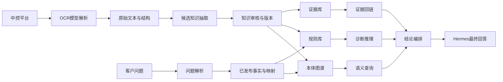
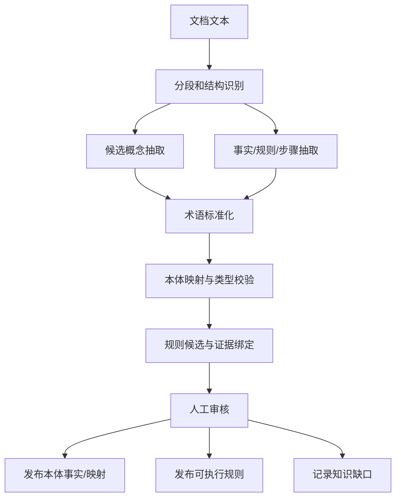

# 本体诊断推理平台设计

## 1. 文档定位

本文是“智能问答平台”的语义推理专题设计，目标是把现有的 FAQ、产品手册、实施记录、版本说明、排障文档和其他业务文档转换为可审核、可版本化、可推理的技术支持知识。

本文不把本体当作向量索引的另一种包装。向量检索可以帮助发现候选术语或定位原文证据，但正式诊断结论必须来自已经审核发布的概念、事实、跨本体映射和规则。

### 1.1 目标

- 识别文档中的产品、版本、组件、环境、资源、症状、根因、步骤、动作、约束和例外。
- 将不同文档中的异名、缩写和上下位概念映射到受治理的本体概念。
- 让跨本体关系通过明确映射、共享标识、事件路径或业务规则产生，而不是依赖字符串相似度。
- 将技术支持问题转成结构化事实，执行可解释的诊断和处置推理。
- 每个结论都返回规则 ID、推理路径、来源文档、原文证据和规则版本。
- 在证据不足、映射未确认、规则冲突或知识过期时拒绝编造结论。

### 1.2 非目标

- 不在第一阶段构建覆盖所有业务域的“大一统本体”。
- 不把所有段落直接转换为 OWL 类。
- 不以向量相似度作为正式根因判断依据。
- 不让 LLM 在运行时自由生成未经审核的规则。
- 不在 POC 阶段自动执行升级、重传文件、修改配置等外部操作。

## 2. 与现有平台的关系

现有平台已经包含中控平台、OCR 模型解析、知识库和 Hermes/skills。本文新增的是知识库和 Hermes 之间的“语义知识与推理层”。



模块边界如下：

| 模块 | 负责内容 | 不负责内容 |
| --- | --- | --- |
| 中控平台 | 入口、权限、任务分发 | 语义抽取和推理 |
| OCR模型解析 | 将文件转换为可处理文本和段落结构 | 批准业务规则 |
| 知识库 | 候选审核、发布、版本、证据和索引 | 运行时回答编排 |
| 语义推理层 | 本体查询、规则执行、推理轨迹 | 文档原始解析 |
| Hermes | 问题路由、调用推理 API、回答收口 | 自行修改正式规则 |

## 3. 统一知识模型

面对 FAQ、手册、实施记录和制度文档，不能为每一种文档创建一套业务字段。统一模型由文档结构、业务对象、断言、规则和来源五部分组成。

### 3.1 文档结构层

```text
Document
Section
Paragraph
List
Table
Question
Answer
```

该层只描述原文位置，不直接把段落当作业务事实。所有抽取结果都必须能回到一个 `EvidenceSpan`。

### 3.2 诊断本体核心概念

```text
SupportCase             技术支持问题
Symptom                 问题现象
Product                 产品
ProductVersion          产品版本
Component               功能或模块
DeploymentEnvironment   部署环境
Artifact                资源，如场景包、TJS、模型、CAD
Cause                   根因
DiagnosticStep          排查步骤
RemediationAction       修复动作
Constraint              前置条件、限制或例外
Process                 流程
KnowledgeGap            知识缺口
Evidence                原文证据
```

### 3.3 核心关系

```text
SupportCase --hasSymptom--> Symptom
SupportCase --occursIn--> DeploymentEnvironment
SupportCase --affects--> Component
SupportCase --involvesArtifact--> Artifact
SupportCase --hasProductVersion--> ProductVersion
Cause --explains--> Symptom
Cause --hasRemediation--> RemediationAction
RemediationAction --hasPrecondition--> Constraint
RemediationAction --hasAlternative--> RemediationAction
DiagnosticStep --precedes--> DiagnosticStep
Evidence --supports--> FactOrRule
```

### 3.4 复杂关系使用断言对象

简单事实可以使用三元组：

```text
Employee --worksFor--> Department
ScenePackage --belongsTo--> EnvironmentPackage
```

带条件的关系不能丢失条件。例如：

```text
“4.2.2 环境包迁移到 4.2.3 后地面模型不显示，重新上传园区 TJS 后恢复。”
```

应表达为：

```text
Claim_6428
  subject: GroundModel
  predicate: notDisplayedAfterMigration
  object: EnvironmentPackageMigration
  conditions:
    sourceVersion = 4.2.2
    targetVersion = 4.2.3
  then:
    recommend ReuploadParkTjs
  source: FAQ-row-6428
```

通用断言结构：

```text
Assertion(
  subject,
  predicate,
  object,
  conditions,
  qualifiers,
  modality,
  polarity,
  provenance,
  confidence
)
```

`modality` 表示 `must`、`should`、`may`、`prohibited` 或 `observed`；`polarity` 表示正向、否定或未知。未知不等于否定。

## 4. 文档到知识的抽取流程



### 4.1 抽取结果状态

```text
candidate     LLM 生成，不能参与正式推理
approved      人工确认，可以参与正式推理
rejected      人工否决，不参与推理
deprecated    曾经有效但已过期，仅保留审计价值
knowledge_gap 文档明确不足以形成规则，需要补充资料
```

### 4.2 术语标准化

使用 SKOS 或等价词汇模型保存：

```text
preferredLabel
alternativeLabel
hiddenLabel
broader
narrower
exactMatch
closeMatch
relatedMatch
```

“场景包”“环境包”“TJS 文件”不能因为字符串相似就直接视为同一概念。系统先生成候选映射，给出上下文、domain/range、共享 ID 和规则影响范围，审核通过后才进入正式推理。

## 5. 跨本体关联

每个稳定业务域维护自己的本体，例如：

```text
OrganizationOntology
SceneOntology
DeploymentOntology
SupportOntology
```

另建 `IntegrationOntology`，只负责跨域映射和桥接规则，不把所有本体强行合并。

### 5.1 映射类型

| 映射 | 语义 | 默认状态 |
| --- | --- | --- |
| `equivalentClass` | 两个类完全等价 | 人工确认 |
| `closeMatch` | 近似对应但边界不同 | 候选后确认 |
| `broader/narrower` | 上位/下位 | 候选后确认 |
| `equivalentProperty` | 属性语义完全一致 | 人工确认 |
| `correspondsTo` | 实例在业务上对应 | 共享唯一标识可自动候选 |
| `derivedRelation` | 通过路径和规则推导 | 人工确认规则 |

不默认使用 `owl:sameAs`。员工与登录用户、场景包与环境包可能是一对多或上下位关系，错误的 sameAs 会污染后续所有推理。

### 5.2 隐藏关系的发现方式

```text
共享唯一标识
  + domain/range 兼容
  + 时间/版本/组织上下文
  + 事件路径
  + 已审核业务规则
  -> 候选跨本体关系
```

正式推理只使用 `approved` 的映射。每个映射保存候选依据、审核人、版本、生效期和影响的规则。

## 6. 规则推理模型

OWL 负责类、关系、继承、等价和一致性；业务规则负责条件、日期、数值、例外、优先级、允许/禁止和流程状态。

### 6.1 规则 DSL

```json
{
  "id": "R-MAP-POINT-001",
  "version": 1,
  "status": "approved",
  "priority": 80,
  "effectiveFrom": "2026-01-01",
  "when": {
    "all": [
      {"fact": "symptom", "operator": "=", "value": "MapPointClickIneffective"},
      {"fact": "productVersion", "operator": "=", "value": "3.5.4"}
    ]
  },
  "then": {
    "cause": "MapPointPlacementDefect",
    "recommend": ["ManuallyAddMapPoint", "UpgradeToVersion:3.5.5"]
  },
  "evidence": ["FAQ-row-2579"]
}
```

### 6.2 规则选择

规则冲突时按以下顺序选择：

1. 当前生效时间范围内的规则优先；
2. 产品、版本和组件条件更具体的规则优先；
3. 人工设定的 `priority` 更高者优先；
4. 同优先级冲突时，不自动给出唯一结论，而是返回冲突并转人工。

### 6.3 推理输出

```json
{
  "answer": "建议重新上传园区 TJS 场景文件。",
  "diagnoses": [
    {
      "cause": "SceneResourceStateIncomplete",
      "confidence": 0.91,
      "ruleId": "R-SCENE-RESOURCE-001"
    }
  ],
  "missingFacts": [],
  "reasoningPath": [
    "symptom=GroundModelNotDisplayed",
    "migration.sourceVersion=4.2.2",
    "migration.targetVersion=4.2.3",
    "rule R-SCENE-RESOURCE-001 matched",
    "recommend ReuploadParkTjsSceneFile"
  ],
  "evidence": ["FAQ-row-6428"]
}
```

## 7. 技术选型

### 7.1 POC 推荐栈

| 层 | 选型 | 说明 |
| --- | --- | --- |
| 本体建模 | Protégé、OWL 2、SKOS | 维护类、关系、别名和桥接映射 |
| RDF 图谱 | GraphDB Free | RDF、SPARQL、命名图、基础推理 |
| 约束校验 | SHACL / pySHACL | 校验主体、客体、值域和必填证据 |
| 业务规则 | JSON Rule DSL + Soufflé Datalog | 多条件、多跳、版本和可解释路径 |
| 抽取服务 | Python 3.12、FastAPI、Pydantic | 文档抽取、问题解析、规则编译 |
| 审核与版本 | PostgreSQL | 审核状态、责任人、生效期、规则版本 |
| 模型接入 | OpenAI-compatible HTTP API | 支持 OpenAI 或自建兼容服务 |
| 前端 | React、TypeScript、Vite、Ant Design、TanStack Query、Zustand、React Flow | 审核、规则编辑、推理路径可视化 |
| 部署 | Docker Compose | POC 复现和组件隔离 |

### 7.2 OpenAI 兼容模型接口

适配层只依赖以下配置：

```text
base_url
api_key
model
timeout
temperature
response_format
```

调用顺序：

```text
优先：Structured Outputs + JSON Schema
降级：JSON mode + Pydantic 校验
修复：一次结构化重试
仍失败：写入人工队列，不生成规则
```

模型能力探测不影响知识模型。更换 OpenAI、Azure OpenAI 或其他兼容服务时，只替换 provider 配置和客户端，不改变提示词契约、规则 DSL 或审核状态。

### 7.3 前端工作台

POC 只做四个页面：

1. 候选知识：原文左栏，候选概念/事实/规则右栏；
2. 规则审核：编辑条件、动作、优先级、生效期和证据；
3. 跨本体映射审核：显示候选关系、依据和受影响规则；
4. 推理问答：展示答案、缺失事实、规则命中、路径和原文证据。

不在 POC 中做复杂本体图形编辑器；本体结构仍由 Protégé 管理，前端管理业务审核和运行时解释。

## 8. 质量、治理和安全

### 8.1 可追溯性

每条事实、规则和映射都必须关联：

```text
documentId
sectionId / paragraphId
sourceText
extractorModel
promptVersion
reviewer
reviewedAt
knowledgeVersion
effectiveFrom / effectiveTo
```

### 8.2 知识缺口

答案为“无”、仅有“场景问题”、根因未知或缺少必要环境信息时，不生成诊断规则。系统记录：

```text
symptom
missingFacts
requiredEvidence
escalationTarget
sourceText
```

### 8.3 安全边界

- 抽取服务不把未审核规则写入发布图谱。
- 推理结果默认是建议，不自动执行外部变更。
- 敏感字段在证据展示前按字段级权限脱敏。
- 规则和映射修改必须记录审核人和前后版本。

## 9. 上线验收指标

POC 通过条件：

- 30 条样本均完成结构化分析，且保留原文证据；
- 至少 15 条样本经人工审核成为正式事实或规则；
- 20 条人工验收问题的标准答案一致率不低于 90%；
- 每个自动结论返回规则 ID、推理路径和证据；
- 缺失事实、未批准映射和规则冲突时不得编造唯一结论；
- 使用相同文档、规则、映射和问题版本可以重放相同结果。

## 10. 主要风险

| 风险 | 后果 | 控制措施 |
| --- | --- | --- |
| LLM 把推测当事实 | 错误规则发布 | Schema、证据强制、人工审核 |
| 同义词误合并 | 跨本体错误推理 | SKOS 映射状态和人工确认 |
| 旧版本规则未下线 | 结论冲突 | 生效期、优先级、冲突检测 |
| FAQ 内容过短 | 诊断不充分 | KnowledgeGap 和追问 |
| 规则过多难维护 | 审核成本高 | 从高频症状和版本问题开始 |
| 推理链不可解释 | 无法采信 | 保留 ruleId、路径和证据 |
