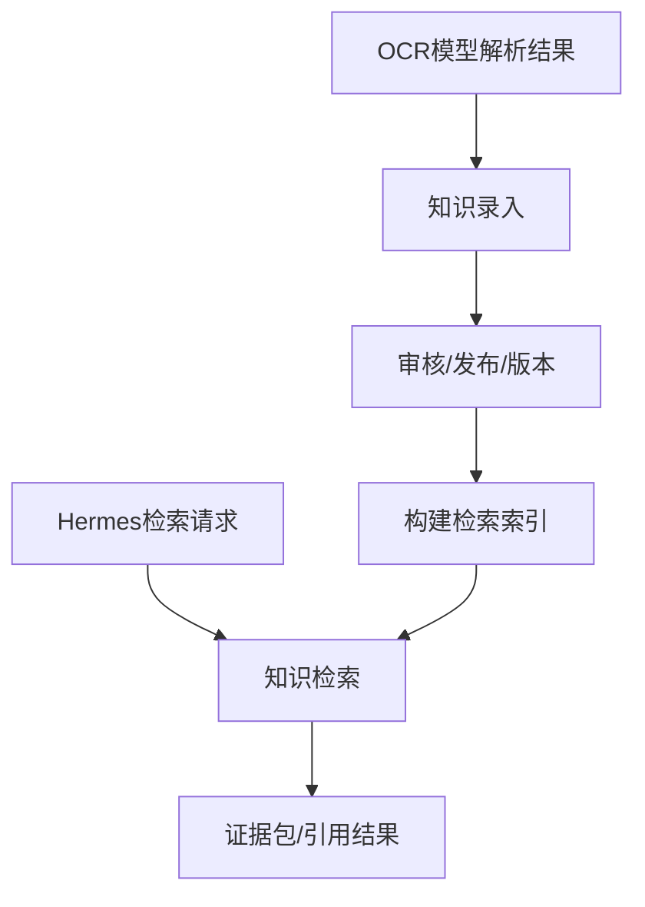

# 知识库设计

- **日期**: 2026-06-05
- **状态**: 草案
**目标**: 提供知识资产管理与检索能力，承接 OCR 解析结果，沉淀为正式知识，并为 Hermes 提供证据查询能力。

---

## 1. 职责边界

### 1.1 负责

- 接收 OCR 解析结果
- 知识录入
- 知识编辑、分类、标签
- 审核、发布、下线、版本管理
- 可见范围控制
- 构建检索索引
- 提供知识检索与证据结果

### 1.2 不负责

- 文档 OCR 原始解析
- 聊天编排
- 工单、权限、第三方动作执行
- 最终回答生成

---

## 2. 输入输出

### 2.1 输入

- OCR 输出的 Markdown
- OCR 输出的结构化结果
- 管理员编辑内容
- 知识审核动作
- Hermes 发起的检索请求

### 2.2 输出

- 正式知识条目
- 版本与审核状态
- 检索结果
- 证据包 / 引用信息

---

## 3. 功能范围

知识库文档合并了“知识管理 + 检索能力”，当前先不继续细拆。

### 3.1 知识管理

- 录入
- 编辑
- 分类
- 标签
- 审核
- 发布
- 下线
- 版本

### 3.2 检索能力

- Query 改写
- 关键词召回
- 向量召回
- 重排
- 证据整理
- 引用输出

---

## 4. 模块功能清单

### 4.1 知识资产管理功能

- 接收 OCR 解析结果
- 创建知识条目
- 编辑知识条目
- 分类与标签维护
- 负责人维护
- 可见范围维护

### 4.2 审核与生命周期功能

- 审核
- 发布
- 下线
- 生效时间管理
- 过期时间管理
- 版本管理

### 4.3 索引与检索功能

- Markdown / 结构化结果入索引
- 关键词索引构建
- 向量索引构建
- 查询改写
- 多路召回
- 重排
- 证据包输出

### 4.4 运营与质量功能

- 知识命中统计
- 知识效果反馈
- 知识质量评估
- 问题缺口发现输入

---

## 5. 技术栈

建议沿用知识管理与 RAG 检索的组合栈：

- `Python 3.12+`
- `FastAPI`
- `PostgreSQL`
- `Elasticsearch`
- `Milvus`
- `Redis`
- `Embedding 服务`
- `Rerank 服务`
- `对象存储`
- `OpenTelemetry`
- `structlog`

---

## 6. 处理流程

---

## 7. 一句话定义

知识库负责把解析结果沉淀为正式知识资产，并向 Hermes 提供可检索、可引用的知识证据。
